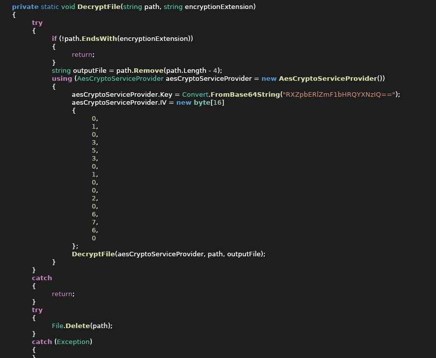

Intro Forensics
===============


#### Files

 * [access.log](0-nginx_log/access.log)


We start out with an Nginx log file, and are told to find an attacker's IP address. 
The log file is only 2k lines, so it's doable to visually scan it and see the relevant line fairly quickly:

   179.97.58.61 - - [Nov 05 2020 16:22:20] "POST /login HTTP/1.1" 200 476 "-" "Evil Browser"

Alternatively, you could filter out every line with a normal-looking user-agent and see what remains.


Entering that ip in the chat acknowledges it as the correct answer and gives you an image file, `evil_country_landscape.jpg`, which weighs in at a hefty 302.6 MiB, while the chat message mentions something about hard drives. 

It also says, in big red letters, "THIS FILE MIGHT CONTAIN A MALWARE SO DO NOT RUN ANYTHING FROM IT ON YOUR COMPUTER", which is both scary and exciting, so I'm absolutely going to be super careful about it and start a VM. Absolutely. Totally not going to just run untrusted code. 

Opening the file in a hex editor, and knowing the usual trick of appending a ZIP file to a JPEG file, we search for the magic "PK" string, confirm that it's there and feed the file to unzip. Might have been a zipbomb but woops it's already open.

```bash

└─[$] unzip evil_country_landscape.jpg
Archive:  evil_country_landscape.jpg
warning [evil_country_landscape.jpg]:  79798 extra bytes at beginning or within zipfile
 (attempting to process anyway)
 inflating: part2.img
 inflating: part3.img
```

 reveals that these two files are part of a raid5:

```bash
└─[$] file part*
part2.img: Linux Software RAID version 1.2 (1) UUID=dfaa645a:19afec72:60f1fa33:30d841da name=user-XPS-15-9570:6 level=5 disks=3
part3.img: Linux Software RAID version 1.2 (1) UUID=dfaa645a:19afec72:60f1fa33:30d841da name=user-XPS-15-9570:6 level=5 disks=3
```

To mount it, grab mdadm from your favorite repository and set the raid up:

```bash
losetup -f part2.img
losetup -f part3.img
mdadm --assemble /dev/md0 /dev/loop0 /dev/loop1
```

Examining the assembled raid disk reveals a raw (unpartitioned) ext3 filesystem, so let's mount that:

```bash
mkdir blep
mount /dev/md0 blep
```

(Wait, is it dangerous to mount an untrusted filesystem? Probably.)

The filesystem contains a standard ext3 lost+found folder, empty, and a zip file called `dump.zip`, containing two files, `dump.vmem` and `dump.vmem.sha256`, the latter containing the sha256 checksum of the former.
Running sha256sum on dump.vmem confirms the checksums matche - to our great relief, no horrible corruption happened to the data so far:

```bash
└─[$] sha256sum dump.vmem
dd170dfbb7046c18850b97ab0f7d7227ad03fbd0b692e60b10549b211373941b  dump.vmem

└─[$] cat dump.vmem.sha256
dd170dfbb7046c18850b97ab0f7d7227ad03fbd0b692e60b10549b211373941b
```

Opening `dump.vmem` in a hex editor reveals strings like "Invalid partition table"/"Error loading operating system"/"Missing operating system" and "VMWARE", so we know we're dealing with some kind of dump of a virtual machine image.

The first relevant tool that I could find to examine VM dumps is [volatility](https://github.com/volatilityfoundation/volatility); being an open-source tool, it's very user friendly:

```bash
└─[$] volatility dump.vmem
Volatility Foundation Volatility Framework 2.6.1
ERROR   : volatility.debug    : You must specify something to do (try -h)

└─[$] volatility -f dump.vmem
Volatility Foundation Volatility Framework 2.6.1
ERROR   : volatility.debug    : You must specify something to do (try -h)

└─[$] volatility -f dump.vmem -O raw_image
Volatility Foundation Volatility Framework 2.6.1
Usage: Volatility - A memory forensics analysis platform.

volatility: error: no such option: -O

└─[$] man volatility
No manual entry for volatility

└─[$] volatility -h
Volatility Foundation Volatility Framework 2.6.1
Usage: Volatility - A memory forensics analysis platform.

Options:
    [hundred lines of options and commands follow]

└─[$] volatility -f dump.vmem --profile Win10x64_17134 vmwareinfo
Volatility Foundation Volatility Framework 2.6.1
ERROR   : volatility.debug    : Memory Image could not be identified as ['VMWareAddressSpace', 'VMWareMetaAddressSpace']
```

Another command brings more luck:

```bash
└─[$] volatility -f dump.mem imageinfo
Volatility Foundation Volatility Framework 2.6.1
INFO    : volatility.debug    : Determining profile based on KDBG search...
         Suggested Profile(s) : Win7SP1x64, Win7SP0x64, Win2008R2SP0x64, Win2008R2SP1x64_24000, Win2008R2SP1x64_23418, Win2008R2SP1x64, Win7SP1x64_24000, Win7SP1x64_23418
                    AS Layer1 : WindowsAMD64PagedMemory (Kernel AS)
                    AS Layer2 : FileAddressSpace (/home/narthorn/dev/challegnes/brigittefriang/dump.vmem)
                     PAE type : No PAE
                          DTB : 0x187000L
                         KDBG : 0xf80002c4c0a0L
         Number of Processors : 1
    Image Type (Service Pack) : 1
               KPCR for CPU 0 : 0xfffff80002c4dd00L
            KUSER_SHARED_DATA : 0xfffff78000000000L
```

And finally:


```bash

volatility -f dump.vmem --profile Win7SP1x64 pslist

└─[$] volatility -f dump.vmem --profile Win7SP1x64 pslist
Volatility Foundation Volatility Framework 2.6.1
Offset(V)          Name                    PID   PPID   Thds     Hnds   Sess  Wow64 Start                          Exit                          
------------------ -------------------- ------ ------ ------ -------- ------ ------ ------------------------------ ------------------------------
0xfffffa8000cc5b30 System                    4      0     87      393 ------      0 2020-10-05 11:13:41 UTC+0000                                 
0xfffffa800bad5480 smss.exe                264      4      2       29 ------      0 2020-10-05 11:13:41 UTC+0000                                 
0xfffffa8002810060 csrss.exe               352    336      8      517      0      0 2020-10-05 11:13:42 UTC+0000                                 
0xfffffa8002816060 wininit.exe             404    336      3       74      0      0 2020-10-05 11:13:42 UTC+0000                                 
0xfffffa80111d32e0 csrss.exe               412    396      9      209      1      0 2020-10-05 11:13:42 UTC+0000                                 
0xfffffa80029c2910 winlogon.exe            460    396      4      110      1      0 2020-10-05 11:13:42 UTC+0000                                 
0xfffffa80029f76d0 services.exe            504    404      8      220      0      0 2020-10-05 11:13:42 UTC+0000                                 
0xfffffa8002a007c0 lsass.exe               512    404      7      565      0      0 2020-10-05 11:13:42 UTC+0000                                 
0xfffffa8002a0db30 lsm.exe                 520    404     10      145      0      0 2020-10-05 11:13:42 UTC+0000                                 
0xfffffa8002a0fb30 svchost.exe             644    504     10      353      0      0 2020-10-05 11:13:43 UTC+0000                                 
0xfffffa8002affb30 svchost.exe             708    504      6      276      0      0 2020-10-05 11:13:43 UTC+0000                                 
0xfffffa8002b1f4a0 svchost.exe             760    504     23      514      0      0 2020-10-05 11:13:43 UTC+0000                                 
0xfffffa8002b28b30 svchost.exe             880    504     16      320      0      0 2020-10-05 11:13:43 UTC+0000                                 
0xfffffa8002b8ab30 svchost.exe             920    504     48      979      0      0 2020-10-05 11:13:43 UTC+0000                                 
0xfffffa8002bb4b30 audiodg.exe             980    760      7      128      0      0 2020-10-05 11:13:44 UTC+0000                                 
0xfffffa8002bd4060 svchost.exe             244    504     26      720      0      0 2020-10-05 11:13:44 UTC+0000                                 
0xfffffa8002bf8060 svchost.exe             304    504     20      391      0      0 2020-10-05 11:13:44 UTC+0000                                 
0xfffffa8002c6b500 dwm.exe                1072    880      6      124      1      0 2020-10-05 11:13:44 UTC+0000                                 
0xfffffa8002c6fb30 explorer.exe           1084   1064     32      828      1      0 2020-10-05 11:13:44 UTC+0000                                 
0xfffffa8002cc6310 spoolsv.exe            1156    504     15      270      0      0 2020-10-05 11:13:44 UTC+0000                                 
0xfffffa8002d11a60 taskhost.exe           1216    504     10      204      1      0 2020-10-05 11:13:44 UTC+0000                                 
0xfffffa8002d234f0 vm3dservice.ex         1240   1084      3       39      1      0 2020-10-05 11:13:44 UTC+0000                                 
0xfffffa8002d27b30 vmtoolsd.exe           1248   1084      8      166      1      0 2020-10-05 11:13:44 UTC+0000                                 
0xfffffa8002d2ab30 svchost.exe            1304    504     20      325      0      0 2020-10-05 11:13:45 UTC+0000                                 
0xfffffa8002b6e430 VGAuthService.         1560    504      4       84      0      0 2020-10-05 11:13:46 UTC+0000                                 
0xfffffa8002b6f2c0 vmtoolsd.exe           1584    504     12      292      0      0 2020-10-05 11:13:46 UTC+0000                                 
0xfffffa8001e6ab30 dllhost.exe            1832    504     20      186      0      0 2020-10-05 11:13:47 UTC+0000                                 
0xfffffa8002f1f060 WmiPrvSE.exe           1892    644     10      193      0      0 2020-10-05 11:13:47 UTC+0000                                 
0xfffffa8002ef2b30 dllhost.exe            2008    504     17      195      0      0 2020-10-05 11:13:48 UTC+0000                                 
0xfffffa8002fc9560 msdtc.exe               872    504     15      155      0      0 2020-10-05 11:13:49 UTC+0000                                 
0xfffffa8003021690 VSSVC.exe              2076    504      6      109      0      0 2020-10-05 11:13:49 UTC+0000                                 
0xfffffa8002c4bb30 SearchIndexer.         2156    504     12      557      0      0 2020-10-05 11:13:50 UTC+0000                                 
0xfffffa8002fd4b30 wmpnetwk.exe           2296    504     11      213      0      0 2020-10-05 11:13:50 UTC+0000                                 
0xfffffa80030d4770 svchost.exe            2372    504     23      258      0      0 2020-10-05 11:13:51 UTC+0000                                 
0xfffffa80030e4750 SearchProtocol         2400   2156      7      273      0      0 2020-10-05 11:13:51 UTC+0000                                 
0xfffffa80030e7b30 SearchFilterHo         2420   2156      4       86      0      0 2020-10-05 11:13:51 UTC+0000                                 
0xfffffa8001ca9060 WmiPrvSE.exe           3032    644     15      330      0      0 2020-10-05 11:14:07 UTC+0000                                 
0xfffffa80031d5790 sppsvc.exe             2844    504      6      156      0      0 2020-10-05 11:16:54 UTC+0000                                 
0xfffffa801bbf6b30 svchost.exe            2276    504     12      327      0      0 2020-10-05 11:16:54 UTC+0000                                 
0xfffffa8000e91b30 drpbx.exe              2304   2916      8      149      1      0 2020-10-05 11:17:01 UTC+0000                                 
0xfffffa8000e78920 taskhost.exe           2464    504      6       88      1      0 2020-10-05 11:17:08 UTC+0000                                 
0xfffffa800107c6a0 WmiApSrv.exe           2632    504      7      119      0      0 2020-10-05 11:17:18 UTC+0000                                 
0xfffffa8001072060 notepad.exe            1880   1084      1       62      1      0 2020-10-05 11:17:36 UTC+0000                                 
0xfffffa800117db30 cmd.exe                1744   1584      0 --------      0      0 2020-10-05 11:17:37 UTC+0000   2020-10-05 11:17:37 UTC+0000  
0xfffffa8002161630 conhost.exe            2928    352      0 --------      0      0 2020-10-05 11:17:37 UTC+0000   2020-10-05 11:17:37 UTC+0000  
0xfffffa8001116060 ipconfig.exe           2832   1744      0 --------      0      0 2020-10-05 11:17:37 UTC+0000   2020-10-05 11:17:37 UTC+0000  

```

Sweet. It's definitely a dump of a running virtual machine, Notepad's open, and volatility has a command to dump notepad, we're in luck:

```bash
   └─[$] volatility -f dump.vmem --profile Win7SP1x64 notepad
   Volatility Foundation Volatility Framework 2.6.1
   ERROR   : volatility.debug    : This command does not support the profile Win7SP1x64
```

zzz

A ton of command-line fumbling later, we manage to extract a few relevant files from the disk of the image:

```bash
└─[$] volatility -f dump.vmem --profile Win7SP1x64 filescan | sort -k5
...
0x000000003db6d740     16      0 R--rwd \Device\HarddiskVolume1\Users\Public\Videos\desktop.ini
0x000000003db6ee60     16      0 RWD--- \Device\HarddiskVolume1\Users\user\AppData\Local\Drpbx\drpbx.exe
0x000000003fc11770     16      0 R--r-d \Device\HarddiskVolume1\Users\user\AppData\Local\Drpbx\drpbx.exe
0x000000003dd41510     15      0 RW-rw- \Device\HarddiskVolume1\Users\user\AppData\Local\GDIPFONTCACHEV1.DAT
...
0x000000003fc4c1c0      2      1 R--rwd \Device\HarddiskVolume1\Users\user\AppData\Local\Microsoft\Windows\WER\ReportArchive
0x000000003ff6e870      1      1 -W-rw- \Device\HarddiskVolume1\Users\user\AppData\Local\Temp\FXSAPIDebugLogFile.txt
0x000000000eb012e0     16      0 RWD--- \Device\HarddiskVolume1\Users\user\AppData\Roaming\Frfx\firefox.exe
0x000000003de445c0      2      1 R--rwd \Device\HarddiskVolume1\Users\user\AppData\Roaming\Microsoft\Credentials
0x000000003dee61c0     16      0 R--rwd \Device\HarddiskVolume1\Users\user\AppData\Roaming\Microsoft\Internet Explorer\Quick Launch\desktop.ini
...
0x000000003df00960     16      0 R--rwd \Device\HarddiskVolume1\Users\user\AppData\Roaming\Microsoft\Windows\Start Menu\Programs\Startup\desktop.ini
0x000000003faebc10     16      0 R--r-- \Device\HarddiskVolume1\Users\user\AppData\Roaming\System32Work\Address.txt
0x000000003faf6a00     16      0 R--r-- \Device\HarddiskVolume1\Users\user\AppData\Roaming\System32Work\EncryptedFileList.txt
0x000000003eb90620     16      0 R--rwd \Device\HarddiskVolume1\Users\user\Contacts\desktop.ini
0x000000003df0f400      2      1 R--rwd \Device\HarddiskVolume1\Users\user\Desktop
0x000000003df26c80      2      1 R--rwd \Device\HarddiskVolume1\Users\user\Desktop
0x000000003dee4bb0     16      0 R--rwd \Device\HarddiskVolume1\Users\user\Desktop\desktop.ini
0x000000003dba9f20      2      1 R--rwd \Device\HarddiskVolume1\Users\user\Documents
0x000000003de0bf20      2      1 R--rwd \Device\HarddiskVolume1\Users\user\Documents
0x000000003dee27d0      1      1 R--rw- \Device\HarddiskVolume1\Users\user\Documents
0x000000003fc61570      1      1 R--rw- \Device\HarddiskVolume1\Users\user\Documents
0x000000003df55dd0     16      0 R--rwd \Device\HarddiskVolume1\Users\user\Documents\desktop.ini
0x000000003daa7f20     12      0 R--r-- \Device\HarddiskVolume1\Users\user\Documents\Firefox_installer.exe
0x000000003ddb1890      7      0 R--r-d \Device\HarddiskVolume1\Users\user\Documents\Firefox_installer.exe
0x000000001715ed50     16      0 R--r-- \Device\HarddiskVolume1\Users\user\Documents\informations_attaque.txt.evil
0x000000003db69e80     16      0 R--rwd \Device\HarddiskVolume1\Users\user\Downloads\desktop.ini
0x000000003ec701e0     16      0 R--rwd \Device\HarddiskVolume1\Users\user\Favorites\desktop.ini
...
```

```bash
volatility -f dump.vmem --profile Win7SP1x64 dumpfiles -Q 0x000000003db6ee60 -n --dump-dir extracted_files
volatility -f dump.vmem --profile Win7SP1x64 dumpfiles -Q 0x000000000eb012e0 -n --dump-dir extracted_files
volatility -f dump.vmem --profile Win7SP1x64 dumpfiles -Q 0x000000001715ed50 -n --dump-dir extracted_files
volatility -f dump.vmem --profile Win7SP1x64 dumpfiles -Q 0x000000003faf6a00 -n --dump-dir extracted_files
...
```

It looks like this machine was attacked by ransomware and some files are encrypted<a name="1b">[¹](#1)</a>. 

Interesting extracted files include:
* [drpbx.exe](4-ransomware/file.2304.0xfffffa8001a29f10.drpbx.exe.dat) and [firefox.exe](4-ransomware/file.None.0xfffffa800cffff10.firefox.exe.dat) - those obviously contain the malware,
* [EncryptedFileList.txt](4-ransomware/file.None.0xfffffa8001100e20.EncryptedFileList.txt.dat) which has what its name says, and
* [informations_attaque.txt.evil](4-ransomware/file.None.0xfffffa800e9fec60.informations_attaque.txt.evil.dat) which is encrypted.

We found the malware, so it's time to see what it's doing. A quick attempt with IDA reveals that it's a dotnet executable, so I look for a dotnet decompiler instead and find [AvaloniaILSpy](https://github.com/icsharpcode/AvaloniaILSpy) which seems to do the trick<a name="2b">[²](#2)</a>.

Immediately we see interesting lines like these: 



Nothing seems too shady about the encryption/decryption; It seems like normal use of AES-128-CBC, so let's convert the iv and key to hex and try decrypting directly with `openssl`:

```bash
└─[$]    openssl aes-128-cbc -d -in file.None.0xfffffa800e9fec60.informations_attaque.txt.evil.dat -out informations_attaque.txt -iv "00010003050300010000020006070600" -K '4576696c44656661756c745061737321' 
bad decrypt
140120922633600:error:06065064:digital envelope routines:EVP_DecryptFinal_ex:bad decrypt:crypto/evp/evp_enc.c:583:
```

openssl throws a "bad decrypt" error because volatility dumped the file with a bunch of nul bytes at the end; But the beginning of the file is decrypted just fine, and reveals the url to the CTF part of the challenge:

```
Ce message est destiné à toute force alliée en mesure de nous venir en aide, nous la résistance d'Evil Country. Hier, nous sommes parvenus à mettre la main sur un dossier confidentiel émanant des services secrets d'Evil Gouv.

Ces documents font mention d'une opération d'anéantissement de la résistance à l'aide d'un puissant agent innervant, le VX. L'attaque est prévue dans 4 jours à 4h40 au sein du fief de la résistance. 

Nous savons de source sure qu'un convoi permettant la synthèse du VX partira de l'entrepot Stockos de Bad Country vers le fief de la résistance d'ici quelques jours. Il faut intercepter ce convoi !

Contactez-nous à cette adresse : http://ctf.challengecybersec.fr/7a144cdc500b28e80cf760d60aca2ed3szÐZn|3’ †ª
ïFƒ…f¸J	v×
```

---

<a name="1">[¹](#1b)</a>: this must be what they meant with the malware warning from the start. Did they really include a live ransomware on the image? That's pretty nuts.

<a name="2">[²](#2b)</a>: despite also being under the curse of being open-source software with barely useable interface. Somehow this supercomputer can render giant 3D scenes more than 144 times a second (once every ~0.00694 seconds) by doing tens of millions of calculations in that timeframe - but this software with a simple static 2d GUI takes **half a second** to expand/collapse a list of items. What is it even doing??? What is going on.

#### process 

One of the easier intro challenges, and the first one that I solved. (00:35-00:55, 01:35-2:55, total 1h40)
