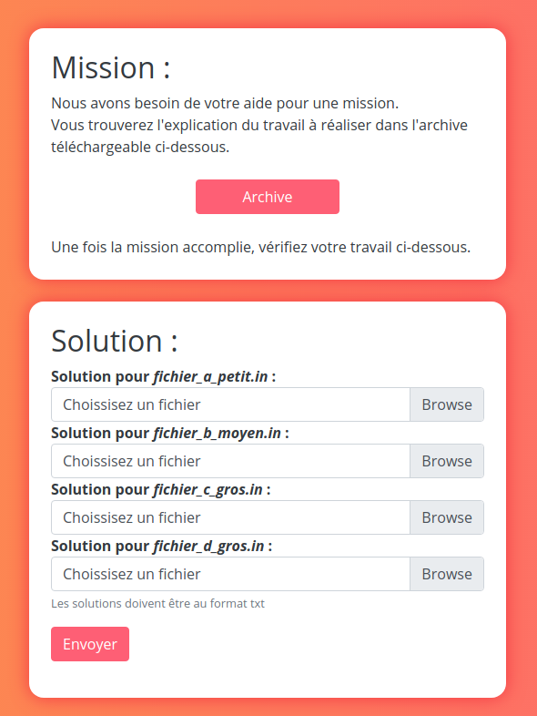
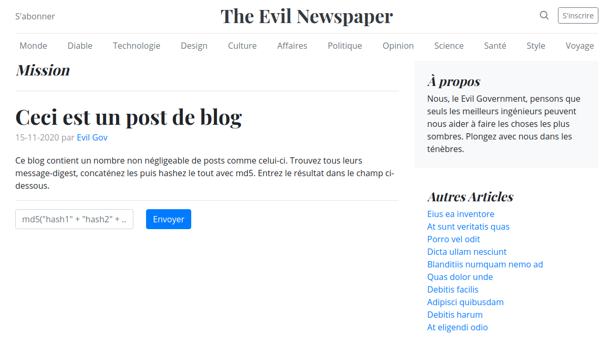
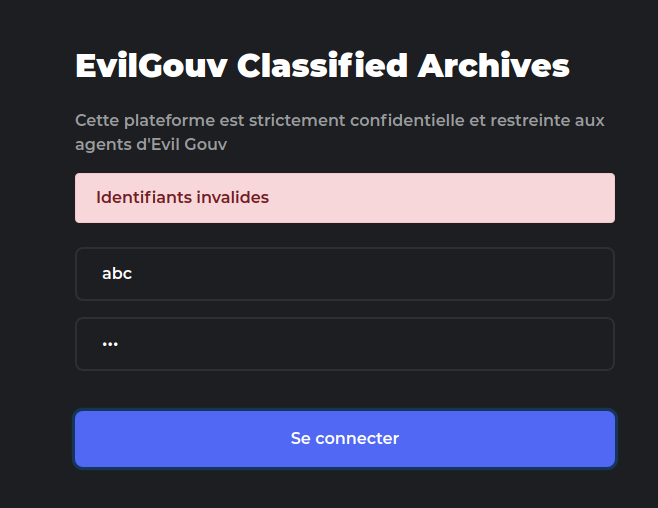
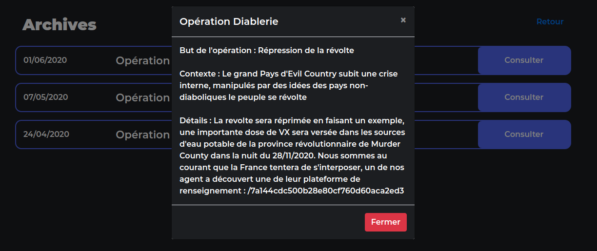

Intro Algo
==========


### Files

 * [original.txt](0-diff/original.txt)
 * [intercepte.txt](0-diff/intercepte.txt)

Two files, almost identical - strip off all the common chars to get at the hidden information.

```python
out = b""
with open("original.txt","rb") as orig:
    with open("intercepte.txt","rb") as inter:
        while True:
            o = orig.read(1)
            i = inter.read(1)
            if not o or not i: break

            if o != i:
                out += i
                orig.seek(-1,1)

with open("diff","wb") as diff: diff.write(out)
```

We're left with a [string](0-diff/diff) that starts with `base64:/9j/...`<a name="1b">[¹](#1)</a>. 

Decode the rest as base64 and you get a jpg picture of a [poster](0-diff/poster.jpg):

```bash
<diff tail -c +8 | base64 -d > poster.jpg
```


Which sends you to a new url: https://challengecybersec.fr/22caeee05cb8b2a49133be134a5e9432 <a name="2b">[²](#2)</a>



Here, we get a sequence of files containing increasingly big sets of integers; the challenge, described in [IMPORTANT.pdf](1-efficient_storage/IMPORTANT.pdf) is to find a subset of those numbers whose sum is equal, but not higher, than a given target. This can be done in many efficient ways, but here the files are small enough that a naive<a name="3">[³](#3b)</a> recursion in a slow language is [good enough](1-efficient_storage/storage.py):

```python
#!/usr/bin/python

from sys import argv,setrecursionlimit

setrecursionlimit(10000) # yolo

with open(argv[1]+".in") as f:
    total, _ = map(int,f.readline().split(" "))
    items = sorted(enumerate(map(int, f.readline().split(" "))),key=(lambda t: t[1]),reverse=True)

def rec(items=items, best=(total,[])):
    best_total, best_list = best
    for j,(i,a) in enumerate(items):
        new_total, new_list = new = (best_total-a,best_list+[i])
        if (new_total == 0): return new
        remaining = [(k,x) for k,x in items[j+1:] if (x,[]) <= new]
        if not remaining: continue
        best = min(best, rec(remaining, new))
        if (best[0] == 0): return best
    return best

best_total, best_list = rec()
with open(argv[1]+".out.txt","w") as out:
    out.write(f"{len(best_list)}\n")
    out.write(" ".join(map(str,sorted(best_list))))
    out.write("\n")

# sanity checks

with open(argv[1]+".in") as f:
    total, _ = map(int,f.readline().split(" "))
    items = list(map(int, f.readline().split(" ")))

assert(best_total == 0)
assert(total == sum(items[i] for i in best_list))
```

```bash
└─[$] time ( for f in fichier_*.in; do ./storage.py ${f%%.in}; done ) 
( for f in fichier_*.in; do; ./storage.py ${f%%.in}; done; )  21.41s user 2.39s system 99% cpu 24.028 total
```


We are then sent to https://www.challengecybersec.fr/9bcb53d26eab7e9e08cc9ffae4396b48: 



This is a pseudo-wordpress-like blog, where the goal is to crawl all posts and extract a hex string from the plaintext of the posts, concatenate all the hex strings and compute their md5 sum. After checking that the blog ids only go from 1 to 1000, a shell one-liner does the trick:

```bash
for i in {1..1000}; do curl https://www.challengecybersec.fr/9bcb53d26eab7e9e08cc9ffae4396b48/blog/post/$i 2>&- | grep message-digest | sed "s#.*proof\">\(.*\)<.*#\1#"; done | tr -d "\n" | md5sum
 ```

It seems the hashes change every so often, so a previously computed solution will stop working after a while.


Next stop: https://www.challengecybersec.fr/1410e53b7550c466c76fc7268a8160ae



This one is cool. A simple login page is "protected" by [heavily obfuscated](3-obfuscated_js/obfuscated.js) javascript. The username is run through the obfuscated function, and if that returns true, the user is redirected to http://www.challengecybersec.fr/1410e53b7550c466c76fc7268a8160ae/[theusername], so you can't just skip to the correct page, you have to figure out the username from the client-side checking code (which might be a one-way hash that can't easily be reversed!).

Not much to say about the process of unobfuscating - since the code was small enough, I did it by hand, replacing variable names with readable english and simplifying the code as I went. The [unobfuscated](3-obfuscated_js/unobfuscated.js) code is way simpler:

```js
var hash = '\x37\x3c\x30\x6c\x3c\x6e\x69\x30\x33\x3c\x6c\x3c\x6c\x3c\x33\x3e\x35\x3c\x62\x60\x3e\x64\x6b\x3e\x6a\x3b\x33\x6e\x30\x3e\x3e\x6f\x39\x6e\x30\x60\x6e\x6b\x33\x39';
var padding = '\x39\x6f\x23\x6a\x7a\x51\x24\x3d\x57\x38\x73\x4e\x3e\x6e\x3f\x6b\x49\x58\x75\x49\x4d\x37\x73\x68\x36\x20\x57\x69\x6c\x62\x44\x50\x78\x60\x31\x26\x59\x46\x35\x7a';
var xor = '\x64\x5b\x63\x6e\x3f\x6b\x2b\x71\x6a\x65\x29\x2f\x4e\x7c\x74\x2e\x77\x6b\x47\x72\x5d\x72\x4f\x2b\x6b\x39\x62\x3d\x32\x79\x2c\x7d\x40\x5a\x79\x62\x3a\x38\x70\x6c\x61\x32\x27\x36\x25\x64\x6e\x29';
var transpose = [0x0, 0x15, 0x0, 0x22, 0x4, 0x9, 0x17, 0x1e, 0xe, 0x5, 0x1d, 0x4, 0x18, 0x16, 0x8, 0x14, 0x1f, 0x11, 0x26, 0x23, 0xf, 0x1, 0xd, 0x6, 0xc, 0x1a, 0x19, 0x1b, 0x21, 0xa, 0x7, 0x10, 0x20, 0x1c, 0x3, 0x13, 0x25, 0x24, 0x12, 0x27];

function check(str) {
    var i = 0;
    while (str.length < 0x28) str += padding[i++ % paddding.length];

    var chars = str.split('');
    for (i=0; i < chars.length; i++) chars[transpose[i]] = str[i];
    for (i=0; i < chars.length; i++) chars[i] = String.fromCharCode(chars[i].charCodeAt(0) ^ (xor.charCodeAt(i) & 0xf));
 
    return chars.join('') == hash;
}

check("3f3939527e73ad93b73b070bb12cde1292bbcde5") // true
```

it takes the username, pads it with a hardcoded suffix to 40 chars, switches characters around with a hardcoded substitution table, xors it with hardcoded key, and finally compares it with a hardcoded target. Nice, everything is deterministic, we can reverse it easily: xor the target with the key, apply the substitutions in reverse, maybe strip off the padding bytes if they seem to be in there, and there we go: `3f3939527e73ad93b73b070bb12cde1292bbcde5`, we enter it on the page, it says "correct login", and we get redirected to a nice 404 page.

Wait, what? Is the challenge broken? admin pls

It's not broken. I went too fast. Remember when I said a client-side javascript check could very well be one-way hashing? Well, it turns one part of this process is one-way: the substitution table. It has two occurences of 0x00 and 0x04. That means the corresponding chars in the output are going to be written to twice, and so it doesn't matter which char is written first because it's getting overwritten. The first occurence of 0x00 is at position 0, and the first occurence of 0x04 is at position 4, so that means char 0 and 4 in the username could be any byte and the check will still succeed. So we don't actually know which chars are correct for those two positions!

The rest of the username being hexadecimal, we can assume that they're also hexadecimal, which leaves us with 16x16=256 valid usernames to try.
Bruteforcing feels bad, but it's not a big search space, so let's do it:

```bash

for x in {0..9} {a..f}; do for y in {0..9} {a..f}; do user="${y}f39${x}9527e73ad93b73b070bb12cde1292bbcde5"; echo $user: $(curl -I -s -o /dev/null -w "%{http_code}" https://challengecybersec.fr/1410e53b7550c466c76fc7268a8160ae/$user 2>&-); done; done
...
2f3949527e73ad93b73b070bb12cde1292bbcde5: 404
3f3949527e73ad93b73b070bb12cde1292bbcde5: 404
4f3949527e73ad93b73b070bb12cde1292bbcde5: 404
5f3949527e73ad93b73b070bb12cde1292bbcde5: 200 < working
6f3949527e73ad93b73b070bb12cde1292bbcde5: 404
7f3949527e73ad93b73b070bb12cde1292bbcde5: 404
8f3949527e73ad93b73b070bb12cde1292bbcde5: 404
9f3949527e73ad93b73b070bb12cde1292bbcde5: 404
...
```

Finally, https://www.challengecybersec.fr/1410e53b7550c466c76fc7268a8160ae/5f3949527e73ad93b73b070bb12cde1292bbcde5.

This page has some flavor-text popups<a name="4b">[⁴](#4)</a>, one of which includes the url to the main part of the CTF.



---

<a name="1">[¹](#1b)</a>: A JPEG file will always start with the bytes `0xffd8ff`, which encodes in base64 to the distinctive string `/9j/`, so if you see that somewhere, you know you probably have a base64-encoded jpg file on your hands.

#### process

<a name="2">[²](#2b)</a>: I actually stopped there and didn't do the rest of this intro until after I was done with the whole CTF. All other paths lead to the same place, and only the [crypto intro](../0_intro_crypto) is referenced in a later challenge, so it's fine to skip all other intros.

<a name="3">[³](#3b)</a>: For some reason it was really hard for me to write the "naive" recursive thing. Like, a few hours? It was after completing everything, so, no time pressure, but still.   
It also threw me for a loop that you have to upload the result files with a .txt extension - I kept double-checking my files thinking I had something wrong in the format or newline issues or whatnot.

<a name="4">[⁴](#4b)</a>: Is there a flag here to be written in the chat page for confirmation? I don't think so, but I don't know.
