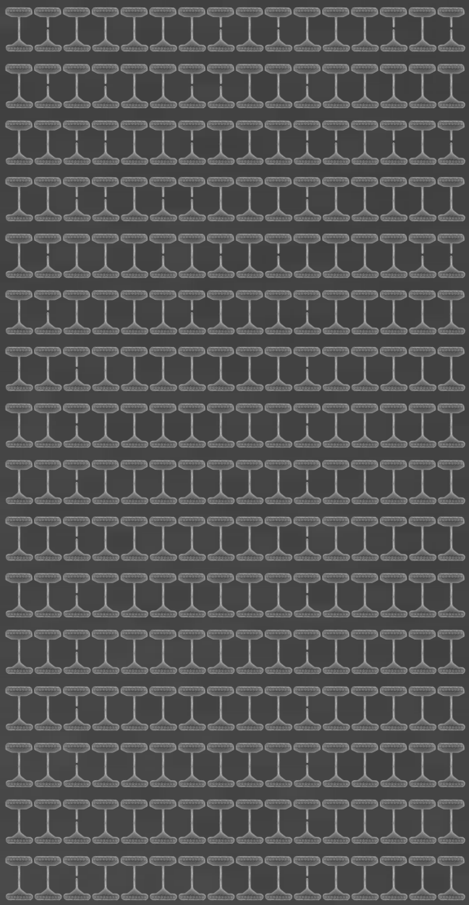
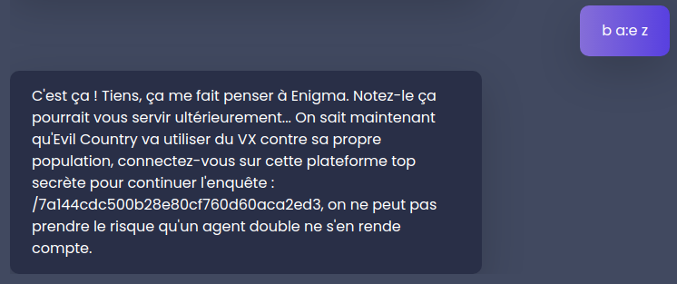

Intro Crypto
============


#### Files

 * [echange.txt](0-hardware_aes/echange.txt)
 * [archive_chiffree](0-hardware_aes/archive_chiffree)
 * [layout.pdf](0-hardware_aes/layout.pdf)
 * [compte_rendu_eve.pdf](0-hardware_aes/compte_rendu_eve.pdf)

The goal is to decrypt the file [archive_chiffree](0-hardware_aes/archive_chiffree). The pdf report heavily implies that it's encrypted with standard AES, with a hardware key embedded in 256 eFuses. [layout.pdf](0-hardware_aes/layout.pdf) should be a electron microscope photography of the fuses, but that PDF is password protected ; Our first task is to figure out the password to that pdf. We're also told in the introduction that the author of the pdf is unreachable, and to try and make contact with her.


The pdf report gives us two leads on that, an email and a phone number.   
Sending an email only results in an automatic reply:


But calling the phone number, we are greeted with a series of morse code beeps:

```
.-. . ... .. ... - .- -. -.-. . 
```

spelling out the word `RESISTANCE`. In lowercase, this is the password to [layout.pdf](0-hardware_aes/layout.pdf), which we can now open:



We have 256 fuses in a 8x32 grid:

```
   0100000101000101
   0101001100100000
   0011001000110101
   0011011000100000
   0100010101000011
   0100001000100000
   0010000000100000
   0010000000100000
   0010000000100000
   0010000000100000
   0010000000100000
   0010000000100000
   0010000000100000
   0010000000100000
   0010000000100000
   0010000000100000
```

This directly transcribes in ascii to <code>AES 256 ECB&nbsp;&nbsp;&nbsp;&nbsp;&nbsp;&nbsp;&nbsp;&nbsp;&nbsp;&nbsp;&nbsp;&nbsp;&nbsp;&nbsp;&nbsp;&nbsp;&nbsp;&nbsp;&nbsp;&nbsp;&nbsp;</code>.

Using this as the key, we can decrypt [archive_chiffree](0-hardware_aes/archive_chiffree):

```bash
└─[$] openssl aes-256-ecb -d -in archive_chiffree -out archive_dechiffree -K "4145532032353620454342202020202020202020202020202020202020202020"

└─[$] file archive_dechiffree
archive_dechiffree: Zip archive data, at least v2.0 to extract

└─[$] unzip archive_dechiffree

└─[$] tree archive 
archive
├── code_acces.pdf
└── message.pdf

```

The [decrypted archive](1-chinese_remainders/archive_dechiffree) unzips into 2 pdfs, [code_acces.pdf](1-chinese_remainders/code_acces.pdf), password protected, and [message.pdf](1-chinese_remainders/message.pdf), describing how to get the password: 


Applying the [Chinese remainder theorem](https://en.wikipedia.org/wiki/Chinese_remainder_theorem), the solution is easily found to be 5622, and we can open [code_acces.pdf](1-chinese_remainders/code_acces.pdf):


Finally, we want to decode 0xAF3A5E20A63AD0 into an ascii pass, by inverting each byte in `GF(256) = Z2[X]/(X⁸+X⁴+X³+X+1)`.

This is easily done in [sage](https://github.com/sagemath):

```python
sage: F.<x> = GF(256, modulus=x^8+x^4+x^3+x+1, repr='int')
sage: [F.fetch_int(b)^(-1) for b in [0xAF, 0x3A, 0x5E, 0x20, 0xA6, 0x3A, 0xD0]]
[98, 32, 97, 58, 101, 32, 122]
sage: ''.join(chr(x) for x in [98, 32, 97, 58, 101, 32, 122])
'b a:e z'
```

Entering `b a:e z` in the chat confirms that we got it right, hints at the solution being related to Enigma, and gives the url to the main CTF.



---

#### process

It's a nice and varied challenge, only tarnished by the fact that it was broken at the start. 
This is the original [layout.pdf](0-hardware_aes/layout_old.pdf) that was given then (same pass, `resistance`), and whose fuses decode to <code>AES 256 ECB&nbsp;&nbsp;&nbsp;&nbsp;&nbsp;&nbsp;&nbsp;&nbsp;&nbsp;B&nbsp;&nbsp;&nbsp;&nbsp;&nbsp;&nbsp;&nbsp;&nbsp;&nbsp;&nbsp;&nbsp;</code> - the wrong key.

Since the pdf report explicitly mentions that "the order of the bits or MSB is unknown", I assumed this meant the actual decryption key used the bits in a different order, so I tried **A LOT OF POSSIBLE COMBINATIONS** for every possible bit/byte order... none of which would ever work. This wouldn't be that big of a deal, but the solution to this challenge is a clue to [l'énigme de la crypte](../200_l'énigme_de_la_crypte) and no announcement was made when the challenge was fixed, so it's only by pure luck that I discovered it had changed.

In the end, the sentence about not knowing the right bit order isn't even significant, so this is a pretty annoying false lead.
