Intro Web
=========

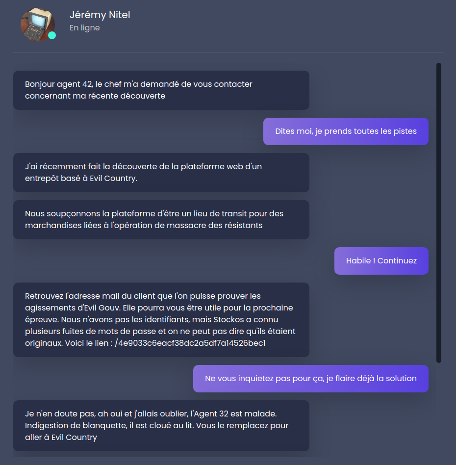


We are presented with two websites:

* Stockos, a fictional inventory management platform: https://challengecybersec.fr/4e9033c6eacf38dc2a5df7a14526bec1
* Air Evil, a fictional airline company's website: https://challengecybersec.fr/35e334a1ef338faf064da9eb5f861d3c

Both websites have to be exploited in some way. The goal is to book a flight on the Air Evil website, so let's check out that one first.

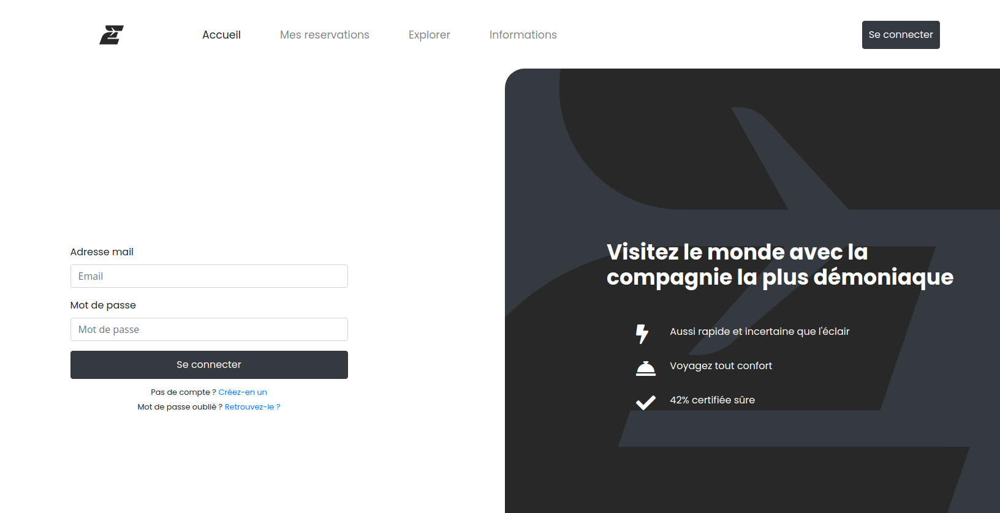

To make a reservation, we need to create an account and activate it:


However, we are not allowed to book flights with this account.


We need to either hack our account's authorization status, or find an existing account that is already authorized.

Since we are told that we will need information from the first website, Stockos, let's go investigate it now.

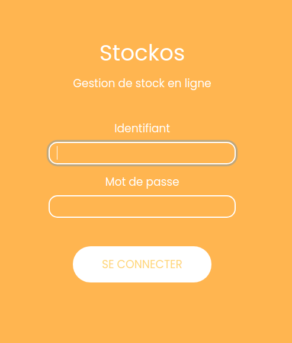

According to the chat messages from earlier, the logins for this are weak. `admin:admin` works:

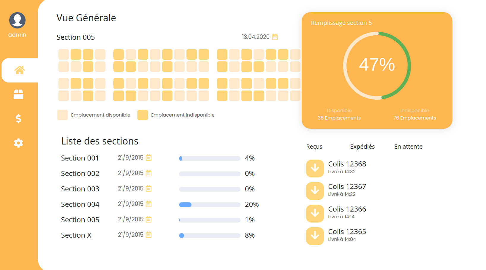

Once logged in, we also have access to a database query form:


The database probably holds the information we need for the other website, so let's try doing a query for `'` to see if the form is vulnerable to SQL injection:


Looks exploitable! Before building more queries, we can figure out which syntax the sql server uses for inline comments:

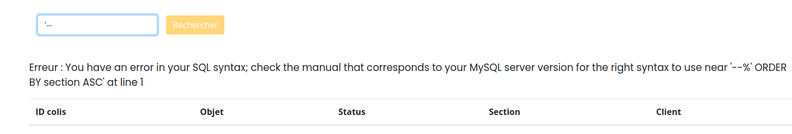

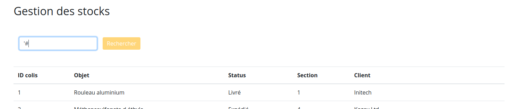

`'--` causes an error, but `'#` lets the query run fine, so the 2nd one is the correct comment syntax.

We can now start using UNION injections to query other tables, but first we need the table names.  
Rather than guessing, we can directly dump the list of tables with the following query:

```
' UNION ALL SELECT table_schema, table_name,NULL,NULL,NULL FROM information_schema.tables#
```

(When doing UNION ALL queries, all tables must be queried for the same number of columns, so we pad the column list with NULLs to match the column count of the original query.)

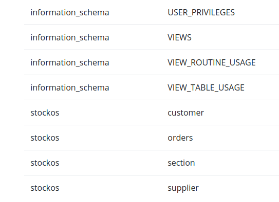

The customer database looks the most interesting, since we need account details for the other website; however, We don't know the columns of that table.

We could dump the `information_schema.columns` table to get them, but we can also try a SELECT * and hope that the `customer` table has exactly 5 columns already:

```
' UNION ALL SELECT * FROM customer#
```

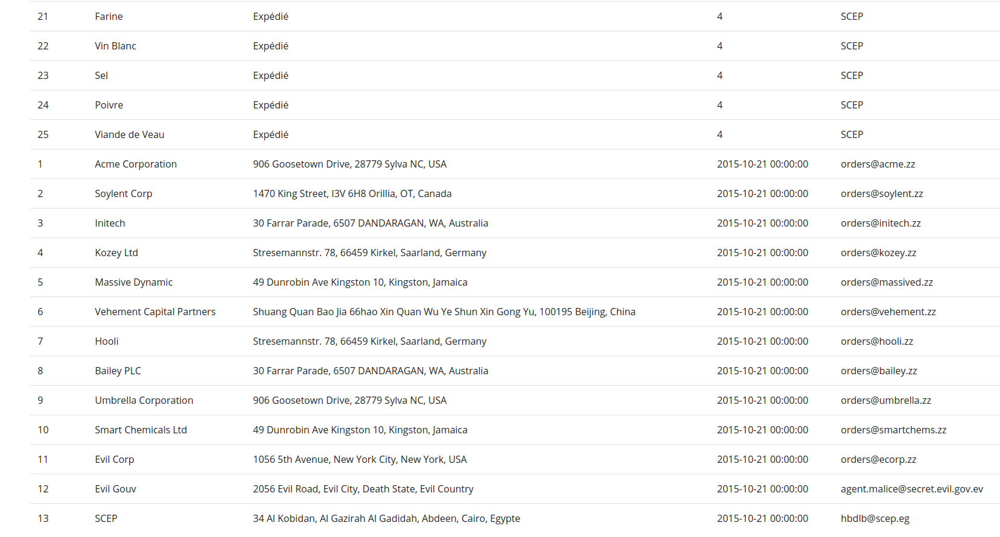

Success! We have an interesting looking email, `agent.malice@secret.evil.gov.ev`, which surely is the email of an authorized account on the Air Evil website. When we try to log in with that email, we get an "Incorrect password" error, instead of an "Email cannot be found" error, so this confirms the account exists. Creating a new account with that email address also fails, saying the account already exists.

Unfortunately, we still don't have its password. Let's try asking for a password reset:


Let's also ask for a password reset on the account we created earlier, to see what the email looks like:


The first noticeable thing is that the base64-looking string in the url is the exact same as the one that was in the activation mail.  
This is suspicious, so let's see if it decodes into anything:

```bash
└─[$] base64 -d <<<"eGFiZW45NjEwNUBydmVtb2xkLmNvbQ=="
xaben96105@rvemold.com%
```

That's just the temporary email I used to create the account. In other words, the activation/password reset "token" is just the email in base64!  
We can therefore directly access the reset url for the malice email:

```bash
└─[$] echo -n "agent.malice@secret.evil.gov.ev" | base64   # don't add a newline at the end
YWdlbnQubWFsaWNlQHNlY3JldC5ldmlsLmdvdi5ldg==
```

https://challengecybersec.fr/35e334a1ef338faf064da9eb5f861d3c/reset/YWdlbnQubWFsaWNlQHNlY3JldC5ldmlsLmdvdi5ldg== ":

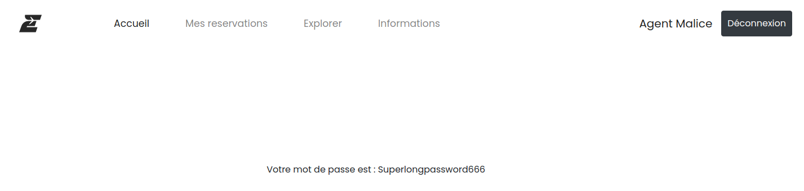

Using that password to log in:


We are authorized, and we can make the reservation we want:

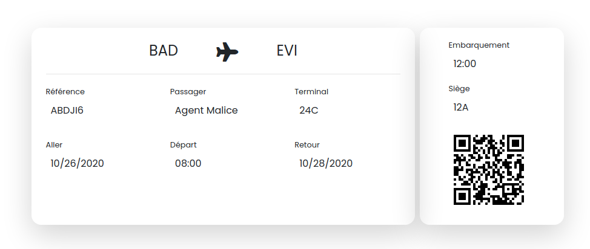

The [QR code](1-airevil/flag.png) then decodes into the flag we need:


Finally, entering this flag into the chat gives us the next step of the challenge.


---

For this part, we get a network traffic capture log file, [capture.pcap](2-satan_pcap/capture.pcap). 

Opening it with wireshark, we see that all the traffic inside is encrypted through TLS:

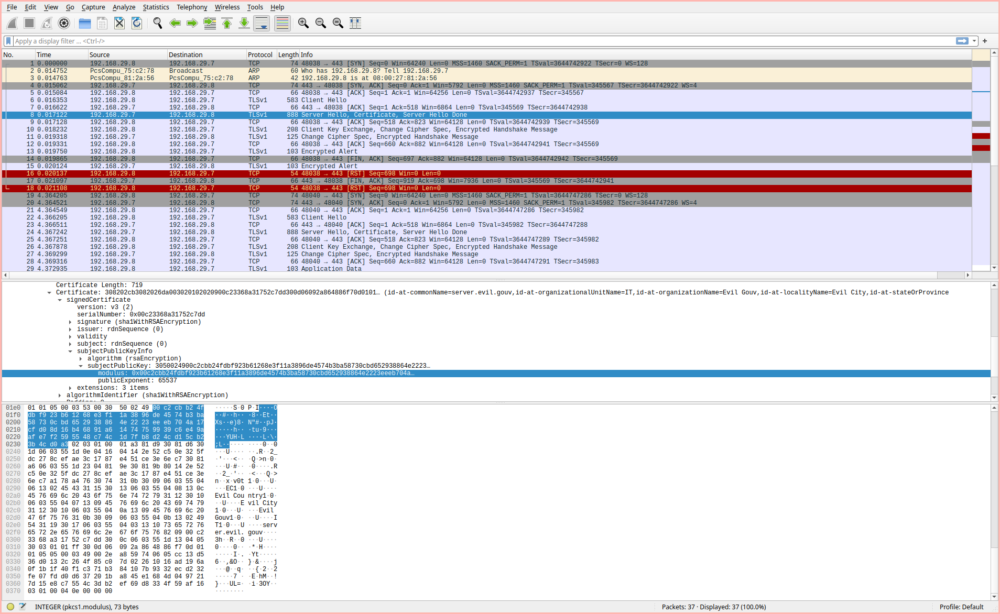

However, the modulus used for the public key is weak; It's [RSA-576](https://en.wikipedia.org/wiki/RSA_numbers#RSA-576), whose factors are well known:
```
p=398075086424064937397125500550386491199064362342526708406385189575946388957261768583317
q=472772146107435302536223071973048224632914695302097116459852171130520711256363590397527
```
We can use this to rebuild the [private key](2-satan_pcap/private.pem). I used https://stalkr.net/files/codegate/2010/7/create_private.c and e_os.h to do so, but there are probably alternatives.

```bash
└─[$] gcc -lssl -lcrypto -L /usr/lib/openssl-1.0 -I/usr/include/openssl-1.0 -o create_private create_private.c
└─[$] ./create_private
```

In wireshark, we can load that private key to automatically decode encrypted TLS traffic: 


With that key added in, opening [capture.pcap](2-satan_pcap/capture.pcap) will show the decrypted traffic:

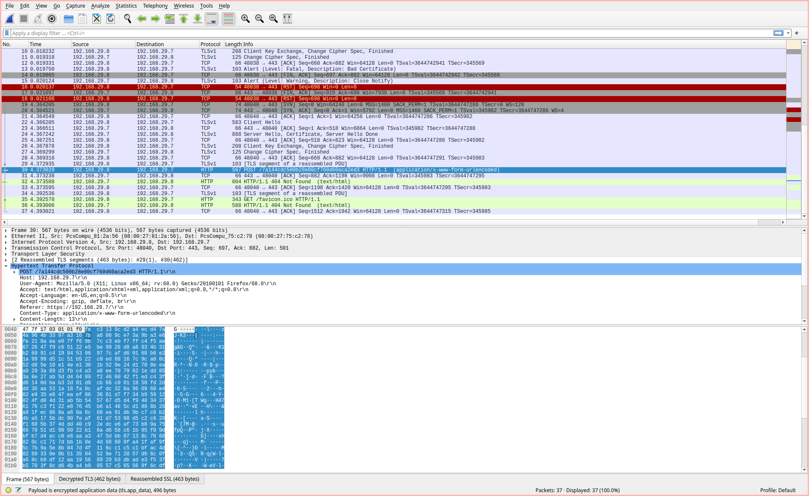

We see a POST request being made to `/7a144cdc500b28e80cf760d60aca2ed3`, which gives the url to the main CTF part of the challenge.
