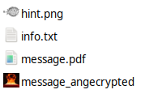
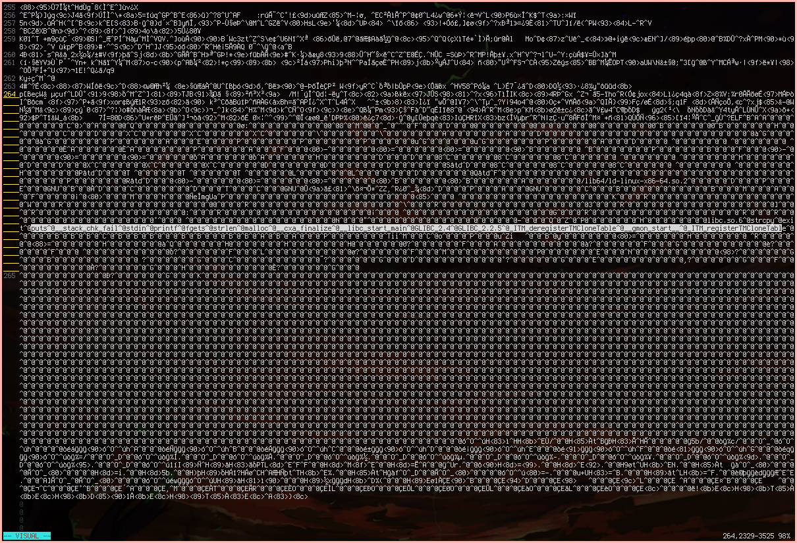
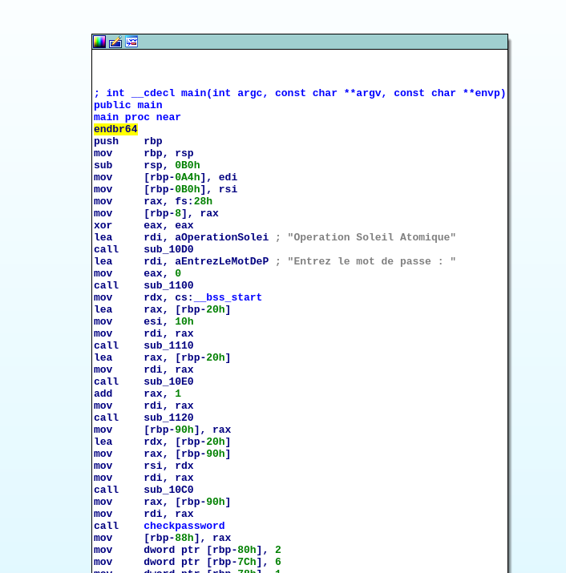
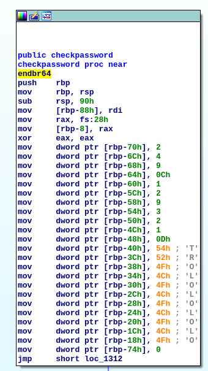
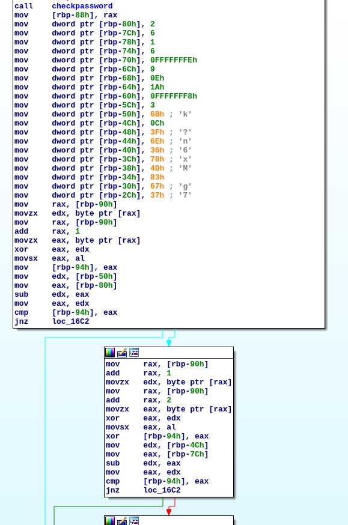

Le Polyglotte
=============

**Category** : Stegano  
**Score** : 150 points  
**Solved** : 115 times  

---

>Nous avons intercepté un fichier top secret émanant d'Evil Country, il est très certainement en rapport avec leur programme nucléaire. Personne n'arrive à lire son contenu.
>
>Pouvez-vous le faire pour nous ? Une archive était dans le même dossier, elle peut vous servir
>
>Le flag est de la forme : DGSESIEE{x} avec x un hash que vous trouverez

---

### Files

 * [message.pdf](message.pdf) (e5aa5c189d3f3397965238fbef5bc02c889de6d5eac713630e87377a5683967c)
 * [secrets.zip](secrets.zip) (ae5877bb06ac9af5ad92c8cd40cd15785cbc7377c629ed8ec7443f251eeca91f)


message.pdf is a polyglot file, that is, a file that simultaenously contains multiple valid file formats. Opening in a text editor, it starts out with a PDF file header, some html, pdf contents, more html, and a big blob of binary data. Extracting the parts that look interesting, we have:

```html

<head>
	<title>Flag</title>
	<meta charset="utf-8">
</head>
<body>
<script>var flag = [91,48,93,97,97,57,51,56,97,49,54];</script>
<!--
```
```pdf
7 0 obj
<< /Length 50 >>
stream
BT
/F1 50 Tf
10 400 Td
0 0 0 rg
<5b 31 5d 34 64 38 36 32 64 35 61> Tj
ET
endstream
endobj
```
```pdf
9 0 obj
<< /Length 50 /MediaBox [0 0 20 20]
>>
stream
BT
/F1 9 Tf
30 600 Td
1 0 0 700 0 0 Tm
0 0 0 rg
<43 65 20 64 6f 63 75 6d 65 6e 74 20 63 6f 6e 63 65 72 6e 65 20 6c 20 6f 70 65 72 61 74 69 6f 6e 20 73 6f 6c 65 69 6c 20 61 74 6f 6d 69 71 75 65 2e 0a 43 65 74 74 65 20 6f 70 65 72 61 74 69 6f 6e 20 65 73 74 20 73 74 72 69 63 74 65 6d 65 6e 74 20 63 6f 6e 66 69 64 65 6e 74 69 65 6c 6c 65 20 65 74 20 6e 65 20 64 6f 69 74 20 65 6e 20 61 75 63 75 6e 20 63 61 73 20 ea 74 72 65 20 64 65 76 6f 69 6c 65 65 2e 20 0a 4c 65 73 20 69 6e 66 6f 72 6d 61 74 69 6f 6e 73 20 73 75 72 20 6c 20 6f 70 65 72 61 74 69 6f 6e 20 73 6f 6e 74 20 64 69 73 73 65 6d 69 6e e9 65 73 20 64 61 6e 73 20 63 65 20 66 69 63 68 69 65 72 2e 0a 43 68 61 71 75 65 20 70 61 72 74 69 65 20 64 65 20 6c 20 69 6e 66 6f 72 6d 61 74 69 6f 6e 20 65 73 74 20 69 64 65 6e 74 69 66 69 65 65 20 70 61 72 20 75 6e 20 6e 6f 6d 62 72 65 20 70 61 72 20 65 78 20 3a 20 0a 5b 30 5d 61 65 37 62 63 61 38 65 20 63 6f 72 72 65 73 70 6f 6e 64 20 61 20 6c 61 20 70 72 65 6d 69 e8 72 65 20 70 61 72 74 69 65 20 64 65 20 6c 20 69 6e 66 6f 72 6d 61 74 69 6f 6e 20 71 75 20 69 6c 20 66 61 75 74 20 63 6f 6e 63 61 74 65 6e 65 72 20 61 75 20 72 65 73 74 65 2e> Tj
ET
endstream
endobj
```
```html
--!>
 <script>for(i=0;i<flag.length;i++){flag[i] = flag[i]+4} alert(String.fromCharCode.apply(String, flag));</script>
<body>
</html>
```

Converting those decimal and hex strings to ascii:

```python
>>> ''.join(chr(x) for x in [91,48,93,97,97,57,51,56,97,49,54])
'[0]aa938a16'

>>>''.join([chr(int(x,16)) for x in "5b 31 5d 34 64 38 36 32 64 35 61".split(' ')])
'[1]4d862d5a'

>>> print(''.join(chr(int(x,16)) for x in "43 65 20 64 6f 63 75 6d 65 6e 74 20 63 6f 6e 63 65 72 6e 65 20 6c 20 6f 70 65 72 61 74 69 6f 6e 20 73 6f 6c 65 69 6c
...  20 61 74 6f 6d 69 71 75 65 2e 0a 43 65 74 74 65 20 6f 70 65 72 61 74 69 6f 6e 20 65 73 74 20 73 74 72 69 63 74 65 6d 65 6e 74 20 63 6f 6e 66 69 64 65 6e 7
... 4 69 65 6c 6c 65 20 65 74 20 6e 65 20 64 6f 69 74 20 65 6e 20 61 75 63 75 6e 20 63 61 73 20 ea 74 72 65 20 64 65 76 6f 69 6c 65 65 2e 20 0a 4c 65 73 20 69 
... 6e 66 6f 72 6d 61 74 69 6f 6e 73 20 73 75 72 20 6c 20 6f 70 65 72 61 74 69 6f 6e 20 73 6f 6e 74 20 64 69 73 73 65 6d 69 6e e9 65 73 20 64 61 6e 73 20 63 65
...  20 66 69 63 68 69 65 72 2e 0a 43 68 61 71 75 65 20 70 61 72 74 69 65 20 64 65 20 6c 20 69 6e 66 6f 72 6d 61 74 69 6f 6e 20 65 73 74 20 69 64 65 6e 74 69 6
... 6 69 65 65 20 70 61 72 20 75 6e 20 6e 6f 6d 62 72 65 20 70 61 72 20 65 78 20 3a 20 0a 5b 30 5d 61 65 37 62 63 61 38 65 20 63 6f 72 72 65 73 70 6f 6e 64 20 
... 61 20 6c 61 20 70 72 65 6d 69 e8 72 65 20 70 61 72 74 69 65 20 64 65 20 6c 20 69 6e 66 6f 72 6d 61 74 69 6f 6e 20 71 75 20 69 6c 20 66 61 75 74 20 63 6f 6e
...  63 61 74 65 6e 65 72 20 61 75 20 72 65 73 74 65 2e".split(' ')))
Ce document concerne l operation soleil atomique.
Cette operation est strictement confidentielle et ne doit en aucun cas être devoilee. 
Les informations sur l operation sont disseminées dans ce fichier.
Chaque partie de l information est identifiee par un nombre par ex : 
[0]ae7bca8e correspond a la première partie de l information qu il faut concatener au reste.
```

So we know we're going to be looking for multiple flags to concatenate together, and we already got two of them.

We also have another file, [secrets.zip](secrets.zip), which is password-protected. A quick john run with rockyou makes short work of it:

```bash
└─[$] zip2john secrets.zip > secrets.hash
└─[$] john --wordlist=/usr/share/dict/rockyou.txt --session=secrets secrets.hash 
Using default input encoding: UTF-8
Loaded 1 password hash (PKZIP [32/64])
Will run 12 OpenMP threads
Press 'q' or Ctrl-C to abort, almost any other key for status
finenuke         (secrets.zip)
1g 0:00:00:00 DONE (2020-11-14 08:12) 1.408g/s 9241Kp/s 9241Kc/s 9241KC/s fichota..firstlove08
Use the "--show" option to display all of the cracked passwords reliably
Session completed
```

Extracting the zip with password 'finenuke', we find two files: [hint.png](hint.png) and [info.txt](info.txt).


[info.txt](info.txt) has the 3rd flag and some more stuff:

```
Ange Albertini
key='\xce]`^+5w#\x96\xbbsa\x14\xa7\x0ei'
iv='\xc4\xa7\x1e\xa6\xc7\xe0\xfc\x82'
[3]4037402d4
```

Looking up "Ange Albertini" on google, we find these:

 * https://www.slideshare.net/ange4771/when-aes-episode-v
 * https://www.youtube.com/watch?v=wbHkVZfCNuE

So angecryption is a stegano technique that lets you can hide an encrypted file inside another valid file, so that when you reverse the encryption of the whole file, you get another valid file as output.
We happen to have a file, message.pdf that has a big blob of binary data at the end, so we can try encrypting that with Blowfish, with the given key and IV to see if it reveals anything:

```bash
└─[$] openssl bf-cbc -iv c4a71ea6c7e0fc82 -K ce5d605e2b35772396bb736114a70e69 -in message.pdf -out message_angecrypted
```

No error, that's promising. What's more, my file browser immediately generated an image thumbnail for the file, so we know we got something.




```bash

└─[$] xxd message_angecrypted | less
00000000: ffd8 fffe 0998 0000 9258 aec3 a53e e525  .........X...>.%
00000010: d880 2e73 69bd 6385 f20f d406 1738 373f  ...si.c......87?
00000020: 8058 0bec 421e 4ab6 7584 f2a2 0813 b24d  .X..B.J.u......M
...
```

[message_angecrypted](message_angecrypted) starts with the bytes ffd8, which is the JPEG header magic bytes, immediately followed by fffe 0998 0000, which indicates a comment block 0x998 bytes long; that's where the "pdf/html" part of the message goes, since it's now garbled after being passed through blowfish. But since it's in a comment block, image viewers can just ignore it.

```bash
...
00000950: 670b 3557 f5f3 3fe2 8266 2723 9ea3 b7e2  g.5W..?..f'#....
00000960: 2be1 5994 78de d185 6453 f3a1 d7c8 4334  +.Y.x...dS....C4
00000970: 9b2b 572e 031c 13d5 bd69 8394 4a23 5a9e  .+W......i..J#Z.
00000980: f177 dd8e c661 032c eeb6 88ea 5de9 2a2b  .w...a.,....].*+
00000990: fd4d d49b b5e9 e9d1 0d43 b3b4 ebdf b56d  .M.......C.....m
000009a0: ffe0 0010 4a46 4946 0001 0101 012c 012c  ....JFIF.....,.,
000009b0: 0000 ffdb 0043 0005 0304 0404 0305 0404  .....C..........
000009c0: 0405 0505 0607 0c08 0707 0707 0f0b 0b09  ................
000009d0: 0c11 0f12 1211 0f11 1113 161c 1713 141a  ................
```

Sure enough, 0x998+8 bytes in the file, we see the more common FFE0 block containing JPEG metadata, and the usual JFIF ascii marker. 

An interesting polyglot feature of the JPEG format is that you're free to append anything at the end of the file, so let's have a look there :



That doesn't look like jpg data, more like a linux executable. We can search for the linux executable format's header 4 magic bytes, `<DEL>ELF (0x7f454c46)`, and strip everything before that to get a runnable executable.

```bash
└─[$] ./message_executable
Operation Soleil Atomique
Entrez le mot de passe : nicenuke
Mauvais mot de passe
```

It wants a password, and `strings` doesn't show anything, so off to your disassembler of choice to try and see what's going on.

<center></center>

Not totally sure why IDA won't give proper names for all the sub_XXXX functions, but those are basically puts, fgets, strcpy, malloc, nothing unexpected for printing out some strings and getting user input.

<center></center>

That checkpassword function, though, is a red herring. The actual password check is down there in main:

<center></center>

Which translates roughly to this:

```c
char pass[10]; // input password
    int offsets[10] = {2, 6, 1, 6, -2, 9, 14, 26, -8, 3};
    int bytes[10] = {0x6B, 0x0C, 0x3F, 0x6E, 0x36, 0x78, 0x4D, 0x83, 0x67, 0x37};
    char tmp = 0;
    for(int i=0; i<9; i++) {
        tmp ^= pass[i] ^ pass[i+1];
        if (tmp != (bytes[i] - offsets[i])) { /* wrong password, exit out */ }
}
if (pass[9] != bytes[9] - offsets[9]) { /* wrong password, exit out */ }
```

Each byte of the password is cumulatively XOR'd with the following byte, and the current result is compared against a hardcoded value - except for the last byte, which is directly compared. Because tmp gets XOR'd twice with each byte after the first, it telescopes out to this:

```c
char tmp = 0;
for(int i=0; i<9; i++) {
	tmp = pass[0] ^ pass[i+1];
	if (tmp != bytes[i]-offsets[i]) { /* wrong password, exit out */ }
}
if (pass[9] != bytes[9] - offsets[9]) { /* wrong password, exit out */ }
```

We know pass[9] == bytes[9] - offsets[9], and when i=8, we have pass[0] ^ pass[9] == bytes[8]-offsets[8], so we have pass[0] as well, and therefore all the bytes of the password:

```c
char pass[11]; // input password, including null byte for printing
int offsets[10] = {2, 6, 1, 6, -2, 9, 14, 26, -8, 3};
int bytes[10] = {0x6B, 0x0C, 0x3F, 0x6E, 0x36, 0x78, 0x4D, 0x83, 0x67, 0x37};

pass[9] = bytes[9] - offsets[9];
pass[0] = pass[9] ^ (bytes[8] - offsets[8]);
for(int i=0; i<9; i++) {
    pass[i+1] = pass[0] ^ (bytes[i] - offsets[i]);
}
puts(pass); // [2]e3c4d24
```

We now have four flags:

```
[0]aa938a16   // from the html in message.pdf
[1]4d862d5a   // from the pdf objects in message.pdf
[2]e3c4d24    // from reverseing the the executable
[3]4037402d4  // from info.txt inside the zip
```

That we concatenate into the final flag, DGSESIEE{aa938a164d862d5ae3c4d244037402d4}.

---

Very nice challenge. I didn't know about Angecryption, that's such a cool trick. 

What a long write-up for a 150 points challenge!
