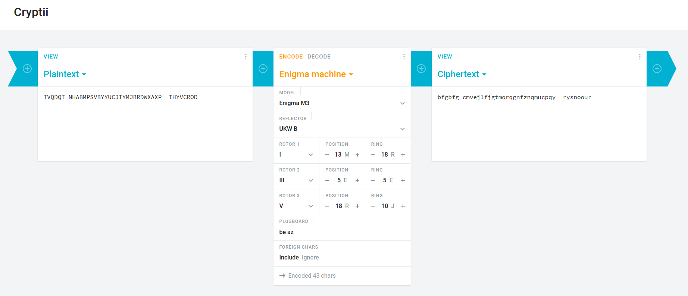
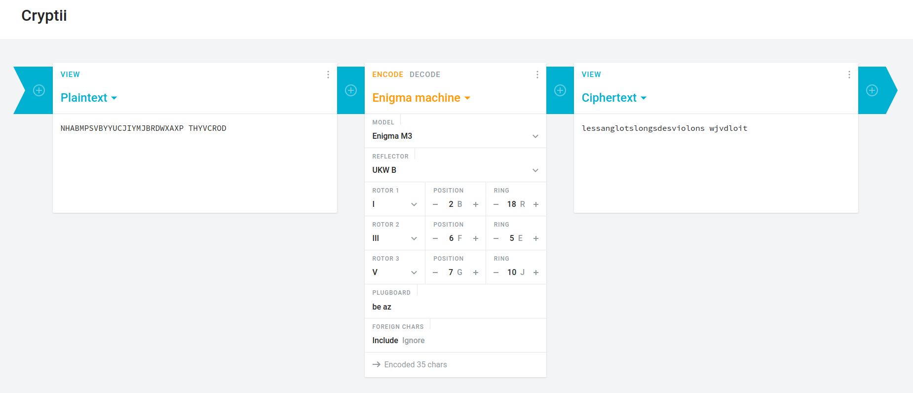

L'énigme de la crypte
=====================

**Category** : Crypto  
**Score** : 200 points  
**Solved** : 46 times  

---

>Une livraison de souffre doit avoir lieu 47°N 34 2°W 1 39.
>
>Elle sera effectuée par un certain REJEWSKI. Il a reçu des instructions sur un foulard pour signaler à Evil Gouv son arrivée imminente.
>
>Nous avons une photo du foulard, mais celle-ci n'est pas très nette et nous n'avons pas pu lire toutes les informations. Le fichier foulard.txt, est la retranscription du foulard.
>
>Nous avons un peu avancé sur les parties illisibles :
>
>(texte illisible 1) est deux lettres un espace deux lettres. Il pourrait y avoir un lien avec le dernier code d'accès que vous avez envoyé à Antoine Rossignol.
>
>(texte illisible 2) a été totalement effacé et enfin (texte illisible 3) semble être deux lettres.
>
>REJEWSKI vient d'envoyer un message (final.txt). Il faut que vous arriviez à le déchiffrer. Je vous conseille d'utiliser openssl pour RSA.
>
>Le flag est de la forme DGSESIEE{MESSAGE} où MESSAGE correspond à la partie centrale du texte en majuscules sans espace.

---

### Files

 * [final.txt](final.txt) (1e93526cd819aedb8496430a800a610068e95762536b0366ca7c303a74eaab03)
 * [foulard.txt](foulard.txt) (9c8b0caf9d72fa68ddb6b4a68e860ee594683f7fe4a01a821914539ef81a1f21)

final.txt is an encrypted file.
foulard.txt contains the following:

>Mission Scherbius
>
>Chiffrez un message suivi de votre nom avec la machine de type M3 avec cette disposition :
>
>Uniquement les impairs en ordre croissant
>Ringstellung : REJ
>Steckerverbindungen : (texte illisible 1)
>Grundstellung : MER
>(texte illisible 2): B(texte illisible 3)
>
>Le résultat (texte) doit être ensuite chiffré avec RSA en utilisant notre clé publique avant de nous l'envoyer. Je vous rappelle notre clé publique :
>
>Modulus (décimal):
>
>25195908475657893494027183240048398571429282126204032027777137836043662020707595556264018525880784406918290641249515082189298559149176184502808489120072844992687392807287776735971418347270261896375014971824691165077613379859095700097330459748808428401797429100642458691817195118746121515172654632282216870038352484922422622979684865170307405907272815653581732377164114195025335694039872221524699156538352092782201392513118326772302632498764753996118057437198905106508696675497143847180616766425109043955104189270381382844602871223783458512671511503420521749067165952916834014926827585314522687939452292676577212513301
>
>PublicExponent (décimal) : 65537

This modulus is weak: [Fermat's method](https://facthacks.cr.yp.to/fermat.html) immediately[¹](#1) factors it into

`p = 158732191050391204174482508661063007579358463444809715795726627753579970080749948404278643259568101132671402056190021464753419480472816840646168575222628947270302161138343957754574996070959235670661942404500680792678841762019555105315453800615468142560756025651432301649463625322248315792212286183936318080423`

and

`q = 158732191050391204174482508661063007579358463444809715795726627753579970080749948404278643259568101132671402056190021464753419480472816840646168575222628922072509317288610921313165983511118710663006195067967359930650798771955898733591259847660546621410836961591033768576235120772719980885978288100259351535587`

which lets us rebuild the private key, and decrypt final.txt with it. To create the private key, I used https://stalkr.net/files/codegate/2010/7/create_private.c and e_os.h to do so, but there are probably alternatives.

```bash
└─[$] gcc -lssl -lcrypto -L /usr/lib/openssl-1.0 -I/usr/include/openssl-1.0 -o create_private create_private.c
└─[$] ./create_private
└─[$] openssl rsautl -decrypt -inkey private.pem -in final.txt -out final_decrypted.txt 
```

final_decrypted.txt:

>IVQDQT NHABMPSVBYYUCJIYMJBRDWXAXP  THYVCROD

The [foulard.txt](foulard.txt) file mentions a M3 machine, which refers to [Enigma](https://en.wikipedia.org/wiki/Cryptanalysis_of_the_Enigma) - as does the name of the message author, [Rejewski](https://en.wikipedia.org/wiki/Marian_Rejewski).

>Uniquement les impairs en ordre croissant
>Ringstellung : REJ
>Steckerverbindungen : (texte illisible 1)
>Grundstellung : MER
>(texte illisible 2): B(texte illisible 3)

 * First line tells us we need rotors 1, 3 and 5;
 * Second line gives us the positions of the alphabet ring for each rotor, REJ;
 * Third line, the plugboard connections, is "XX XX", and we are told this might have something to do with the solution to the [Crypto intro](../0_intro_crypto) challenge, from which we got "b a:e z";
 * Fourth line gives the initial rotor positions, MER
 * Fifth line could refer either to the reflector plate (B), or to the [Indicator](https://en.wikipedia.org/wiki/Enigma_machine#Indicator) initialization vector.

Using those parameters on an [online Enigma simulator](https://cryptii.com/pipes/enigma-machine), we get the following decryption:



The first word is BFG repeated twice, which confirms we are on the right track, as this is how an indicator string would be used in early versions of the Enigma encryption scheme.

To decode the rest of the message, we then set the rotor positions to BFG, and obtain the flag string: `DGSESIEE{LESSANGLOTSLONGSDESVIOLONS}`.



---

The last word can be decoded to REJEWSKI with those same initial parameters, which is kind of strange - you'd expect both the flag and the last word to be decoded as a sequence.

However, since this word is known, this maybe allows for some sort of known plaintext attack, which might help recover some of the parameters of the machine, in case we were missing any.

---

>Une livraison de souffre doit avoir lieu 47°N 34 2°W 1 39.

I'm not sure if those coordinates mean anything.

---

¹: [maybe more about fermat factorization here]

ceil(sqrt(N))² - N is a square, so with:
a = ceil(sqrt(N))
b = sqrt(ceil(sqrt(N)) - N)
we have N = a² - b² = (a+b)*(a-b).

---

I somehow managed to completely forget the first clue that tells you which gears to pick, so I spent a lot of time just... bruteforcing the gears... Really dumb. I would have saved a LOT of time. 

Also at this point, I had to go back and solve the crypto intro challenge - however, that challenge was broken at the time I downloaded the files, so I lost a ton of time trying to solve the unsolvable... 

Even after I solved that, I managed to pair the wrong letters together and not realize that was the issue for a long time.
