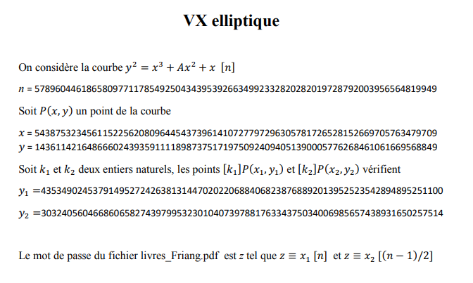

VX Elliptique
=============

**Category** : Crypto  
**Score** : 250 points  
**Solved** : 51 times  

---

>Nous avons intercepté 2 fichiers (VX_elliptique.pdf et livres_Friang.pdf) émis par un sous-marin d'Evil Gouv. La référence à Brigitte Friang ne peut être une coïncidence. Nous savons de source sure qu'Eve Descartes a été enlevée par Evil Gouv et est retenue dans un de leurs sous-marins dans l'océan Atlantique. Ce doit être elle qui a envoyé ces fichiers. Grâce à une de ses crises mathématiques, elle aura sûrement caché l'identification du sous-marin dans ces fichiers. Votre mission est de retrouver l'identification du sous-marin.
>
>Le flag est de la forme DGSESIEE{x} avec x le code d'identification

---

### Files

 * [VX_elliptique.pdf](VX_elliptique.pdf) (7995fc6529494734bae9e2a0b1800632bf9ebd41cbfab19ce23d834eabcf7523)
 * [livres_Friang.pdf](livres_Friang.pdf) (222a463aeb09ef4c0599b9448184e616462459baea327827469bc7b0dd738b75)



This elliptic curve looks like the commonly-used [Curve25519](https://en.wikipedia.org/wiki/Curve25519), (n = 2^255-19) which would mean A = 486662. We can plug in P's coordinates to verify.

Trying to find k1 and k2 would be solving the discrete log problem for an elliptic curve, which is not a good plan since P is of order 2^252.

However, we only need to get x1 and x2 from y1 and y2, and that only requires finding roots of a 3rd degree polynomial modulo [n]. It's surprisingly hard to find people on the internet explaining "how to get x coordinates from y on an elliptic curve", so I kind of had to wing it in sage:

```python
n = 2^255 - 19
A = 486662

R.<x,y> = GF(n)[]
p = y^2 - x^3 - A*x^2 - x
E = EllipticCurve(p)

xP = 54387532345611522562080964454373961410727797296305781726528152669705763479709
yP = 14361142164866602439359111189873751719750924094051390005776268461061669568849

assert(E.lift_x(xP) == E(xP,yP))

y1 = 43534902453791495272426381314470202206884068238768892013952523542894895251100
y2 = 30324056046686065827439799532301040739788176334375034006985657438931650257514

def lift_y(y_val):
	roots = p.subs({y:y_val}).univariate_polynomial().roots(multiplicities=False)
	return [E(x,y_val) for x in roots]
```

```python
sage: lift_y(y1)
[(54387532345611522562080964454373961410727797296305781726528152669705763479709 : 43534902453791495272426381314470202206884068238768892013952523542894895251100 : 1),
 (48377962721867712227812115825967814866900072246814115371447647755178792218507 : 43534902453791495272426381314470202206884068238768892013952523542894895251100 : 1),
 (13026594169836960633677904728346131575642115122520666941481783583028573455020 : 43534902453791495272426381314470202206884068238768892013952523542894895251100 : 1)]
```

```python
sage: lift_y(y2)
[(24592060322915955458376742075654918743307884467086758475495911637571571854426 : 30324056046686065827439799532301040739788176334375034006985657438931650257514 : 1)]
```

So we have x2, but there are 3 different points on the curve with y1 as y-coordinate. Nevertheless, if we have both x1 and x2, we can just apply the Chinese Remainder Theorem to get z, so it's quick enough[¹](#1) to manually try all 3 coordinates for x1:

```python
sage: x2 = 24592060322915955458376742075654918743307884467086758475495911637571571854426

sage: x1 = 54387532345611522562080964454373961410727797296305781726528152669705763479709
sage: CRT([x1,x2], [n, (n-1)//2])
1626912004825687681266928944940137740110044614947501502667974700957265876831665835249437745227202257555252761324145945972681589648893511804029315415851794

sage: x1 = 48377962721867712227812115825967814866900072246814115371447647755178792218507
sage: CRT([x1,x2], [n, (n-1)//2])
298866324658067043152535979487281689346418895898703530005178331141609468368515196383762924558049325643319211125756093104393630525207165166469723912137964

sage: x1 = 13026594169836960633677904728346131575642115122520666941481783583028573455020
sage: CRT([x1,x2], [n, (n-1)//2])
669594744434241509260428824541316709656639804114134854927746139613649946258056910180935366203703863781306641125198724424226805412500527449207424152005314

```

The first result, 1626912004825687681266928944940137740110044614947501502667974700957265876831665835249437745227202257555252761324145945972681589648893511804029315415851794, is the correct password for [livres_friang.pdf](livres_friang.pdf).


The flag is easily visible in the barcode of the 2nd book.

---

I don't know anything about elliptic curves! If I did, this would probably have been trivial.

I also feel like I missed some tricks² that could have made this easier, but it was still fairly simple, just a lot of lost time being frustrated with sage's documentation.

---

<a name="1">¹</a>: To eliminate the other 2 possibilities, since we know that P(x1,y1) is supposed to be a multiple of P, it must have the same order as P. Fortunately that's computationally easy to check:

```python
sage: [p1.order() == P.order() for p1 in lift_y(y1)]
[True, False, False]
```

So we could have known right then and there that the first solution was the only correct one.

But it's fast enough to just try them all, so...

---

<a name="2">²</a>: For some reason, out of the 3 possible coordinates for x1, the working one just happens to be P's x-axis mirror (same x coordinate, but y coordinate is the other square root of y²).

That's probably not a coincidence. Maybe you were meant to notice that y1+yP = n ? Maybe there's something similar about (x2,y2) that makes x2 really fast to find.

In any case, once you know what you're doing with sage (god, that documentation is awful), it's pretty fast to get x1 and x2.

