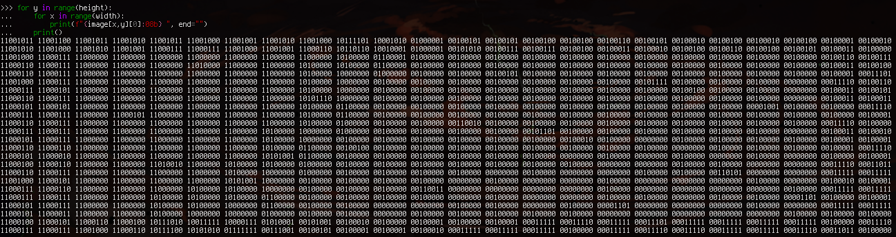
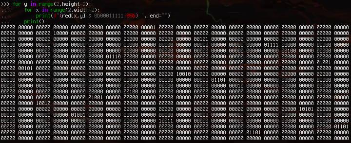
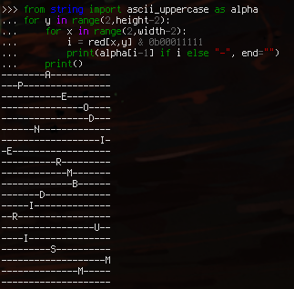

Automatos
=========

**Category** : Stegano  
**Score** : 300 points  
**Solved** : 28 times  

---

>Un de nos agents ne répond plus depuis quelques jours, nous avons reçu un mail avec une photo d'archives de Brigitte Friang. Cela ne peut pas être une coïncidence. Il a certainement cherché à cacher des informations dans l'image. Nous devons le secourir au plus vite, il est certainement en danger et sur écoute.
>
>Le flag est juste une chaîne de caractères

---

### Files

 * [brigitte.png](brigitte.png) (31b88d96ff54ef15e6c995aac5a1759068ac8ba43d3cbdf561c7ea44ab42d735)


Nothing suspicious shows up when looking at the file in a hex editor, or when trying to dump metadata; this is a stegano challenge, so let's run it through [stegsolve](http://www.caesum.com/handbook/Stegsolve.jar) to see if anything has been directly done to the pixels:


Something interesting is happening in the low bits of the red channel. Let's cut [that square](brigitte_suspicious_square.png) out, with a 2px wide margin on the sides for comparison, then dump the raw pixel data for the red channel and see what's going on:

```python
from PIL import Image
im = Image.open("brigitte_suspicious_square.png").load()
width, height = im.size
red = im.split()[0].load()

for y in range(height):
	for x in range(width):
		print(f"{red[x,y]:08b} ", end="")
	print()
```



The first 3 bits in the square look ok (as we saw in stegsolve), but the lower 5 bits are tampered with. Isolating them:

```python
for y in range(2,height-2):
	for x in range(2,width-2):
		print(f"{red[x,y] & 0b00011111 :05b} ", end="")
	print()
```



5 bits (32 chars) is a little bit bigger than the alphabet (26 letters), but interestingly, no value here is bigger than 26 (0b11010), so we might have letters on our hand.



Unfortunately, they don't seem to spell anything useful.

There's another unusual thing, however: aside from the first column and last line, there is exactly one non-zero element in each row/column<a name="1b">[¹](#1)</a> (this is perhaps easier to see in the previous picture).

This is where the name of the challenge gives us the clue we need: Automatos, as in, [finite automata](https://en.wikipedia.org/wiki/Deterministic_finite_automaton), as in, [state transition table](https://en.wikipedia.org/wiki/State-transition_table).

Indeed, if we consider each letter as being an entry in a 2d transition table, where the rows indicate the start state and the columns indicate the end state:

```
   0  1  2  3  4  5  6  7  8  9 10 11 12 13 14 15 16 17 18 19
 0 -  -  -  -  -  -  -  -  A  -  -  -  -  -  -  -  -  -  -  -
 1 -  -  -  P  -  -  -  -  -  -  -  -  -  -  -  -  -  -  -  -
 2 -  -  -  -  -  -  -  -  -  -  -  E  -  -  -  -  -  -  -  -
 3 -  -  -  -  -  -  -  -  -  -  -  -  -  -  -  O  -  -  -  -
 4 -  -  -  -  -  -  -  -  -  -  -  -  -  -  -  -  D  -  -  -
 5 -  -  -  -  -  -  N  -  -  -  -  -  -  -  -  -  -  -  -  -
 6 -  -  -  -  -  -  -  -  -  -  -  -  -  -  -  -  -  -  I  -
 7 -  E  -  -  -  -  -  -  -  -  -  -  -  -  -  -  -  -  -  -
 8 -  -  -  -  -  -  -  -  -  -  R  -  -  -  -  -  -  -  -  -
 9 -  -  -  -  -  -  -  -  -  -  -  -  M  -  -  -  -  -  -  -
10 -  -  -  -  -  -  -  -  -  -  -  -  -  B  -  -  -  -  -  -
11 -  -  -  -  -  -  -  D  -  -  -  -  -  -  -  -  -  -  -  -
12 -  -  -  -  -  I  -  -  -  -  -  -  -  -  -  -  -  -  -  -
13 -  -  R  -  -  -  -  -  -  -  -  -  -  -  -  -  -  -  -  -
14 -  -  -  -  -  -  -  -  -  -  -  -  -  -  -  -  -  U  -  -
15 -  -  -  -  I  -  -  -  -  -  -  -  -  -  -  -  -  -  -  -
16 -  -  -  -  -  -  -  -  -  S  -  -  -  -  -  -  -  -  -  -
17 -  -  -  -  -  -  -  -  -  -  -  -  -  -  -  -  -  -  -  M
18 -  -  -  -  -  -  -  -  -  -  -  -  -  -  M  -  -  -  -  -
19 -  -  -  -  -  -  -  -  -  -  -  -  -  -  -  -  -  -  -  -
```

This unexpectedly<a name="2b">[²](#2)</a> gives us a nice chain of transitions: 

 * A is a transition from state 0 to state 8,
 * R is a transition from state 8 to state 10,
 * B is a transition from state 10 to state 13,
 * R is a transition from state 13 to state 2,
 * E is a transition from state 2 to state 11,
 * ...

And so on through all letters, giving us the flag sentence: `ARBREDEPOIDSMINIMUM`.

---

<a name="1">[¹](#1b)</a>: I noticed this very quickly but still got stuck for a loooong time. Blame lack of sleep.

<a name="2">[²](#2b)</a>: It's very much *not* a given that a table with exactly one entry per row/column makes a chain of transitions that go through every possible state; you could imagine for example, a table with a transition in row 4 / column 4, which would make a loop from state 4 to itself and be unreachable from any other state. So even in cases where we didn't quite decode the letters correctly (I was off by one char the whole time), the fact that we are going through all states is super telling that it's the correct thing to do.

--- 

#### process

Very cool challenge. I lost a bunch of time having to caesar everything I tried, due to not being sure whether I had the correct offset for the integer to alphabeT conversion ; It's happened two or three times now on different challenges that when I'm in a situation where I have to generate a lot of possible candidate solutions, I tend to get lost in doing that, and I have a hard time stepping back and noticing the clues that point to the one "correct" solution.
