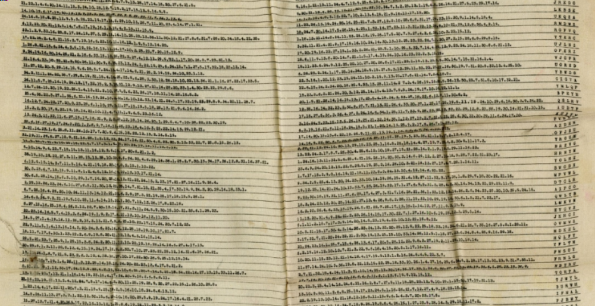

Steganosaurus
=============

**Category** : Forensic  
**Score** : 400 points  
**Solved** : 52 times  

---

>Nos agents ont trouvé dans le camion de livraison une clef USB. Nous vous transférons le filesystem de cette dernière et espérons que votre grande capacité de réflexion pemettra de révéler les secrets les plus sombres d'Evil Country !
>
>Le flag est de la forme DGSEESIEE{x} avec x une chaine de caractères. (Attention au DGEESIEE, une erreur de typo s'est glissée dans le flag)

---

### Files

 * message (100MB, too large to go on github) (3889febebd6b1d35c057c3ba3f6f722798f029d6d0321b484305922a3d55d4d8)

```bash
└─[$] file message
message: DOS/MBR boot sector, code offset 0x58+2, OEM-ID "mkfs.fat", Media descriptor 0xf8, sectors/track 32, heads 64, hidden sectors 7256064, sectors 266240 (volumes > 32 MB), FAT (32 bit), sectors/FAT 2048, reserved 0x1, serial number 0xccd8d7cd, unlabeled
```

message is a disk image. We can mount it and check out what's inside:

```bash
└─[$] mkdir image
└─[$] mount message image
└─[$] tree -a image
image
├── readme
├── steganausorus.apk
└── .Trash-1000
    ├── files
    │   └── flag.png
    └── info
        └── flag.png.trashinfo
```

The trash folder has an interesting file called flag.png:



The [readme](readme) file reads:

```
Bonjour evilcollegue !
Je te laisse ici une note d'avancement sur mes travaux !
J'ai réussi à implémenter complétement l'algorithme que j'avais présenté au QG au sein d'une application.
Je te joins également discrétement mes premiers résultats avec de vraies données sensibles ! Ils sont bons pour la corbeille mais ça n'est que le début !
Je t'avertis, l'application souffre d'un serieux defaut de performance ! je m'en occuperai plus tard.
contente-toi de valider les résultats.
Merci d'avance

For the worst,

QASKAB
```

[steganausorus.apk](steganausorus.apk) is an android application package file. You can install it on a phone, or run it in an android virtual machine to see what it looks like, but more importantly apk files are just archives, so you can extract their contents with [apktool](https://ibotpeaches.github.io/Apktool/):

```bash
└─[$] apktool d steganausorus.apk 
I: Using Apktool 2.4.1 on steganausorus.apk
I: Loading resource table...
I: Decoding AndroidManifest.xml with resources...
I: Loading resource table from file: /home/narthorn/.local/share/apktool/framework/1.apk
I: Regular manifest package...
I: Decoding file-resources...
I: Decoding values */* XMLs...
I: Baksmaling classes.dex...
I: Copying assets and libs...
I: Copying unknown files...
I: Copying original files...
```

Looking around in the decompressed apk, we find out the app is written in Flutter, a framework for Android applications. If it was compiled in debug mode, this [means](https://medium.com/@rondalal54/reverse-engineering-flutter-apps-5d620bb105c0) all of its source code will be stored in plaintext alongside the bytecode of the app, in the file `/assets/flutter_assets/kernel_blob.bin`.

So we can dump all the plaintext strings of the file and search for a relevant string (like "Steganausorus") to we find the actual app's code ([steganosaurus.dart](steganosaurus.dart)):

```dart
└─[$] strings steganausorus/assets/flutter_assets/kernel_blob.bin | less
...
package:process/src/interface/process_wrapper.dart(file:///D:/stegapp/stegapp/lib/main.dart
.// Copyright 2018 The Flutter team. All rights reserved.
// Use of this source code is governed by a BSD-style license that can be
// found in the LICENSE file.
import 'dart:convert';
import 'dart:math';
import 'dart:ui';
import 'package:flutter/services.dart';
import 'package:image/image.dart' as A;
import 'package:flutter/cupertino.dart';
import 'package:flutter/material.dart';
import 'package:image_picker/image_picker.dart';
import 'dart:io';
import 'package:path_provider/path_provider.dart';
import 'package:color/color.dart';
void main() => runApp(MyApp());
// #docregion MyApp
class MyApp extends StatelessWidget {
  // #docregion build
  @override
  Widget build(BuildContext context) {
    return MaterialApp(
      title: 'Startup Name Generator',
      home: MyHomePage(),
    );
  class MyHomePage extends StatefulWidget {
  @override
  _MyHomePageState createState() => _MyHomePageState();
  class _MyHomePageState extends State<MyHomePage> {
  File _image;
  final picker = ImagePicker();
  bool _btnEnabled = false;
  final myController = TextEditingController();
  String tempPath;
  Future getImage() async {
  final pickedFile = await picker.getImage(source: ImageSource.gallery);
  setState(() {
  _image = File(pickedFile.path);
  });
  String MessageToBinaryString(String pMessage){
    String Result;
    Result="";
    List<int> bytes = utf8.encode(pMessage);
    bytes.forEach((item) { Result+=item.toRadixString(2).padLeft(8,'0');});
    return Result;
  Future<void> steggapp(File pImage, String pMessage) async {
    //Declaration
    String ImagePath;
    String binaryStringmessage;
    String binaryStringImage;
    String binaryStringData;
    Directory tempDir = await getTemporaryDirectory();
    tempPath  = tempDir.path;
    print(tempPath);
    List<List<int>> DataList =  List<List<int> >();
    //Initialisation
    //get the two binary string from parameters
    binaryStringmessage= MessageToBinaryString(pMessage);
    ImagePath = pImage.path;
    File image =new File(ImagePath);
    var decodedImage =await  decodeImageFromList(image.readAsBytesSync());
    ByteData imgbyte=await decodedImage.toByteData();
    var imgintlist = imgbyte.buffer.asUint8List();
    A.Image aimage =A.Image.fromBytes(decodedImage.width,decodedImage.height, imgintlist, format: A.Format.rgba);
    A.Image resisedimage=A.copyResize(aimage,width:1000);
    String RRGGBBString;
    String RedBinString;
    String BlueBinString;
    String GreenBinString;
    String PixelString;
    String MegaString;
    MegaString="";
    for (int i = 0;i < resisedimage.length;i++){
      RRGGBBString=resisedimage[i].toRadixString(2).padLeft(32, '0').substring(8);
      PixelString=RRGGBBString.substring(16,24)+RRGGBBString.substring(8,16)+RRGGBBString.substring(0,8);
      MegaString+=PixelString;
    }
    int messaggelength=0;
    String messagetohide=binaryStringmessage;
    String substringtoFind;
    substringtoFind=messagetohide.substring(0,1);
    String Stringbuilttest="";
    var offsetarray = new List();
    int offsettostore;
    int lengthtostore;
    int offset;
    String Megastringtosearch= MegaString.substring((MegaString.length/4).round());
    //print("performing data calculation");
    while(messaggelength < binaryStringmessage.length ) {
      offsettostore=Megastringtosearch.indexOf(substringtoFind);
      //print(Megastringtosearch.substring(offsettostore,offsettostore+substringtoFind.length));
      while(offsettostore !=-1 && substringtoFind.length<=messagetohide.length-1){
          lengthtostore = substringtoFind.length;
          offset = offsettostore;
          substringtoFind = messagetohide.substring(0, substringtoFind.length + 1);
          offsettostore = Megastringtosearch.indexOf(substringtoFind);
        }
    if(substringtoFind.length == messagetohide.length  ){
      int lastoffsettostore=Megastringtosearch.indexOf(substringtoFind);
      if(lastoffsettostore==-1){
        offsetarray.add([offset, lengthtostore]);
        offsetarray.add([Megastringtosearch.indexOf(substringtoFind[-1]),1]);
        Stringbuilttest+=Megastringtosearch.substring(Megastringtosearch.indexOf(substringtoFind[-1]),(Megastringtosearch.indexOf(substringtoFind[-1])+lengthtostore));
      }
      else{
        offsetarray.add([Megastringtosearch.indexOf(substringtoFind),substringtoFind.length]);
        var lastitem=offsetarray.last;
        Stringbuilttest+=Megastringtosearch.substring(Megastringtosearch.indexOf(substringtoFind),(offsettostore+substringtoFind.length));
      }
      messaggelength+=substringtoFind.length;
    }
    else {
      messagetohide = messagetohide.substring(substringtoFind.length - 1);
      messaggelength += substringtoFind.length;
      Stringbuilttest +=
          Megastringtosearch.substring(offset, (offset + lengthtostore));
      offsetarray.add([offset, lengthtostore]);
      offsettostore = 0;
      lengthtostore = 1;
      offset = 0;
      substringtoFind = messagetohide.substring(0, 1);
    }
    int offsetdatasize=resisedimage.length*8*3;
    int lenghtdatasize=binaryStringmessage.length;
    int lenghtsizebit=lenghtdatasize.toRadixString(2).length;;
    int datasizebit= offsetdatasize.toRadixString(2).length;
    String stringtowrite="";
    stringtowrite+=offsetarray.length.toRadixString(2).padLeft(datasizebit,'0')+lenghtsizebit.toRadixString(2).padLeft(datasizebit,'0');
    offsetarray.forEach((listofdata){
//      listofdata.forEach((data){
//        print(data.toRadixString(2).padLeft(datasizebit,'0'));
        stringtowrite+=listofdata[0].toRadixString(2).padLeft(datasizebit,'0')+listofdata[1].toRadixString(2).padLeft(lenghtsizebit,'0');
      });
    int lengthofmodifiedstring=stringtowrite.length;
    List<int> pixelvalue= new List();
    int compteur = 0;
    int missingsize;
    String finaleImageString;
    finaleImageString=stringtowrite+MegaString.substring(stringtowrite.length);
    int limit;
    limit=stringtowrite.length;
    while(compteur <limit){
      try {
        pixelvalue.add(int.parse(stringtowrite.substring(0, 8),radix: 2));
        stringtowrite=stringtowrite.substring(8);
        compteur+=8;
      }
      on RangeError {
        missingsize=8-stringtowrite.length;
        pixelvalue.add(int.parse(stringtowrite+finaleImageString.substring(compteur+stringtowrite.length,compteur+stringtowrite.length+missingsize),radix: 2));
       compteur+=8;
      }
    }
    A.Image imagetosave;
    int compteurpixel;
    imagetosave= resisedimage.clone();
    compteurpixel =0;
    List<int> lastpixellist = new List();
    for(int iz=0;iz<pixelvalue.length;iz+=3){
      try{
        var testpixel=pixelvalue[iz+2];
        imagetosave.data[compteurpixel]=A.getColor(pixelvalue[iz],pixelvalue[iz+1], pixelvalue[iz+2]);
        compteurpixel+=1;
      }
      on RangeError{
        pixelvalue=pixelvalue.sublist(iz);
        var basixpixellist=imagetosave.data[compteurpixel].toRadixString(2).padLeft(32, '0').substring(8);
        int RedChannelint=int.parse(basixpixellist.substring(16,24),radix: 2);
        int GreenChannelint=int.parse(basixpixellist.substring(16,24),radix: 2);
        int BlueChannelint=int.parse(basixpixellist.substring(16,24),radix: 2);
        List<int> originalpixelvalue = [RedChannelint,GreenChannelint,BlueChannelint];
        for(int ze=0;ze<=2;ze++){
          if (ze > pixelvalue.length-1){
          lastpixellist.add(originalpixelvalue[ze]);
          }  else {
            lastpixellist.add(pixelvalue[ze]);
          }
        }
        imagetosave.data[compteurpixel]=A.getColor(lastpixellist[0],lastpixellist[1], lastpixellist[2]);
      }
    }
    Directory documentD= await getExternalStorageDirectory();
    new File(documentD.path+'/thumbnail-test.png')..writeAsBytesSync(A.encodePng(imagetosave));
```

This is a pain to reverse, but here's what that code does to hide a message in an image file:

* Convert the secret message to a string of bits, by concatenating the ascii values of each char in binary, left-padded to 8bits
* Convert the image data to a string of bits, by concatenating the RGB values of each pixel in binary, left-padded to 8bits
* Search for substrings of the hidden message bitstring that can be found inside the image bitstring past a certain point (`base_offset`), and write down the offsets and length of each substring found this way.
* Calculate the number of bits necessary to index the entire range of the image bitstring (`data_size`)
* Calculate the number of bits necessary to store the substring lengths (`length_size`)
* Convert the array of `(offset,length)` tuples to a string of bits, with offsets left-padded to `data_size` and lengths left-padded to `length_size`
* Overwrite the start of the bitstring of the image with the length of the array, (converted to a string of bits left-padded to `data_size`), followed by the length size (also left-padded to `data_size`), followed by the bitstring of the array itself.
* Convert the modified image bitstring back to RGB pixel data, and save the resulting image.

So, to extract the hidden message, we:

* convert the image to a bitstring above,
* calculate `data_size`,
* extract `data_size bits to get the length of the offset array,
* extract another `data_size` bits to get `length_size`,
* for each element in the offset array, extract `chunk_size` bits to get the offset and `length_size` bits to get the length
* calculate `base_offset` (1/4 of the total bitstring length)
* for each `(offset, length)` pair, lookup the corresponding substring of the image bitstring at `base_offset+offset` of size `length`, and concatenate all of them
* convert that result back to an ASCII string.

As a python [script](steganosaurus.py):

```python
#!/usr/bin/python3
from PIL import Image
import re

src = Image.open("flag.png")
srcpixels = src.getdata()
bitstring = ''.join(f'{r:08b}{g:08b}{b:08b}' for (r,g,b,a) in srcpixels)

data_size = len(bin(len(srcpixels)*8*3))-2 # datasizebit

number_of_offsets = int(bitstring[:data_size],2)

length_size = int(bitstring[data_size:2*data_size],2)

offsets = []
for i in range(number_of_offsets):
   offset = bitstring[2*data_size + i*(data_size+length_size)          :2*data_size + i*(data_size+length_size) + data_size]
   length = bitstring[2*data_size + i*(data_size+length_size)+data_size:2*data_size + i*(data_size+length_size) + data_size+length_size]
   offsets.append((int(offset,2),int(length,2)))

base_offset = (len(srcpixels)*8*3)//4

out = ''.join(bitstring[base_offset+o:base_offset+o+n] for (o,n) in offsets)   

print(int(out,2).to_bytes((len(out)+7)//8, byteorder='big'))
```

Running it successfully extracts the flag from the [flag.png](flag.png) image in the trash bin.

```bash
└─[$] ./steganosaurus.py
b'DGSEESIEE{FL4GISH3R3}'
```

---

**Bonus**: Although base_offset is not hard to compute, it's possible to skip it entirely; because we know the flag starts with "DGS", and the first substring in the array is of length 19, we can actually search the entire image bitstring for the bitstring corresponding to "DGS", clipped to 19 bits:


```python
for match in re.finditer(''.join(f'{ord(c):08b}' for c in "DGS")[:19], bitstring):
      out = ""
      base_offset = match.start(0)-offsets[0][0]
      for (o,n) in offsets:
          out += bitstring[base_offset+o:base_offset+o+n]
      print(base_offset, int(out,2).to_bytes((len(out)+7)//8, byteorder='big'))
```

This lets us work out a bunch of possible values for base_offset, and all the corresponding decryptions for that base_offset.

```bash
└─[$] ./steganosaurus.py
93168 b'DG]\xcf\xe2Z\xc9\xe2Y\x93W\xaf\x91\xbd\xd7ie\x11P\xcd\x11'
2147209 b'DGB(^A\xa6\xbc\xb7\x02\x8fC\x10\xfe\x91\xbb\xaf0n\xb2\xee'
2172120 b'DGC\x98\xad\xa7==\xbbE\x16\xae\x95\xbeBE\xbb\x17\xb6\xe3\x17'
3084000 b'DGSEESIEE{FL4GISH3R3}'
4199952 b'DG]1\xccA\x18!\x99\x97RwdS\xd3\xeb`us\xb5\x19'
4674913 b'DGM`\xb3\xbe\xa0\xcb\xba\x1d\xbb2\xf5D}\x91\x8b-\xec`\xf0'
4783585 b'DGX\x99\xcd\xa3LKB\x86\x1e\xd8\xae\xdc\x9c\xc7\xba\xa1\x9f\xda\xf6'
4833913 b'DG_\xa4\xcb\xc0\xa3\xcb\xbb\x1a\xa6\xaaf\xb0\xaa\xd4\xc8\xe0_\x82\xc2'
4979304 b"DGVH\xbe\xb5'\xb2/\x89Q\x97|\x92S\xe9\xe254Y\x81"
5454553 b'DG[c\x83h2\x99\x91\x8dE=\x052\xa8\xcb\xc7\xea\xa9;"'
5889312 b"DGSA\xd2\xc7\xd8l\xe1\x1c\xe4\x96\x80\xa7Pc\xdc\xf3\x12'S"
6894648 b'DG^Nc^Pd](\xf3\xa0\x85\xae)\xb94\xd1\xf1\r\xab'
8706168 b'\x01\x11\x1d{9\x95}\xe4\xe6\x96.\xaf\x1f[Q\x81'
8926249 b'\x01\x11\x1d\x16\x8f[\x0c\n\x0c\xcb\xec\xfe\x8f\x02\xfa\x8a'
9634536 b'\x01\x11\x1d[!\x7f~\x95\xa9t\xd9\xb9Y\xb3\x977'
10247808 b"\x01\x11\x1dK\x1f'\x16$\xee\xf2\x7f\x11S\x9b\x89\x8d"
10698504 b'\x01\x11\x1d6\xf5U$\xe3\xca\xceV\xfdY'     

--- 

This challenge was broken at the start (I think it was missing flag.png). Since it was such a high-points challenge, I figured I would just leave it for the end, and luckily it got fixed before I attempted it.
