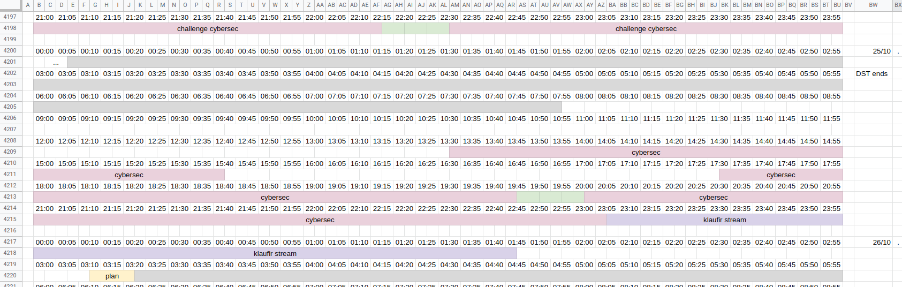
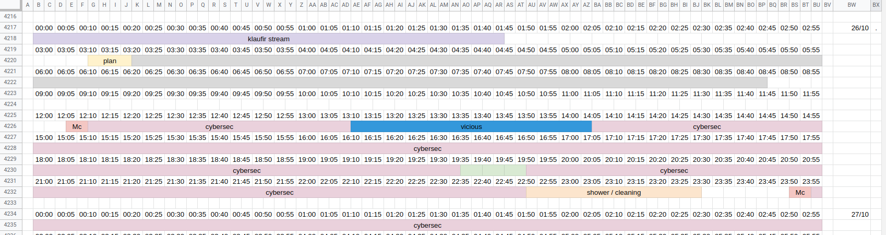
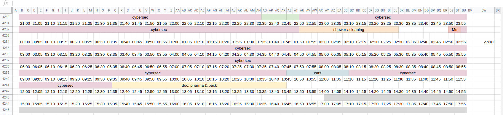

Timeline
========

**Started**: 2020-10-24 00:00  
**Ended**:   2020-10-27 09:35  
**Total time**: ~48 hours

I picked up the habit of keeping track of my time in a big spreadsheet. I'm sure I'll find a real use for it some day, but it comes in pretty handy when I need to figure out what I was doing at any given time.

Saturday 24
-----------

I should have gone to sleep a couple hours earlier, but stayed up to see what the challenge was.

It's a good day when you spend 21 hours of it working on something you enjoy.

#### Challenges completed:

* [Intro](../0_intro)
* [Intro Forensics](../0_intro_forensics)
* [Intro Web](../0_intro_web)
* [Alone Muks](../100_alone_muks)

\*sleep\*

* [Sous l'océan](../50_sous_l'océan)
* [Keypad Sniffer](../150_keypad_sniffer)
* [Le Polyglotte](../150_le_polyglotte)

Sunday 25
---------

Woke up at 8am, (technically 9 hours of sleep because of DST). I was feeling a bit discouraged from seeing how fast some of the hard challenges were solved, so I started slacking a little. I stopped to catch a stream that I was looking forward to, and then went to sleep around 3am. 

#### Challenges completed:

* [ASCII UART](../100_ascii_uart)
* [Définition](../50_définition)
* [Intro Crypto](../0_intro_crypto)
* [L'énigme de la crypte](../200_l'énigme_de_la_crypte)

Monday 26
---------

Another slow start; I woke up at 8:45 but only started working at 12:05, taking a 1h break in the afternoon to chat with a friend, and another 1h break to clean my room and shower, so I could feel less like roadkill.

At this point I had attempted every single challenge besides Evil Cipher, and was only left with things I was stuck on, so it was time to get serious.

#### Challenges completed:

* [VX Elliptique](../250_vx_elliptique)
* [Steganosaurus](../400_steganosaurus)
* [Stranger RSA](../200_stranger_rsa)

Come midnight, I didn't feel like I wanted to stop. So I filled up my biggest coffee mug, emptied the sugar tray and settled down for an all-nighter.

Tuesday 27
----------

I had a very enjoyable 6 hours of focused coding for Evil Cipher (well, more like 2 hours coding / 4 hours debugging). Then lack of sleep started to catch up with me, and I lost a lot of time on Automatos randomly guessing before forcing myself to reason to the correct solution.

At 8:30 am, the only challenge I had left was ChatBot, and I still had absolutely no idea how to do it, and had to leave 1h later for an appointment.

#### Challenges completed:

* [Evil Cipher](../400_evil_cipher)
* [Automatos](../300_automatos)
* [ChatBot](../100_chatbot)
