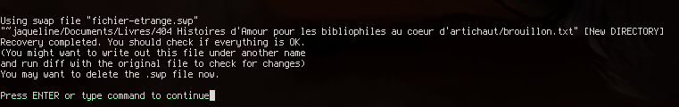

[Le Mystère du roman d'amour](challenge_files/README.md) - forensics, easy, 519 solves
===

**Author**: [mh4ckt3mh4ckt1c4s#0705](https://www.mh4ckt3mh4ckt1c4s.xyz/)    
**Files**: [fichier-etrange.swp](https://www.narthorn.com/ctf/404CTF-2023/challenge_files/Analyse%20forensique/Le%20Myst%C3%A8re%20du%20roman%20d%27amour/fichier-etrange.swp)

## Other write-ups

- https://nouman404.github.io/CTFs/404CTF_2023/Forensique/Le_Mystere_du_roman_d
- https://writeups.ayweth20.com/2023/404ctf-2023/analyse-forensique/le-mystere-du-roman-damour (in french)

## Solve

This mysterious file is a vim swapfile, used for recovering files that were open in the text editor during a crash.    
We can recover the original file with `vim -r fichier-etrange.swp` :



This gives us some limited info, like the original path to the file, and also the username (because `~jaqueline` is the shortcut syntax for "home folder of user named jacqueline", which is usually `/home/jaqueline` (but doesn't necessarily have to be)).

Opening the file proper, we get a bunch of binary output spam, starting with a PNG header. It's a png file, so let's save it as such: `:w fichier_etrange.png`, and open it:


Nothing stands out so let's check if the image has any hidden content, with the tried and true method of opening it in an image editor with a paint bucket tool:


It's a QR code. Because of course it's too fancy for [zxing.org](https://zxing.org) to be able to decode it, after scrambling to find some other [online website](https://products.aspose.app/barcode/recognize/qr) that can actually decode it (what do you mean, my phone? what's a phone), we get the text:

```
Il était une fois, dans un village rempli d'amour, deux amoureux qui s'aimaient...

Bien joué ! Notre écrivaine va pouvoir reprendre son chef-d'oeuvre grâce à vous !
Voici ce que vous devez rentrer dans la partie "contenu du fichier" du flag : 3n_V01L4_Un_Dr0l3_D3_R0m4N
```

But wait, we're still missing a bunch of the info requested from the flag. Where's the PID? the hostname?    
It turns out this info that was actually in the vim swapfile all along, but vim did not display it earlier.   
To show everything, simply[^1] run `vim -r`, no arguments, in the same folder as the swapfile:

```
Swap files found:
   In current directory:
1.    fichier-etrange.swp
          owned by: narthorn   dated: Sat May 13 00:27:45 2023
         file name: ~jaqueline/Documents/Livres/404 Histoires d'Amour pour les bibliophiles au coeur d'artichaut/brouillon.txt
          modified: no
         user name: jaqueline   host name: aime_ecrire
        process ID: 168
```

Alternatively, you can just run `file`:

```
└─[$] file fichier-etrange.swp 
fichier-etrange.swp: Vim swap file, version 7.4, pid 168, user jaqueline, host aime_ecrire, file ~jaqueline/Documents/Livres/404 Histoires d'Amour pour les bibliophiles au coeur d'artichaut/brouillon.txt
```

This confirms our earlier username deduction and gives us all the remaining info for the flag.

`404CTF{168-~jaqueline/Documents/Livres/404 Histoires d'Amour pour les bibliophiles au coeur d'artichaut/brouillon.txt-jaqueline-aime_ecrire-3n_V01L4_Un_Dr0l3_D3_R0m4N}`

## Comments

I didn't even know `file` showed all that swapfile info too. Goes to show, even when you know a file format, you should still start there...

[^1]: You might find that even when you're in the same directory, `vim -r` will not find the swapfile. This can happen if, like me, you've configured vim to shove all the swapfiles somewhere like ~/.config/vim, by setting the `directory` config var. Normally this variable includes the current directory. When your own config gets in the way of solving the challenge... why doesn't vim show all that info in the first place anyway??
