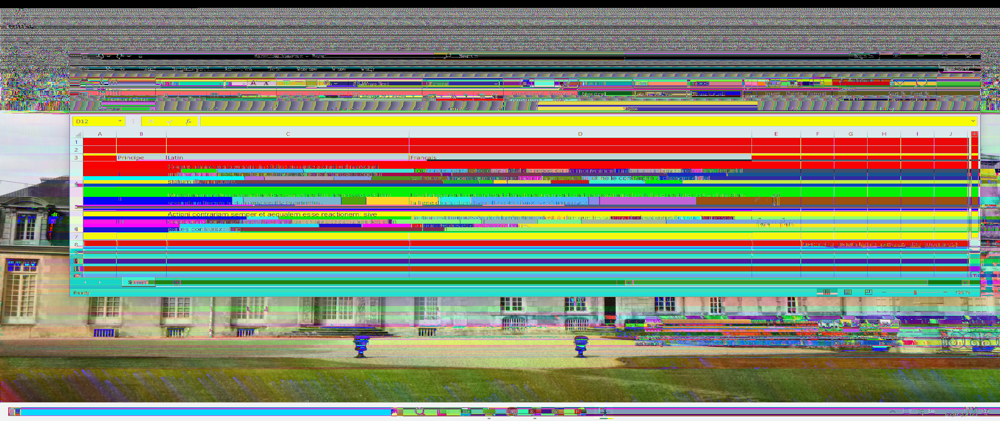
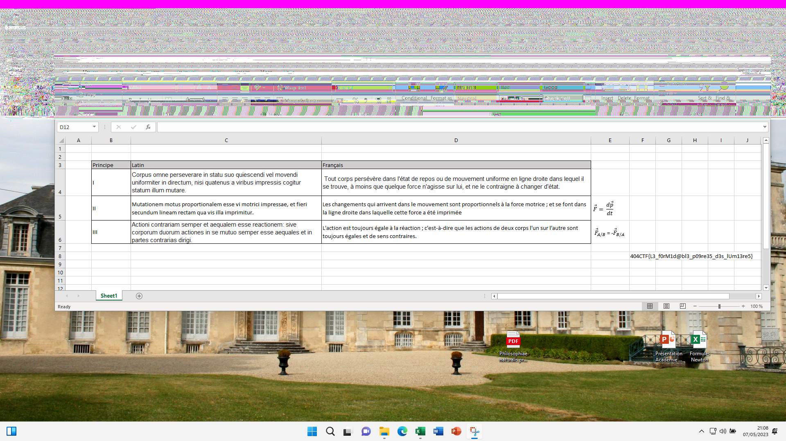

[Note de bas de page](challenge_files/README.md) - forensics, hard, 85 solves
===

**Author**: [Smyler#7078](https://github.com/SmylerMC)    
**Files**: [backup.pst](https://www.narthorn.com/ctf/404CTF-2023/challenge_files/Analyse%20forensique/Note%20de%20bas%20de%20page/backup.pst)

## Other write-ups

- https://nozyzy.github.io/posts/notesdebasdepage/
- https://writeups.ayweth20.com/2023/404ctf-2023/analyse-forensique/note-de-bas-de-page (in french)

## Solve

What is a pst file?

```
└─[$] file backup.pst 
backup.pst: Microsoft Outlook Personal Storage (>=2003, Unicode, version 23), bidUnused=0000000000000000, dwUnique=0x13c, 4334592 bytes, bCryptMethod=1, CRC32 0xe47ef24a
```
More windows stuff. I'm not desperate enough yet to run a whole virtual machine just for Outlook, surely Arch has something useful...

```
└─[$] pacman -Ss outlook    
extra/libpst 0.6.76-9
    Outlook .pst file converter
```

Alright. We can use `readpst` from that package to convert the .pst to more human-readable .eml files.[^1]

```
└─[$] readpst -De backup.pst  
Opening PST file and indexes...
Processing Folder "Deleted Items"
Processing Folder "Éléments supprimés"
Processing Folder "Boîte de réception"
Processing Folder "Boîte d'envoi"
Processing Folder "Éléments envoyés"
Processing Folder "Fichiers"
Processing Folder "Racine de Yammer"
Processing Folder "Historique des conversations"
Processing Folder "Entrant"
Processing Folder "Sortant"
Processing Folder "Flux"
	"Racine de Yammer" - 3 items done, 0 items skipped.
Processing Folder "Notes"
Processing Folder "Journal"
Processing Folder "Tâches"
Processing Folder "ExternalContacts"
Processing Folder "Contacts"
	"Éléments supprimés" - 1 items done, 0 items skipped.
Processing Folder "Discussion d’équipe"
	"Historique des conversations" - 1 items done, 0 items skipped.
Processing Folder "Brouillons"
Processing Folder "Recipient Cache"
Processing Folder "{06967759-274D-40B2-A3EB-D7F9E73727D7}"
Processing Folder "PeopleCentricConversation Buddies"
Processing Folder "Organizational Contacts"
Processing Folder "GAL Contacts"
Processing Folder "Sociétés"
Processing Folder "{A9E2BC46-B3A0-4243-B315-60D991004455}"
	"Contacts" - 7 items done, 0 items skipped.
Processing Folder "Archive"
Processing Folder "Courrier indésirable"
	"Éléments envoyés" - 1 items done, 0 items skipped.
Processing Folder "Calendrier"
Processing Folder "Sync Issues"
	"Brouillons" - 1 items done, 0 items skipped.
Processing Folder "Anniversaires"
Processing Folder "Jours fériés - France"
Processing Folder "RSS Feeds"
Processing Folder "Conversation Action Settings"
Processing Folder "Quick Step Settings"
	"Outlook Data File" - 21 items done, 0 items skipped.
	"Boîte de réception" - 1 items done, 0 items skipped.
Processing Folder "Conflicts"
Processing Folder "Local Failures"
Processing Folder "Server Failures"
	"Calendrier" - 2 items done, 0 items skipped.
	"Sync Issues" - 5 items done, 0 items skipped.
	"Courrier indésirable" - 1 items done, 0 items skipped.
	"Jours fériés - France" - 61 items done, 0 items skipped.
```

Of all these items, only a few turn out to be actual emails we can read.    
The [important one](sent_mail.eml) is in sent mail, and it contains a picture as attachment:


Unfortunately the flag is cropped out! How do we recover something that isn't there?

Opening the png file in a hex editor, we can see a huge amount of data after the IEND png header, which is a little suspicious.

At this point you might remember something that made the news a few months ago: (ACropalypse)(https://en.wikipedia.org/wiki/ACropalypse?useskin=monobook), a vunerability in some photo editing tools where crops of an existing image were saved by only overwriting the start of the original file, leaving a bunch of original image data floating at the end after the IEND header of the cropped image.

This is exactly what we're looking at here: using https://acropalypse.app/, with a custom resolution set to 1080 in height and 2560 in width, we can recover this very mangled image:



The flag is readable (painfully)[^2], but something seems to have gone wrong: the image is weirdly stretched compared to the original screenshot, and the colors are all messed up. Why did the website only works with a width of 2560, anyway? 

If you try to un-stretch the picture to match the original screenshot, you'll end up with a width of around 1920 pixels, which is exactly 2560*3/4.   
The acropalypse website was expecting RGB pngs, with 3 bytes per pixels, but this is actually an RGBA picture, with 4 bytes per pixel!

Searching the internet, we can find the [original acropalypse poc](https://gist.githubusercontent.com/DavidBuchanan314/93de9d07f7fab494bcdf17c2bd6cef02/raw/dc92b2d8e4d4ded6db5e4e98afb6e1617e8aebc4/acropalypse_matching_sha256.py), and [change it](recover_rgba.py) to work with RGBA images: 

```diff
└─[$] diff recover_rgb.py recover_rgba.py 
1,2d0
< #!/usr/bin/python 
< 
134c132
< ihdr += (2).to_bytes(1, "big") # true colour
---
> ihdr += (6).to_bytes(1, "big") # RGBA
142c140
< reconstructed_idat = bytearray((b"\x00" + b"\xff\x00\xff" * orig_width) * orig_height)
---
> reconstructed_idat = bytearray((b"\x00" + b"\xff\x00\xff\xff" * orig_width) * orig_height)
151c149
< for i in range(0, len(reconstructed_idat), orig_width*3+1):
---
> for i in range(0, len(reconstructed_idat), orig_width*4+1):
```

Finally, running it gives us a very readable recovered flag:

`python ./recover_rgba.py 1920 1080 Capture\ d’écran\ 2023-05-07\ 210840.png recovered.png`



`404CTF{L3_f0rM1d@bl3_p09re35_d3s_lUm13re5}`

## Comments

I was waiting for this to show up in a CTF from the moment I saw it... nice twist with the RGB/RGBA situation, wish I had caught that myself.

[^1]: A quick read of the manpage for `readpst` shows that it has options to extract "deleted items" as well, I used that option in the commandline but for this challenge it turned out not to be relevant.

[^2]: At this point, I got the flag and moved on. I did not realise until after the CTF, by reading other write-ups, that you could do better!