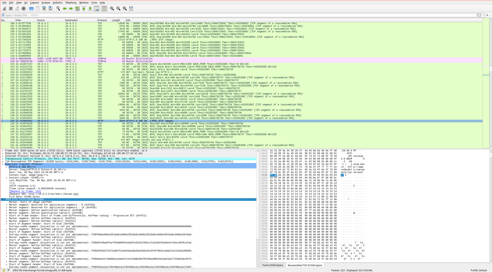

[Pêche au livre](challenge_files/README.md) - forensics, intro, 1071 solves
===

**Author**: Direshaw#6811    
**Files**: [Capture.pcapng](https://www.narthorn.com/ctf/404CTF-2023/challenge_files/Analyse%20forensique/P%C3%AAche%20au%20livre/Capture.pcapng)

## Other write-ups

- https://nouman404.github.io/CTFs/404CTF_2023/Forensique/Peche_au_livre
- https://writeups.ayweth20.com/2023/404ctf-2023/analyse-forensique/peche-au-livre (in french)

## Solve

We open the network capture file with Wireshark and see it's a TCP stream of HTTP requests.

There are only a couple actual requests, which are downloading some images from a local webserver.    
Opening the last HTTP response packet, Wireshark lets us export only those bytes of the packet that contain the image:   

Which gives us the flag:

`404CTF{345Y_W1r35h4rK}`

## Comments

The write-ups I linked above have an even simpler way of getting all the images out of the capture. I didn't know!