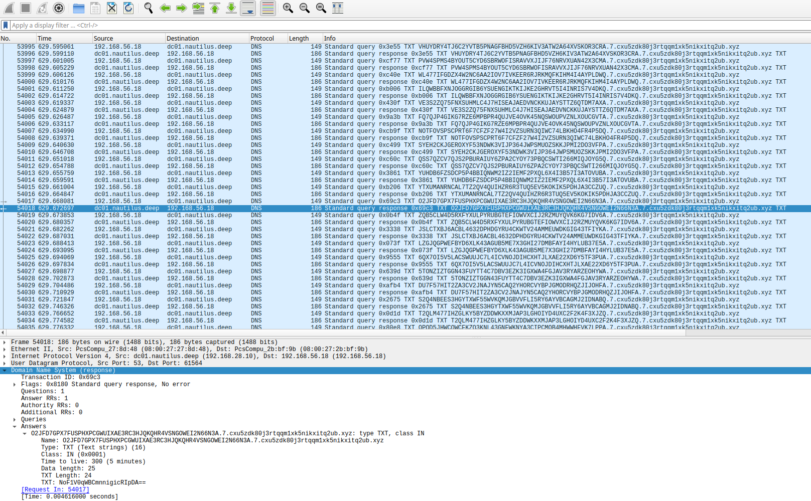
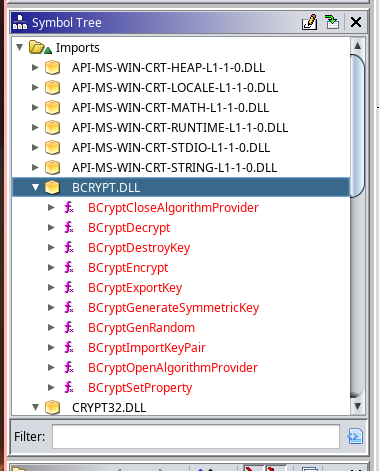
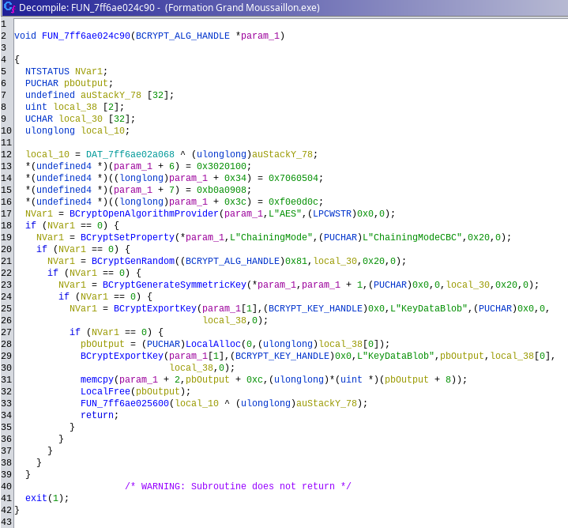
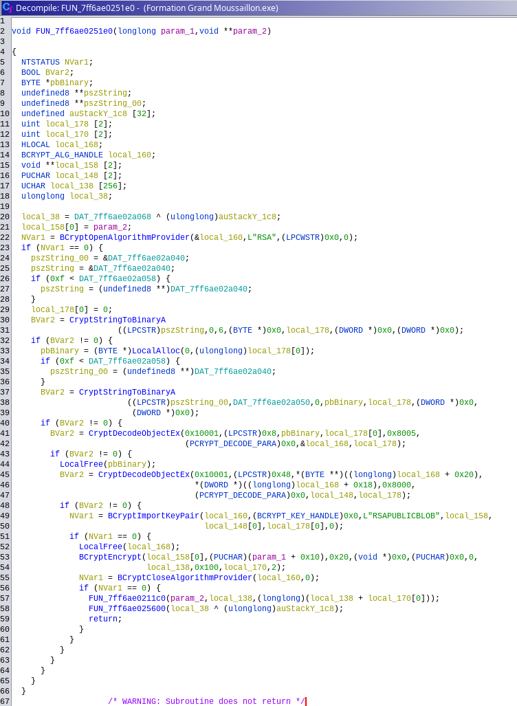
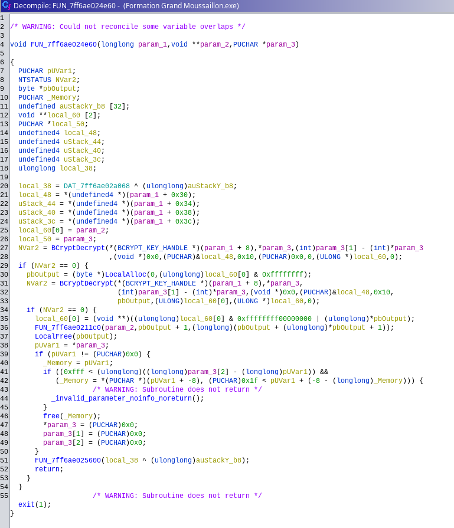
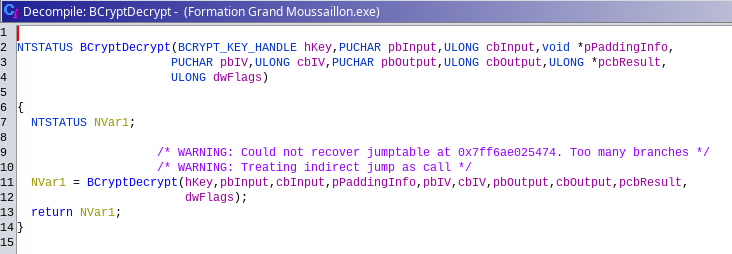
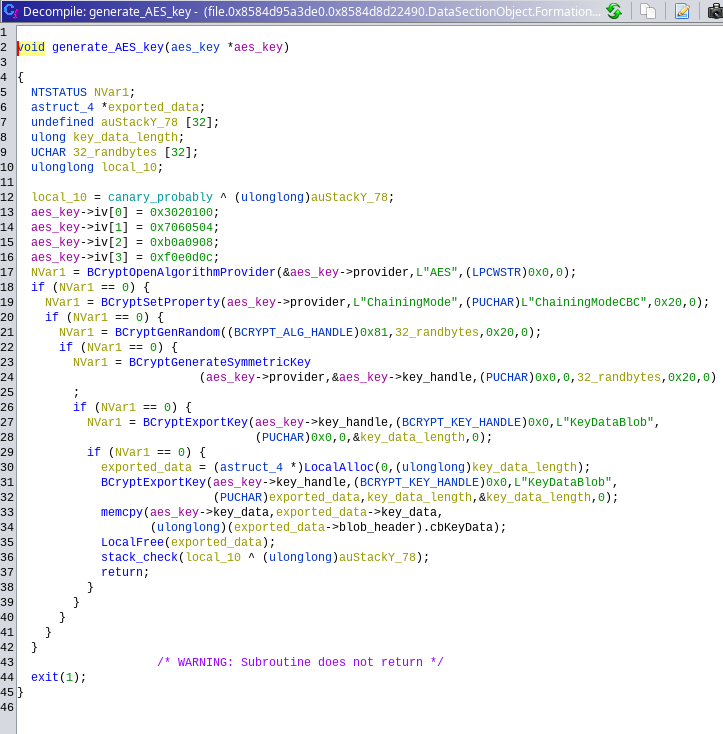
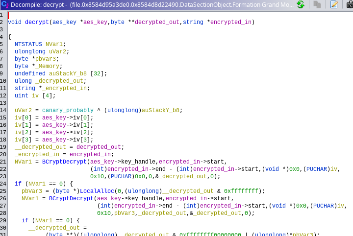
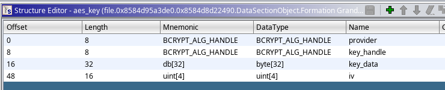

[Le Cracken](challenge_files/README.md) - forensics, insane, 3 solves
===

**Author**: [Smyler#7078](https://github.com/SmylerMC)    
**Files**: [Cracken.7z](https://www.narthorn.com/ctf/404CTF-2023/challenge_files/Analyse%20forensique/Le%20Cracken/Cracken.7z)

## Other write-ups

- https://github.com/TechieNeurons/404CTF_2023_write_ups/tree/main/forensics/le_cracken (much more concise than this!)

## Solve

[Cracken.7z](https://www.narthorn.com/ctf/404CTF-2023/challenge_files/Analyse%20forensique/Le%20Cracken/Cracken.7z) contains three files:

- capture.pcap, a network capture of the traffic 
- WS02-20230524-025804.raw, a full memory dump of the windows machine
- Network.png, a (mostly irrelevant) diagram of the network

### The network capture

Let's look at the pcap file first. Most of it is filled with DNS requests like these:



It seems that data is being exfiltrated from 192.168.56.18 through DNS, by doing TXT queries to domains in this format: 

`{something that looks base32-encoded}.7.cxu5zdk80j3rtqqm1xk5nikxitq2ub.xyz`

Unfortunately, base32-decoding the data only yields random bytes.

The content of the TXT records that are sent in reply to these DNS queries have a few different variations: 

```
7GAiIvNXFpqTXVI98g284noWMRDAqwVnWOUiFTfDCAh6fLVv38Tt7Awgx5jQuvJuHQ0braFXSBQfBxw+9Am+jIjUvfuc1uPjPoa6ctDiSWQ=
7r7spJNLfLiJI8RJ2jQ3ow==
9EyxRYNXMEVSADffa4xIVA==
A+HHrl8Df/Yu7pBoUwsnjg== # second most common, 7 occurences
Aa+pEJkO/J7Mnat1c9HJhQ==
JEyN4XiEuDcNyLjFQojCjQ==
MKc+hQ4adbBUJxvSburovQ==
NoF1V0qWBCmnnigicRIpDA== # most common, 76239 occurences
NxFsiIVP+gFcjnY2hNuu0Q==
ObWEiR2ebEBijsKe2mTEKA==
cZKLuh+UMQiAU9rbobx2Cw==
d+Fp11eOVBqIXyQmDbhYow==
r+r87c3UqYZ+yeBmJXX7kg==
utZX5byhXKpt+E1ezF3CUg==
uuR6f0lKxtLXyW1docUCIw==
yotSUGpmhX6R/Bq++cjNxA==
ztKKj2VCU2PQ5TYQH5+k3g==
```

These all look like base64-encoded strings, but once again, trying to decode just yields random bytes.    
In all cases however, for both the b32-encoded queries and the b64-encoded responses, the messages always have an amount of bytes that is divisible by 16; this suggests that they may have been encrypted with a block cipher that has a block size of 128 bits, for example AES.

The vast majority of replies are `NoF1V0qWBCmnnigicRIpDA`, seven are `A+HHrl8Df/Yu7pBoUwsnjg==`, and the rest only appear at most once or twice.

At this point, we can presume this is a malware of some kind communicating with its c2 server; the server could be replying to exfiltrated data most of the time with a standard ACK message (`NoF1V0qWBCmnnigicRIpDA`), while occasionally sending more commands back to the malware.

Even though we can't read it yet, we will surely need that exfiltrated data at some point, so I'll use scapy to extract it all to a file for later:

```python
└─[$] python -m scapy

a = rdpcap("capture.pcap")
with open("exfiltrated","wb") as file:
    for x in a[DNSQR]:
        if IP not in x or x[IP].src != "192.168.56.18": continue
        name = x[DNSQR].qname
        if name.endswith(b"xyz."): file.write(name[:name.index(b'.')] + b"\n")
```

### The memory dump

As usual with forensics challenges, there's going to be a lot of irrelevant stuff to get distracted by in any given dump. It helps a lot to have an idea of what you want to find before you dive in.[^1]

In our case, we would like to get more information about the malware itself, to figure out how the data is encrypted.    
We can look at the list of running processees, hopefully the malware was still running at the time the dump was made:

```
└─[$] vol -f WS02-20230524-025804.raw windows.cmdline.CmdLine
Volatility 3 Framework 2.4.1
Progress:  100.00		PDB scanning finished                        
PID	Process	Args

4	System	Required memory at 0x20 is not valid (process exited?)
88	Registry	Required memory at 0x20 is not valid (process exited?)
392	smss.exe	\SystemRoot\System32\smss.exe
...
5792	firefox.exe	"C:\Program Files\Mozilla Firefox\firefox.exe
...
1264	WINWORD.EXE	"C:\Program Files\Microsoft Office\Root\Office16\WINWORD.EXE" /n "C:\Users\Matelot\Desktop\Manuel du récureur de pont.docx
...
5404	Notepad.exe	"C:\Program Files\WindowsApps\Microsoft.WindowsNotepad_11.2112.32.0_x64__8wekyb3d8bbwe\Notepad\Notepad.exe" 
...
9960	7zFM.exe	"C:\Program Files\7-Zip\7zFM.exe" "C:\Users\Matelot\Downloads\Formation Grand Moussaillon.7z"
...
4016	Formation Gran	"C:\Users\Matelot\Downloads\Formation Grand Moussaillon.exe" 
6524	cmd.exe	cmd.exe
7656	conhost.exe	\??\C:\Windows\system32\conhost.exe 0x4
...
7976	cmd.exe	"C:\Windows\system32\cmd.exe"
11248	conhost.exe	\??\C:\Windows\system32\conhost.exe 0x4
...
7272	DumpIt.exe	DumpIt.exe
...

```

Among the most interesting running processes are firefox, word, notepad, a [very suspicious exe](Formation%20Grand%20Moussaillon.exe), a couple console terminals, and the memory dump program (DumpIt.exe, same one used in [Lettres volatiles](../Lettres%20volatiles)).

It looks like we found our malware, so let's ask volatility to dump all files associated with that process, to get the exe of the malware:

```
└─[$] vol -f WS02-20230524-025804.raw windows.dumpfiles.DumpFiles --pid 4016 
Volatility 3 Framework 2.4.1
Progress:  100.00		PDB scanning finished                        
Cache	FileObject	FileName	Result

ImageSectionObject	0x8584d5703380	crypt32.dll	file.0x8584d5703380.0x8584d537f7f0.ImageSectionObject.crypt32.dll.img
ImageSectionObject	0x8584d8109bc0	vcruntime140.dll	file.0x8584d8109bc0.0x8584d628b050.ImageSectionObject.vcruntime140.dll.img
ImageSectionObject	0x8584d6f490a0	msvcp140.dll	file.0x8584d6f490a0.0x8584d5fcb270.ImageSectionObject.msvcp140.dll.img
DataSectionObject	0x8584d95a3de0	Formation Grand Moussaillon.exe	file.0x8584d95a3de0.0x8584d8d22490.DataSectionObject.Formation Grand Moussaillon.exe.dat
ImageSectionObject	0x8584d95a3de0	Formation Grand Moussaillon.exe	file.0x8584d95a3de0.0x8584d88d6050.ImageSectionObject.Formation Grand Moussaillon.exe.img
ImageSectionObject	0x8584d5a66de0	dnsapi.dll	file.0x8584d5a66de0.0x8584d5aa2010.ImageSectionObject.dnsapi.dll.img
ImageSectionObject	0x8584d8108900	vcruntime140_1.dll	file.0x8584d8108900.0x8584d66ca730.ImageSectionObject.vcruntime140_1.dll.img
ImageSectionObject	0x8584d5a65e40	IPHLPAPI.DLL	file.0x8584d5a65e40.0x8584d5a56aa0.ImageSectionObject.IPHLPAPI.DLL.img
ImageSectionObject	0x8584d387d4c0	bcrypt.dll	file.0x8584d387d4c0.0x8584d5a2daa0.ImageSectionObject.bcrypt.dll.img
ImageSectionObject	0x8584d387b580	msasn1.dll	file.0x8584d387b580.0x8584d38e9d70.ImageSectionObject.msasn1.dll.img
ImageSectionObject	0x8584d3f32890	kernel32.dll	file.0x8584d3f32890.0x8584d52708f0.ImageSectionObject.kernel32.dll.img
ImageSectionObject	0x8584d538aed0	KernelBase.dll	file.0x8584d538aed0.0x8584d537f2b0.ImageSectionObject.KernelBase.dll.img
ImageSectionObject	0x8584d57031f0	ucrtbase.dll	file.0x8584d57031f0.0x8584d5164010.ImageSectionObject.ucrtbase.dll.img
ImageSectionObject	0x8584d538b1f0	bcryptprimitives.dll	file.0x8584d538b1f0.0x8584d5164270.ImageSectionObject.bcryptprimitives.dll.img
ImageSectionObject	0x8584d538bce0	nsi.dll	file.0x8584d538bce0.0x8584d5161270.ImageSectionObject.nsi.dll.img
ImageSectionObject	0x8584d3f336a0	ws2_32.dll	file.0x8584d3f336a0.0x8584d537bb10.ImageSectionObject.ws2_32.dll.img
ImageSectionObject	0x8584d3f32700	rpcrt4.dll	file.0x8584d3f32700.0x8584d3bf68e0.ImageSectionObject.rpcrt4.dll.img
ImageSectionObject	0x8584d3f32ed0	sechost.dll	file.0x8584d3f32ed0.0x8584d3b14010.ImageSectionObject.sechost.dll.img
ImageSectionObject	0x8584d39344f0	ntdll.dll	file.0x8584d39344f0.0x8584d38d0010.ImageSectionObject.ntdll.dll.img
```

Time to launch the reversing tool of your choice - I used ghidra for this one.

Here too, we can get a really good headstart on reversing if we know what to look for[^1]; here, we expect the malware to be doing some kind of encryption. Indeed, if we look at the DLLs it's calling into, we find `bcrypt.dll`, a standard windows library for doing encryption with modern ciphers. 



By looking at where those library functions are called, we can jump directly to the code that is relevant for us, and avoid having to reverse more than necessary. The key management functions, `BCryptGenerateSymmetricKey`, and `BCryptImportKeyPair`, are used in two places:




Before even having done any serious reversing, we can immediately see the first function seems to be doing something related to AES, which we expected, and the second is doing something related to RSA.

Modern encrypted communications often work with this mix of asymmetric and symmetric cryptography: asymmetric crypto can be used to safely exchange encrypted data without an eavesdropper being able to intercept an encryption key and decrypting messages - but it is more CPU-heavy than symmetric cryptography. Symmetric cryptography is faster, but it needs an encryption key to be exchanged between parties before encryption can be done. Because of this, asymmetric crypto is often only used at the very start, to encrypt and safely transmit an encryption key for the symmetric cipher, and the rest of the communication is done with the symmetric cipher.

This is what is happening here: the first function calls `BCryptGenRandom`/`BCryptGenerateSymmetricKey` to generate a random key for the symmetric cipher (AES), and the second function calls `BCryptImportKeyPair` to import an RSA public key that was directly embbeded in the executable, then calls `BCryptEncrypt` to encrypt the AES key with it. Most likely this will be sent to the c2 server as the very first part of the transmission, the c2 will decrypt it using the corresponding RSA private key that it possesses, then subsequent communications will be made only using AES. 

Since the network capture started in the middle of a transmission, we don't get to see this initial exchange; but even if we did, it would be useless, because the point of public key cryptography is that even if you can intercept everything, you still cannot decrypt the communication. 

Our objective is now to acquire all the parameters we need to do the AES decryption ourselves:

- The block cipher mode: this is [CBC](https://en.wikipedia.org/wiki/Block_cipher_mode_of_operation?useskin=monobook#Cipher_block_chaining_(CBC)), we see it being set in the call to `BCryptSetProperty` which has argumnent `"ChainingModeCBC"`
- The key: normally the key doesn't have to reside in the program memory, but we see BCryptExportKey being specifically called to write out the key bytes to the argument of the function, so there is a good chance we could find it in memory somewhere.
- The IV used during encryption/decryption[^3]: to find this, let's check where `BCryptDecrypt` is called:



Ghidra helpfully gives us names for the parameters of `BCryptDecrypt`, including where the IV is provided; but you can also [look them up](https://learn.microsoft.com/en-us/windows/win32/api/bcrypt/nf-bcrypt-bcryptdecrypt) online in the microsoft docs.



At this point, between those three functions, we can start doing a small bit of actual reversing, starting with auto creating structs for the parameters and typing/naming them accordingly.    
You don't have to go too crazy with it[^1], but here is what you could end up with for the function that decrypts messages, and the AES key generation function :





We can see that not only is the iv always the same, `000102030405060708090a0b0c0d0e0f`, it's actually stored right after the AES key! We also learn that the key is 256 bits.
Armed with this knowledge, we can go search the memory for all instances of 16 bytes directly preceding the iv: one of them is bound to be the AES key we're looking for.

First we can use volatilty to dump the memory ranges that were accessible to the malware process:

```
└─[$] vol -f WS02-20230524-025804.raw windows.memmap.Memmap --pid 4016 --dump
```

Then we can search this memory (~1.6GiB) for the pattern we want:

```python
iv = bytes(range(16)) # 00010203040506060708090a0b0c0d0e0f
mem = open("pid.4016.dmp","rb").read()
keys = re.findall(b"(.{32})"+iv, mem)
```
```python
>>>len(keys)
53
```

```python
>>> for key in keys: print(key)
b'\x00\x00\x00\x00\x00\x00\x00\x00\x00\x00\x00\x00\x00\x00\x00\x00\x00\x00\x00\x00\x00\x00\x00\x00\x00\x00\x00\x00\x00\x00\x00\x00'
b'l\xbb\xf2\xa3\x9f\xc7\xa2\xa6N\x92\x17\xc8rH^AQ\xec\xfe\xf9\xe3H\xe2\x07\x07\xec\x1b\xd3e\xb1\x12-'
b'l\xbb\xf2\xa3\x9f\xc7\xa2\xa6N\x92\x17\xc8rH^AQ\xec\xfe\xf9\xe3H\xe2\x07\x07\xec\x1b\xd3e\xb1\x12-'
b'\xf3\x00\xf4\x00\xf5\x00\xf6\x00\xf7\x00\xf8\x00\xf9\x00\xfa\x00\xfb\x00\xfc\x00\xfd\x00\xfe\x00\xff\x00\x00\x00\x00\x00\x00\x00'
b'\x17 \xbe\x00\xb6\x00\xa7\x00\xf7\x00\xb8\x00\xb0\x00\xa8\x00\xb7\x00\xb9\x00\xb3\x00\xb2\x00\xa0%\xa0\x00\x00\x00\x00\x00'
b'\xf3\x00\xf4\x00\xf5\x00\xf6\x00\xf7\x00\xf8\x00\xf9\x00\xfa\x00\xfb\x00\xfc\x00\xfd\x00\xfe\x00\xff\x00\x00\x00\x00\x00\x00\x00'
b'\x17 \xbe\x00\xb6\x00\xa7\x00\xf7\x00\xb8\x00\xb0\x00\xa8\x00\xb7\x00\xb9\x00\xb3\x00\xb2\x00\xa0%\xa0\x00\x00\x00\x00\x00'
b'\r\r\r\r\r\x00\x00\x000123456789abcdefABCDEF\x00\x00'
b'8\x009\x00a\x00b\x00c\x00d\x00e\x00f\x00A\x00B\x00C\x00D\x00E\x00F\x00\x00\x00\x00\x00'
b'e\x00\x00\x00\x00\x00\x00\x00\x00\x00>@@@?456789:;<=@@@@@@@'
b'D\x00\x00\x00\x00\x00\x00\x00\x00\x00@@>@@456789:;<=@@@@@@@'
b'DefaultLocaleName\x00\x00\x00\x00\x10\x00\x00\x00\x00\x00\x00\x00\x00\x00\x00'
b'\xe0\xe1\xe2\xe3\xe4\xe5\xe6\xe7\xe8\xe9\xea\xeb\xec\xed\xee\xef\xf0\xf1\xf2\xf3\xf4\xf5\xf6\xf7\xf8\xf9\xfa\xfb\xfc\xfd\xfe\xff'
b'\xe0\xe1\xe2\xe3\xe4\xe5\xe6\xe7\xe8\xe9\xea\xeb\xec\xed\xee\xef\xf0\xf1\xf2\xf3\xf4\xf5\xf6\xf7\xf8\xf9\xfa\xfb\xfc\xfd\xfe\xff'
b'\x87\xe7H\x90\x83\x9b\x89Y\x14\x17\xaf\xad\x14\xb2&\xd5\xb4\x03k\x1d\xba\x04:\xe6U\xac\xd6F\xecZ\xd3\\'
b'rim\\msprim\\algself.c\x00\x00\x00\x00status\x00\x00'
b'\xe0\xe1\xe2\xe3\xe4\xe5\xe6\xe7\xe8\xe9\xea\xeb\xec\xed\xee\xef\xf0\xf1\xf2\xf3\xf4\xf5\xf6\xf7\xf8\xf9\xfa\xfb\xfc\xfd\xfe\xff'
b'\xe0\xe1\xe2\xe3\xe4\xe5\xe6\xe7\xe8\xe9\xea\xeb\xec\xed\xee\xef\xf0\xf1\xf2\xf3\xf4\xf5\xf6\xf7\xf8\xf9\xfa\xfb\xfc\xfd\xfe\xff'
b'8\x009\x00A\x00B\x00C\x00D\x00E\x00F\x00\xab\xab\xab\xab\xab\xab\xab\xab\xab\xab\xab\xab\xab\xab\xab\xab'
b"\x98'\x10\xde\x00\x00\x00\x00\x18\xe0\xde\xde\x00\x00\x00\x00\xb0\xcd2\xdf\x00\x00\x00\x00\x00\x00\x00\x00\x00\x00\x00\x00"
b'\x01\x01\x01\x01\x01\x01\x01\x01\x01\x01\x01\x01\x01\x01\x01\x01\x01\x01\x01\x01\x01\x01\x01\x00\x01\x01\x01\x01\x01\x01\x01\x00'
b'\xe5\xe6\xe7\xe7\xe8\xe9\xea\xeb\xec\xed\xed\xee\xef\xf0\xf1\xf2\xf2\xf3\xf4\xf5\xf6\xf7\xf7\xf8\xf9\xfa\xfb\xfc\xfc\xfd\xfe\xff'
b'\x08\x00\x00\x00\x00\x00\x00\x00\x00\x00\x00\x00\xf8\xff\xff\xff\xf8\xff\xff\xff\x00\x00\x00\x00\x00\x00\x00\x00\x00\x00\x00\x00'
b'\x1f\x1f\x1f\x1f\x1f\x1f\x1f\x1f\x1f\x1f\x1f\x1f\x1f\x1f\x1f\x1f\x00\x00\x00\x00\x00\x00\x00\x00\x00\x00\x00\x00\x00\x00\x00\x00'
b'\x17W\x07G\x13S\x03C\x16V\x06F\x12R\x02Bw7g\'s3c#v6f&r2b"'
b'b\x00\x00\x00\x00\x18\x00\x00\x00|\x00\x00\x00@\x02\x00\x00]\x02\x00\x00\x00\x00\x00\x001\x05\x00\x00\x88\x05\x00'
b'\x10\x11\x12\x13\x14\x15\x16\x17\x18\x19\x1a\x1b\x1c\x1d\x1e\x1f !\x00"#$\x00\x00\x00\x00\x00\x00\x00\x00\x00\x00'
b'\xe0\xe1\xe2\xe3\xe4\xe5\xe6\xe7\xe8\xe9\xea\xeb\xec\xed\xee\xef\xf0\xf1\xf2\xf3\xf4\xf5\xf6\xf7\xf8\xf9\xfa\xfb\xfc\xfd\xfe\xff'
b'\xe0\xe1\xe2\xe3\xe4\xe5\xe6\xe7\xe8\xe9\xea\xeb\xec\xed\xee\xef\xf0\xf1\xf2\xf3\xf4\xf5\xf6\xf7\xf8\xf9\xfa\xfb\xfc\xfd\xfe\xff'
b'\x00\x00\x00@\x00\x00\x00\x00\x00\x00 \x00\x00\x00\x00\x00\x00\x00\x01\x00\x00\x00\x00\x00\x00\x10\x00\x00\x00\x00\x00\x00'
b'\xf0\x07\x00\x00\x00\x00\x00\x00\x00\x00\x00\x00\x00\x00\x00\xf8\xff\xfe\xfc\xf8\xf0\xe0\xc0\x80\x00\x01\x03\x07\x0f\x1f?\x7f'
b' !"#$%&\'()*+,-./0123456789:;<=>?'
b' !"#$%&\'()*+,-./0123456789:;<=>?'
b' !"#$%&\'()*+,-./0123456789:;<=>?'
b'\x01\x00\x00\x00\x00\x00\x00\x00\x00\x00\x00\x00\x02\x00\x00\x00\x02\x00\x00\x00\x00\x00\x00\x00\x00\x00\x00\x00\x00\x00\x00\x00'
b'\x14\x17\xaf\xad\x14\xb2&\xd5\xb4\x03k\x1d\xba\x04:\xe6U\xac\xd6F\xecZ\xd3\\\x00\x00\x00\x00\x00\x00\x00\x00'
b'ptoapi\\ncrypt\\loader\\loader.c\x00\x00\x00'
b'\x00\x02\x00\x00\x00\xfe\x00\x00\x00\x01\x00\x00\x00\x00\x00\x00\x02\x00\x00\x00\x00\x00\x00\x00\x00\x00\x00\x00\x00\x00\x00\x00'
b'rypt\\msprim\\msprim\\algself.c\x00\x00\x00\x00'
b'\xff\xff\xff\xff\xff\xff\xff\xff\xff\xff>\xff\xff\xff?456789:;<=\xff\xff\xff\x00\xff\xff\xff'
b'\x0b\x0b\x0c\x0c\r\r\x0e\x0e\x0f\x0f\x10\x10\x11\x11\x11\x11\x11\x11\x11\x11\x11\x11\x11\x11\x11\x11\x11\x00\x00\x00\x00\x00'
b'\xff\xff\xff\xff\xff\xff\xff\xff\xff\xff>\xff\xff\xff?456789:;<=\xff\xff\xff\x00\xff\xff\xff'
b'\xf3\x00\xf4\x00\xf5\x00\xf6\x00\xf7\x00\xf8\x00\xf9\x00\xfa\x00\xfb\x00\xfc\x00\xfd\x00\xfe\x00\xff\x00\x00\x00\x00\x00\x00\x00'
b'\x17 \xbe\x00\xb6\x00\xa7\x00\xf7\x00\xb8\x00\xb0\x00\xa8\x00\xb7\x00\xb9\x00\xb3\x00\xb2\x00\xa0%\xa0\x00\x00\x00\x00\x00'
b'\x05\x98\x1e\x89H\xd2\x84a*)\x85@#\xba.\xf1I\x0f\x8c\xd8\x97\xa8\xcckU{*\x12\x00\x00\x00\x00'
b's\x00]\x00\x00\x00\x00\x00[\x00s\x00h\x00i\x00f\x00t\x00e\x00d\x00]\x00\x00\x00\x00\x00\x00\x00'
b'wxyz0123456789-_\x00\x00\x00\x00\x00\x00\x00\x00\x00\x00\x00\x00\x00\x00\x00\x00'
b'\x00\x00\x00\x00\x00\x00\x00\x00\x00"/\\[]:| <>+=;,?*%#@{}^`'
b'\x00\x00\x00\x00\x00\x00\x00\x00\x00\x00\x00\x00\x00\x00\x00\x00\x00\x00\x00\x00\x00\x00\x00\x00\x00\x00\x00\x00\x00\x00\x00\x00'
b'@@@@@@@@@@@@>@@456789:;<=@@@@@@@'
b'@@@@@@@@@@>@@@?456789:;<=@@@@@@@'
b'\xd3\xdf\xd4\xd2\xf5\xd5\xb5\xfe\xde\xda\xdb\xd9\xfd\xdd\xaf\xb4\xad\xb1=\xbe\xb6\xa7\xf7\xb8\xb0\xa8\xb7\xb9\xb3\xb2\xa6\xa0'
b'\xd3\xdf\xd4\xd2\xf5\xd5\xb5\xfe\xde\xda\xdb\xd9\xfd\xdd\xaf\xb4\xad\xb1=\xbe\xb6\xa7\xf7\xb8\xb0\xa8\xb7\xb9\xb3\xb2\xa6\xa0'
```

Out of all these, we can remove duplicates and those that don't look like truly random bytes:

```
b'l\xbb\xf2\xa3\x9f\xc7\xa2\xa6N\x92\x17\xc8rH^AQ\xec\xfe\xf9\xe3H\xe2\x07\x07\xec\x1b\xd3e\xb1\x12-'
b'\x87\xe7H\x90\x83\x9b\x89Y\x14\x17\xaf\xad\x14\xb2&\xd5\xb4\x03k\x1d\xba\x04:\xe6U\xac\xd6F\xecZ\xd3\\'
```

One of these two is bound to be the key we want; we can try decrypting[^4] the messages with the first one:


```python
from Crypto.Cipher import AES
from Crypto.Util.Padding import unpad
from base64 import b32decode as b32d

iv = bytes(range(16))
key = b'l\xbb\xf2\xa3\x9f\xc7\xa2\xa6N\x92\x17\xc8rH^AQ\xec\xfe\xf9\xe3H\xe2\x07\x07\xec\x1b\xd3e\xb1\x12-'


for line in open("exfiltrated").readlines()[:10]:
    line = line.strip()
    line = line + "=" * ((len(line)//8 + 1)*8 - len(line)) # add missing base32 padding
    decrypted = AES.new(key,AES.MODE_CBC,iv=iv).decrypt(b32d(line))
    decrypted = unpad(decrypted,16)
    print(decrypted)

b'\x1e\x00\x00\x01\x88K\xad\n1<DIR>          ..\r\n24/'
b'\x1e\x00\x00\x01\x88K\xad\x0bi05/2023  03:24        '
b'\x1e\x00\x00\x01\x88K\xad\x0b\xb5 1\xff575\xff742 7z2201-x64.'
b'\x1e\x00\x00\x01\x88K\xad\x0cEexe\r\n24/05/2023  03:24'
b'\x1e\x00\x00\x01\x88K\xad\x0c\x8b            32\xff114 For'
b'\x1e\x00\x00\x01\x88K\xad\x0c\xbdmation Grand Moussaill'
b'\x1e\x00\x00\x01\x88K\xad\r#on.7z\r\n21/05/2023  20:'
b'\x1e\x00\x00\x01\x88K\xad\x0e&34           252\xff928 F'
b'\x1e\x00\x00\x01\x88K\xad\x0e\xceormation Grand Moussai'
b'\x1e\x00\x00\x01\x88K\xad\x0f"llon.exe\r\n23/05/2023  '
```


Hell yeah. Let's dig a little bit more into the format : 

```
30 000001884bad0a31  <DIR>          ..\r\n24/
30 000001884bad0b69  05/2023  03:24        
30 000001884bad0bb5   1\xff575\xff742 7z2201-x64.
30 000001884bad0c45  exe\r\n24/05/2023  03:24
30 000001884bad0c8b              32\xff114 For
30 000001884bad0cbd  mation Grand Moussaill
30 000001884bad0d23  on.7z\r\n21/05/2023  20:
30 000001884bad0e26  34           252\xff928 F
30 000001884bad0ece  ormation Grand Moussai
30 000001884bad0f22  llon.exe\r\n23/05/2023  
30 000001884bad1032  12:58         3\xff082\xff74
30 000001884bad1032  12:58         3\xff082\xff74
30 000001884bad124c  2 white-and-black-sea-
30 000001884bad1291  waves-1586131.jpg\r\n   
30 000001884bad12f3              4 fichier(
30 000001884bad1315  s)        4\xff943\xff526 oc
30 000001884bad13b6  tets\r\n               2
30 000001884bad1521   R\x82p(s)  53\xff286\xff465\xff53
30 000001884bad1662  6 octets libres\r\n\r\nC:\\
30 000001884bad16a0  Users\\Matelot\\Download
10 000001884bad18d3  s>
08 000001884bad1d5c  
08 000001884bad227e  
15 000001884bad248e  whoami\n
30 000001884bad29d9  nautilus\\matelot\r\n\r\nC:
30 000001884bad2a22  \\Users\\Matelot\\Downloa
11 000001884bad2a2b  ds>
08 000001884bad2ebb  
08 000001884bad3325  
08 000001884bad39a0  
```

- the first byte matches the total length of the message; 
- following it are 8 bytes, which sometimes repeat but always monotonically increase;
- then comes some plaintext of varying length.

Those 8 bytes turn out to be a regular unix timestamp with microseconds[^2]: 

```bash
└─[$] echo $((0x000001884bad13b6))
1684896814006

└─[$] date -d @1684896814.006
Wed 24 May 04:53:34 CEST 2023
```

We can use that timestamp to eliminate duplicate data and make sure everything is in chronological order.


```python
from Crypto.Cipher import AES
from Crypto.Util.Padding import unpad
from base64 import b32decode as b32d

iv = bytes(range(16))
key = bytes.fromhex("6cbbf2a39fc7a2a64e9217c872485e4151ecfef9e348e20707ec1bd365b1122d")

exfil = {}
for line in open("exfiltrated"):
    line = line.strip()
    line = line + "=" * ((len(line)//8 + 1)*8 - len(line)) # add missing base32 padding
    decrypted = AES.new(key,AES.MODE_CBC,iv=iv).decrypt(b32d(line))
    decrypted = unpad(decrypted,16)

    length = decrypted[0] - 8
    ts     = decrypted[1:9]
    data   = decrypted[9:]

    assert length == len(data), f"expected {length} bytes of data but got {len(data)}, {data.hex()}"

    if ts in exfil: assert data == exfil[ts], f"same timestamp but different data: {length}, {data.hex()}, {exfil[ts].hex()}"

    exfil[ts] = data

decrypted = b""
for i in sorted(exfil): decrypted += exfil[i].decode("cp437").encode()

open("decrypted","wb").write(decrypted)
```

At last, we can read [what was exchanged](decrypted). The malware actually gives the attacker a full encrypted remote shell over DNS!    
The biggest chunk of data in this is a base64-encoded transmission of the file LeNautilus.pdf, which we can extract, decode, and [open](LeNautilus.pdf) to finally get the flag.

`404CTF{Cr1pt0_DNS_l3@k5_r3v_5h3ll_4_thE_w1N}`

## Comments

A fun and very fair challenge! 

This took me a full day to solve (but most of it was wasted looking at irrelevant things in volatility, then reversing irrelevant things in the binary, then spending extremely irrelevant but [extremely fun](hard_mode.md) hours trying to recover the flag from the broken pdf I had incorrectly decoded). 

If you have the right combination of basic knowledge in the areas that this challenge touches (forensics, reversing, just enough crypto general knowledge to guess what the malware is doing), this is actually quite doable, and it's a very rewarding exercise to try to go through all those steps on your own.

[^1]: Whenever you see this footnote, it means "I did not follow my own advice and wasted a lot of time going through everything just in case". I don't think that's a very good approach to forensics *unless* you really have no idea what to look for, or you've already looked at everything you thought was worth looking at. Of course, it's always easy to know in retrospect what you should have been looking at, but I think this challenge in particular is well-made and fair, so it should have been possible to follow the trail cleanly.

[^2]: I did not figure this out at first, and simply ignored those bytes. This was a very bad idea. If you don't take this timestamp into account, you get duplicated bytes in the reassembled transmission, possibly bytes out of order, but worst of all - it *looks* like it's decoding [somewhat fine](Le%20Cracken/decrypted_badly). If you pay attention you might notice a few dupes, but most of it is fine, so you might not think there's a problem at all. So you try to extract the PDF file, and it's corrupted, but *only in some places*. And then, you enter [hard mode](Le%20Cracken/hard_mode.md).

[^3]: For AES in [CBC mode](https://en.wikipedia.org/wiki/Block_cipher_mode_of_operation?useskin=monobook#Cipher_block_chaining_(CBC)), actually, it is possible that the IV does not matter that much; it's only used to decrypt the first block, and the rest of the blocks can be decrypted with only the key and the previous crypted block. However, it might also be the case that *every* message in the exfiltrated data is encrypted independently of the previous ones, in which case the IV would be used for the first block of each of those messages, every single time, and we really would lose too much information if we did not know it.

[^4]: As mentioned in the previous footnote, it is in fact the case that every message is decrypted independently, and so we call AES.new once per loop to restart decryption from the start, instead of initializing it before the loop and decrypting all the messages as a continuous chain of blocks.
