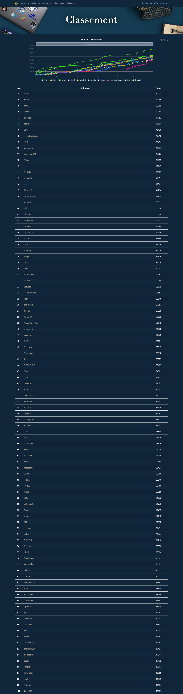

404CTF, 2023 edition
===

Hello! I started doing write-ups for all the challenges but then got distracted. I may get back to them in the future, but it's unlikely... this repository still holds the original challenge files for every challenge, if you want to browse them.

Here are some of my favorite challenges from this CTF:

- [Le Cracken](01.%20forensics/Le%20Cracken) (forensics)
- Gestionnaire de Perruche de Sparrman (radio-frequencies)
- Le Jour du mange poney (reverse engineering)
- Des tetrominos qui choient (hardware security)
- ... 

Write-ups done so far:

- [x] [01. forensics](01.%20forensics)
- [ ] 02. cloud
- [ ] 03. crypto
- [ ] 04. misc
- [ ] 05. pwn
- [ ] 06. ai
- [ ] 07. code
- [ ] 08. rf
- [ ] 09. osint
- [ ] 10. re
- [ ] 11. hw
- [ ] 12. steg
- [ ] 13. web
- [ ] 14. web3

