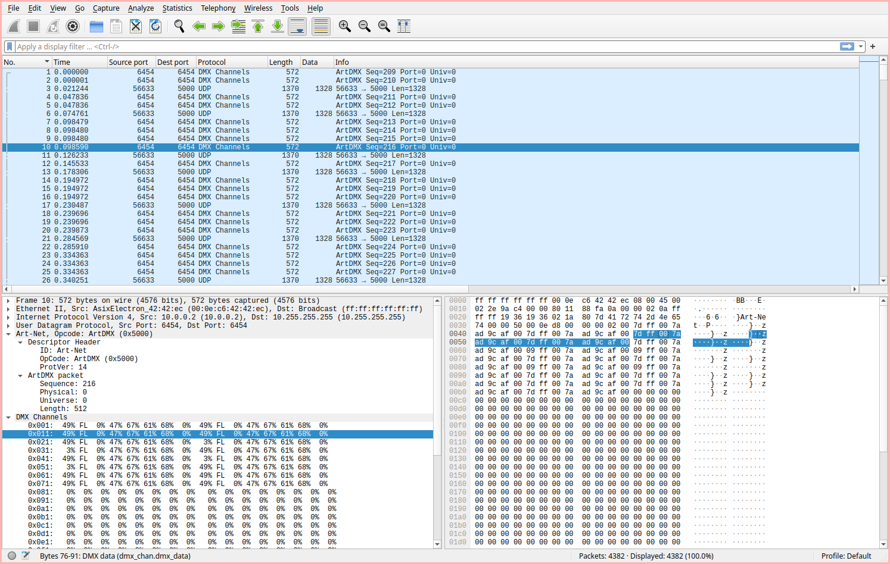
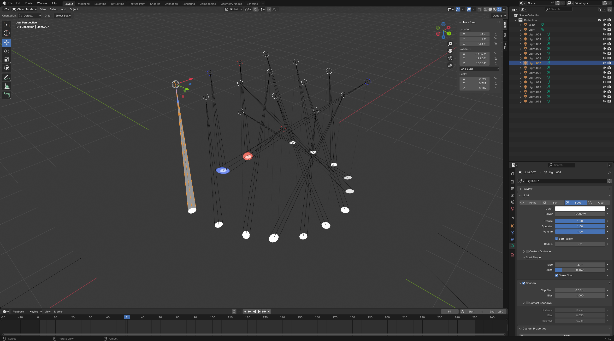
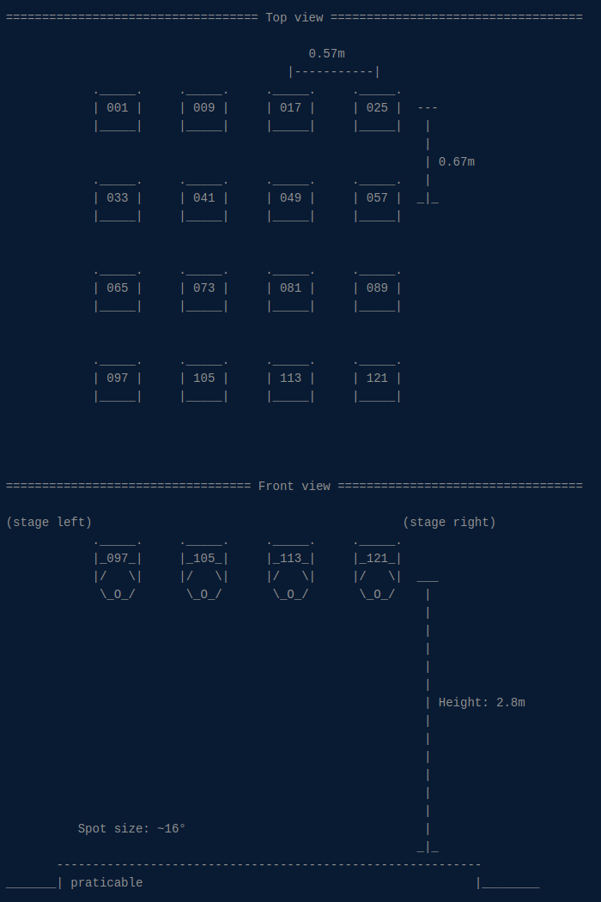
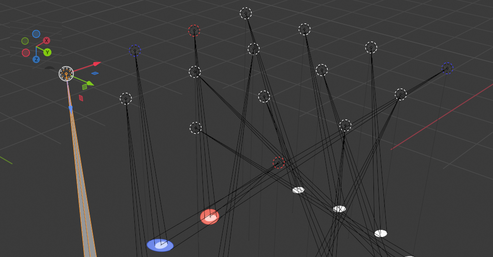
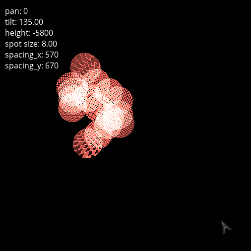

[Dazzled](challenge_files/README.md) - misc, ⭐⭐⭐, 8 solves
===

**Files**: [projector.pdf](https://www.narthorn.com/ctf/FCSC-2024/challenge_files/misc/Dazzled/projector.pdf), [capture.pcap](https://www.narthorn.com/ctf/FCSC-2024/challenge_files/misc/Dazzled/capture.pcap)

## Extracting the projector data

First step is to get the relevant data out of the pcap. Here's how the capture looks like in wireshark:



Referencing the [pdf](challenge_files/projector.pdf), there are a few things that can be noticed from this dump:

 * dimmer is only ever 0x00 (fully off) or 0xff (fully bright)
 * focus is always 0, so we can safely ignore it
 * pan and pan_fine can basically be read as one big-endian 16-bit number spanning the whole range, ditto for tilt/tilt_fine
 * reset is also always 0, we can ignore it too

I'll use [scapy](https://scapy.net/) to extract the relevant data out of the (8 bytes)*(16 projectors) in each frame of projector data:

```python
from struct import pack, unpack
with open("dazzled_data","wb") as f:
    for packet in rdpcap("capture.pcap"):
        if packet[UDP].dport != 6454: continue # ignore anything that's not the ArtDMX data
        frame = packet[Raw].load[18:18+16*8]   # frame data starts 18 bytes in
        for i in range(16):
            projector = frame[8*i:8*i+8]
            color, dimmer, focus, pan, tilt, reset = unpack(">cccHHc", projector)
            f.write(pack('=ccHH', color, dimmer, pan, tilt))
```

I go out of my way to read the x/x_fine as big-endian 16-bit, and write them back as the machine's native endianness - you don't need to do that, but it makes it straightforward to load all the data into a C struct later.

wait, C? Well, the challenge notes say not to try coding a 3D engine, but that's boring, so let's code a 3D engine.

## because it's fun

It's actually not that hard! There are only a few primitives we need:

 1) some way to rotate 3d vectors in space
 2) some way to project a point onto a plane along a certain direction

That's it. We can imagine the projectors as being vectors suspended in the air, casting straight beams of light to a single point down somewhere on the ground:



Unlike blender above rendering the entire 3d scene in perspective, all we care about is what's actually drawn on the ground, so we only need to render that 2d plane.
We still need to represent the position and orientation of the projectors as 3d objects, though, so let's define a vector type and a couple straightforward vector arithmetic functions:

```c
typedef struct Vec3 { float x; float y; float z; } Vec3;

Vec3 add(Vec3 a, Vec3 b) { a.x += b.x; a.y += b.y; a.z += b.z; return a; }
Vec3 sub(Vec3 a, Vec3 b) { a.x -= b.x; a.y -= b.y; a.z -= b.z; return a; }
Vec3 mul(Vec3 a, float k) { a.x *= k;  a.y *= k;   a.z *= k;   return a; }

float dot(Vec3 a, Vec3 b) { return a.x * b.x + a.y * b.y + a.z * b.z; }

```

To represent the projector's position and orientation as vectors, we need to choose a coordinate system.
This choice of coordinate system is completely arbitrary, you can pick whichever one you want - as long as you write the rest of the code accordingly. However, ***IT IS REALLY IMPORTANT TO GET IT RIGHT.*** You don't want to spend multiple hours flipping signs and swapping things around randomly while also trying to find potential bugs in your code[^3].



Looking at the given diagram[^2], we'll set our origin at the top left corner of the top view, on the ground, with our x-axis going to the right (from the projectors labeled 001 to 025), and our y-axis going down (from the projectors labeled 001 to 097).
Then, the [right-hand rule](https://en.wikipedia.org/wiki/Right-hand_rule) gives us the z-axis going from the projectors towards the ground.

Referencing the previous illustration in blender, it looks like this:



For example, projector 001 is at {0, 0, -2.8}, projector 009 is at {0.57, 0, -2.8},  projector 033 is at {0, 0.67, -2.8}, etc[^4].
We can write the positions like this:

```c
float spacing_x = 0.57;
float spacing_y = 0.67;
float height = -2.8;
...
        for (int i=0; i<16; i++) {
            ...
            Vec3 beam_origin = {spacing_x * (i%4), spacing_y * (i/4), height};
...
```

where i is the index of the projector from 0 to 15, enumerating them from left-to-right then top-to-bottom.

We'll also describe the direction the projectors are pointing towards as a 3d vector. Judging from the front view in the ascii illustration, it seems that the projectors are initially shining towards {0,1,0}. The axes that the projectors are going to tilt and rotate around are orthogonal to that: 

```c
Vec3 beam_axis = { 0, 1, 0};
Vec3 tilt_axis = { 1, 0, 0};
Vec3 pan_axis  = { 0, 0, 1};
```

However, we can't really know whether the rotations are clockwise or counterclockwise (which determines the sign of the vectors), so we'll just guess that they're clockwise rotations and flip the sign if we get a nonsense output.

# Rotating the projectors

To rotate a 3d vector around an axis, all you have to do is calculate the 3x3 [rotation matrix](https://en.wikipedia.org/wiki/Rotation_matrix) associated with that axis and angle, and then simply multiply your vector by that matrix.

I'm not going to go deep into how the rotation matrix is calculated, you can find many derivations of it online, but here is a [common implementation](https://en.wikipedia.org/w/index.php?title=Euler%E2%80%93Rodrigues_formula):

```c

typedef struct Matrix { float d[3][3]; } Matrix;

Matrix rotation_matrix(Vec3 axis, float angle) {
    angle = angle/360 * 2*M_PI;
    axis = mul(axis, sin(angle / 2.0)/sqrt(dot(axis, axis)));
    float a = cos(angle / 2.0), b = axis.x, c = axis.y, d = axis.z;
    return (Matrix){{
        {a*a + b*b - c*c - d*d, 2 * (b*c + a*d),       2 * (b*d - a*c)      },
        {2 * (b*c - a*d),       a*a + c*c - b*b - d*d, 2 * (c*d + a*b)      },
        {2 * (b*d + a*c),       2 * (c*d - a*b),       a*a + d*d - b*b - c*c},
    }};
}

// and the standard matrix-with-vector multiplication:

Vec3 matrix_mul(Matrix m, Vec3 p) {
    return (Vec3){
        m.d[0][0] * p.x + m.d[0][1] * p.y + m.d[0][2] * p.z,
        m.d[1][0] * p.x + m.d[1][1] * p.y + m.d[1][2] * p.z,
        m.d[2][0] * p.x + m.d[2][1] * p.y + m.d[2][2] * p.z,
    };
}

```

For systems that can be rotated through pan/tilt/roll, the rotations are usually done in that order: first pan (rotation around the usually vertical pan axis), then tilt (rotation around the tilt axis, which itself has been panned along the object), then roll (rotation around the roll axis, after it has been panned and tilted).
Rotations in 3D do not commute, so if you try to do it in another order, you will get different results.

The projectors do not roll (since the beam is circular, it wouldn't really do anything), so we only need to pan the beam, pan the tilt axis, and tilt the panned beam:

```c
Vec3 rotate_projector(Vec3 beam_axis, float pan, float tilt) {
    Vec3 panned_beam_axis = matrix_mul(rotation_matrix(pan_axis, pan), beam_axis);
    Vec3 panned_tilt_axis = matrix_mul(rotation_matrix(pan_axis, pan), tilt_axis);

    return matrix_mul(rotation_matrix(panned_tilt_axis, tilt), panned_beam_axis);
}
```

# Casting rays

The last thing we need is to figure out the {x,y} coordinates of the point on the ground that is going to be lit up by the beam.

Every point p along the direction of the beam can be written `p = beam_origin + t * beam_axis`, where t goes from 0 (directly at the source of the beam) to however far you want the beam to go.

Every point p on a plane follows the equation `dot(p,n) = d`, where n is the [normal vector](https://en.wikipedia.org/wiki/Normal_\(geometry\)) to the plane, and d is the shortest distance between that plane and the origin of the coordinate system.

We want a point that is both on the beam and on the plane, so it follows both equations; plugging in the first equation into the second, we get `dot(beam_origin,n) + t * dot(beam_axis, n) = d` and finally `t = (d - dot(beam_axis, n)) / dot(beam_origin, n)`, so that's the value of t we need to calculate the point.

So the most general formula for the raycast of a beam onto a plane is this:

```c
Vec3 raycast(Vec3 beam_origin, Vec3 beam_axis, Vec3 plane_normal, f64 plane_distance) {
    return add(beam_origin, mul(beam_axis, (plane_distance - dot(beam_origin, plane_normal)) / dot(beam_axis, plane_normal)));
}
```
In our specific case, the plane we care about has normal {0,0,1} and distance 0, so you could also simplify the calculations like this [^5]:

```c
Vec3 raycast_to_ground(Vec3 beam_origin, Vec3 beam_axis) {
    return add(beam_origin, mul(beam_axis, -beam_origin.z / beam_axis.z));
}
```

And that's most of the math we need done! To get the ground point, this is now all we need to do:

```c
        Vec3 p = raycast_to_ground(beam_origin, rotate_projector(beam_axis, pan, tilt));
```

# Loading the projector data

Nothing super exciting here, but because of the endianness trick from earlier we can just read the data directly into an array of structs.

```c
typedef struct Projector {
    char color;
    char dimmer;
    unsigned short pan;
    unsigned short tilt;
} Projector;

FILE *data = fopen("dazzled_data", "r");
fseek(data, 0, SEEK_END);
long size = ftell(data);
rewind(data);

int frame_size = sizeof(Projector)*16;
int n_frames = size / frame_size;

Projector *frame_data = malloc(size);
fread(frame_data, frame_size, n_frames, data);
fclose(data);

int frame = 0;
while (1) {

    frame %= n_frames; // loop when we get to the end
    Projector *projectors = frame_data + (16*frame); // this is pointer arithmetic, so sizeof(Projector) is already taken into account
    ...
    for (int i=0; i<16; i++) {
        ...
        Projector projector = projectors[i];
        ...
    }
    ...
    frame++;
}

```

We also need to map the color integers to actual colors[^6], reusing the Vec3 triplet for r,g,b values:

```c

Vec3 colormap[256];
for (int i =   0; i<  9; i++) colormap[i] = (Vec3){255,255,255}; // white
for (int i =   9; i< 18; i++) colormap[i] = (Vec3){255,0,0};     // red
for (int i =  18; i< 26; i++) colormap[i] = (Vec3){255,128,0};   // orange
for (int i =  26; i< 35; i++) colormap[i] = (Vec3){0,255,200};   // cyan-green
for (int i =  35; i< 43; i++) colormap[i] = (Vec3){0,255,0};     // green
for (int i =  43; i< 52; i++) colormap[i] = (Vec3){128,255,128}; // light green
for (int i =  52; i< 60; i++) colormap[i] = (Vec3){128,0,128};   // purple
for (int i =  60; i< 69; i++) colormap[i] = (Vec3){255,107,95};  // pink
for (int i =  69; i< 77; i++) colormap[i] = (Vec3){255,255,0};   // yellow
for (int i =  77; i< 86; i++) colormap[i] = (Vec3){255,165,0};   // magenta
for (int i =  86; i< 94; i++) colormap[i] = (Vec3){0,255,255};   // cyan
for (int i =  94; i<103; i++) colormap[i] = (Vec3){128,128,128}; // CTO 190k (not really)
for (int i = 103; i<111; i++) colormap[i] = (Vec3){165,165,165}; // CTO 240k (not really)
for (int i = 111; i<120; i++) colormap[i] = (Vec3){64,64,64};    // CTB 7000k (not really)
for (int i = 120; i<128; i++) colormap[i] = (Vec3){0,0,255};     // blue

...
        Vec3 color = colormap[projector.color];
...


```

When looping over the projector data, we'll need to scale the values loaded from the data according to the range defined in the pdf:

```c
...
        float pan  = projector.pan/65535. * 540;
        float tilt = projector.tilt/65535. * 270;
...
```

# Drawing on the screen

Finally, we need to map the (x,y) coordinates of the ground to (x,y) coordinates of an image on the screen.
the projectors sit between between `{0,0}` and `{3*0.57+0.52, 3*0.67+0.33} = {2.23, 2.34}`, so we'll give ourselves some room around that rectangle, in case the projectors point slightly off to the side:

```c
#define MIN_X -1.
#define MAX_X 3.5
#define MIN_Y -1.
#define MAX_Y 3.5
```

We only draw points on the ground that end up falling between those coordinates.

```c
#define WINDOW_WIDTH  512
#define WINDOW_HEIGHT 512
float x_resolution = WINDOW_WIDTH/(MAX_X - MIN_X);
float y_resolution = WINDOW_HEIGHT/(MAX_Y - MIN_Y);

...
        Vec3 p = raycast_to_ground(beam_origin, rotate_projector(beam_axis, pan, tilt));

        if (p.x < MIN_X || MAX_Y <= p.x) continue;
        if (p.y < MIN_Y || MAX_Y <= p.y) continue;

        int x = (p.x - MIN_X) * x_resolution;
        int y = (p.y - MIN_Y) * y_resolution;
...

```

# Putting it all together

I'm using SDL2 to draw stuff to the screen. There's a little bit of boilerplate setup to spawn and destroy the window, but otherwise the functions are straightforward - clear image, set the color, draw a pixel, show image.

```c
#include <SDL2/SDL.h>

// compile with `gcc dazzled_sdl2_simple.c -O3 -lm -lSDL2 -lSDL2main -o dazzled_sdl2_simple`

typedef struct Vec3 { float x; float y; float z; } Vec3;

Vec3 add(Vec3 a, Vec3 b) { a.x += b.x; a.y += b.y; a.z += b.z; return a; }
Vec3 sub(Vec3 a, Vec3 b) { a.x -= b.x; a.y -= b.y; a.z -= b.z; return a; }
Vec3 mul(Vec3 a, float k) { a.x *= k;  a.y *= k;   a.z *= k;   return a; }

float dot(Vec3 a, Vec3 b) { return a.x * b.x + a.y * b.y + a.z * b.z; }

Vec3 beam_axis = { 0, 1, 0};
Vec3 tilt_axis = { 1, 0, 0};
Vec3 pan_axis  = { 0, 0, 1};

typedef struct Matrix { float d[3][3]; } Matrix;

Matrix rotation_matrix(Vec3 axis, float angle) {
    angle = angle/360 * 2*M_PI;
    axis = mul(axis, sin(angle / 2.0)/sqrt(dot(axis, axis)));
    float a = cos(angle / 2.0), b = axis.x, c = axis.y, d = axis.z;
    return (Matrix){{
        {a*a + b*b - c*c - d*d,     2 * (b*c + a*d),       2 * (b*d - a*c)   },
        {   2 * (b*c - a*d),     a*a + c*c - b*b - d*d,    2 * (c*d + a*b)   },
        {   2 * (b*d + a*c),        2 * (c*d - a*b),    a*a + d*d - b*b - c*c},
    }};
}

Vec3 matrix_mul(Matrix m, Vec3 p) {
    return (Vec3){
        m.d[0][0] * p.x + m.d[0][1] * p.y + m.d[0][2] * p.z,
        m.d[1][0] * p.x + m.d[1][1] * p.y + m.d[1][2] * p.z,
        m.d[2][0] * p.x + m.d[2][1] * p.y + m.d[2][2] * p.z,
    };
}

Vec3 rotate_projector(Vec3 beam, float pan, float tilt) {
    Matrix pan_matrix = rotation_matrix(pan_axis, pan);

    Vec3 panned_beam = matrix_mul(pan_matrix, beam);
    Vec3 panned_tilt_axis = matrix_mul(pan_matrix, tilt_axis);

    Vec3 panned_and_tilted_beam = matrix_mul(rotation_matrix(panned_tilt_axis, tilt), panned_beam);

    return panned_and_tilted_beam;
}

Vec3 raycast_to_ground(Vec3 beam_origin, Vec3 beam_axis) {
    return add(beam_origin, mul(beam_axis, -beam_origin.z / beam_axis.z));
}

#define MIN_X -1.
#define MAX_X 3.5
#define MIN_Y -1.
#define MAX_Y 3.5

#define WINDOW_WIDTH  512
#define WINDOW_HEIGHT 512
float x_resolution = WINDOW_WIDTH/(MAX_X - MIN_X);
float y_resolution = WINDOW_HEIGHT/(MAX_Y - MIN_Y);

float spacing_x = 0.57;
float spacing_y = 0.67;
float height = -2.8;

void main() {

    SDL_Init(SDL_INIT_VIDEO);
    SDL_Window *window = SDL_CreateWindow("dazzled", SDL_WINDOWPOS_CENTERED, SDL_WINDOWPOS_CENTERED, WINDOW_WIDTH, WINDOW_HEIGHT, SDL_WINDOW_SHOWN);
    SDL_Renderer *renderer = SDL_CreateRenderer(window, -1, SDL_RENDERER_ACCELERATED || SDL_RENDERER_PRESENTVSYNC);
    SDL_GL_SetSwapInterval(1); // force vsync

    Vec3 colormap[256];
    for (int i =   0; i<  9; i++) colormap[i] = (Vec3){255,255,255}; // white
    for (int i =   9; i< 18; i++) colormap[i] = (Vec3){255,0,0};     // red
    for (int i =  18; i< 26; i++) colormap[i] = (Vec3){255,128,0};   // orange
    for (int i =  26; i< 35; i++) colormap[i] = (Vec3){0,255,200};   // cyan-green
    for (int i =  35; i< 43; i++) colormap[i] = (Vec3){0,255,0};     // green
    for (int i =  43; i< 52; i++) colormap[i] = (Vec3){128,255,128}; // light green
    for (int i =  52; i< 60; i++) colormap[i] = (Vec3){128,0,128};   // purple
    for (int i =  60; i< 69; i++) colormap[i] = (Vec3){255,107,95};  // pink
    for (int i =  69; i< 77; i++) colormap[i] = (Vec3){255,255,0};   // yellow
    for (int i =  77; i< 86; i++) colormap[i] = (Vec3){255,165,0};   // magenta
    for (int i =  86; i< 94; i++) colormap[i] = (Vec3){0,255,255};   // cyan
    for (int i =  94; i<103; i++) colormap[i] = (Vec3){128,128,128}; // CTO 190k (not really)
    for (int i = 103; i<111; i++) colormap[i] = (Vec3){165,165,165}; // CTO 240k (not really)
    for (int i = 111; i<120; i++) colormap[i] = (Vec3){64,64,64};    // CTB 7000k (not really)
    for (int i = 120; i<128; i++) colormap[i] = (Vec3){0,0,255};     // blue

    typedef struct Projector {
        char color;
        char dimmer;
        unsigned short pan;
        unsigned short tilt;
    } Projector;

    FILE *data = fopen("dazzled_data", "r");
    if (!data) { printf("Couldn't open dazzled_data\n"); return; }
    fseek(data, 0, SEEK_END);
    long size = ftell(data);
    rewind(data);

    int frame_size = sizeof(Projector)*16;
    int n_frames = size / frame_size;

    Projector *frame_data = malloc(size);
    fread(frame_data, frame_size, n_frames, data);
    fclose(data);

    int frame = 0;
    while (1) {

        frame = frame % n_frames; // loop when we get to the end
        Projector *projectors = frame_data + (16*frame); // this is pointer arithmetic, so sizeof(Projector) is already taken into account

        SDL_Event event;
        SDL_PollEvent(&event);
        if (event.type == SDL_QUIT) return;

        SDL_SetRenderDrawColor(renderer, 0, 0, 0, SDL_ALPHA_OPAQUE);
        SDL_RenderClear(renderer);

        for (int i=0; i<16; i++) {

            Projector projector = projectors[i];
            if (projector.dimmer == 0) continue;

            Vec3 beam_origin = {spacing_x * (i%4), spacing_y * (i/4), height};
            float pan  = projector.pan/65535. * 540;
            float tilt = projector.tilt/65535. * 270;

            Vec3 p = raycast_to_ground(beam_origin, rotate_projector(beam_axis, pan, tilt));

            if (p.x < MIN_X || MAX_Y <= p.x) continue;
            if (p.y < MIN_Y || MAX_Y <= p.y) continue;

            int x = (p.x - MIN_X) * x_resolution;
            int y = (p.y - MIN_Y) * y_resolution;

            Vec3 color = colormap[projector.color];
            SDL_SetRenderDrawColor(renderer, color.x, color.y, color.z, SDL_ALPHA_OPAQUE);

            for (int dx=-2; dx<3; dx++) {      // paint a few pixels around the target 
                for (int dy=-2; dy<3; dy++) {  // to make the dots thicker and easier to see
                    SDL_RenderDrawPoint(renderer, x+dx, y+dy);
                }
            }
        }

        SDL_RenderPresent(renderer);

        frame++;
    }
}
```

We run it and...


It doesn't really spell anything. The code is working correctly ; and even if we try to flip the sign of the tilt/pan axes, it still doesn't look good. 
The problem here is that we assumed pan 0, tilt 0 corresponded to the initial state of the projector (pointing horizontally along the y-axis). However, that's not the case and we need to figure out the real offset for these values.

This is where we're really happy to be coding in C, because since it's rendering fast, we are able to change those parameters in real time:

```c
...
    float tilt_offset = 0;
    float pan_offset = 0;
    char paused = 0;
...

        if (event.type == SDL_KEYDOWN) {
            switch(event.key.keysym.sym) {
                case SDLK_DOWN:  tilt_offset -= 1;  break;
                case SDLK_UP:    tilt_offset += 1;  break;
                case SDLK_LEFT:  pan_offset -= 1;   break;
                case SDLK_RIGHT: pan_offset += 1;   break;
                case SDLK_SPACE:  paused = 1-paused; break;
                case SDLK_ESCAPE: return;
            }
        }

...
            float pan  = projector.pan/65535. * 540 + tilt_offset;
            float tilt = projector.tilt/65535. * 270 + pan_offset;
...

        if (!paused) frame++;
...


```

We can now pause the loop on the first char, which we are told is an F, and adjust the parameters till we can read it, ending up with a pan offset of 0 and a tilt offset of 135:


`FCSC{1344A1F2B236C9}`

## Comments

There's a lot of cool things I didn't cover. You can consider the beams having some width to them (as provided by the [pdf](challenge_files/projector.pdf) giving a "spot angle" of 16°), and what happens when two spots illuminate the same point - as it turns out, this isn't needed for this challenge, and for the sake of keeping this already insanely long writeup manageable, I left those out of the code. In practice it should look more like this:



It can be a fun exercise to try and implement those features yourself, but if you want spoilers, here is the [full version](dazzled_sdl2_full.c).

During the CTF, I actually did [all of it in python](dazzled.py), rendering frames and writing them out with PIL as animated gifs - but that was very very slow, even with numpy doing a lot of the heavy lifting. It took a few minutes to generate the whole animation, and bruteforcing the tilt offset was very painful, especially considering I also had totally wrong values for the spacing. It's probably doable to rewrite some of the code to make it real-time even in python, but I think the SDL2/C combo is less of a headache, if you've done it a couple times before. You can re-use all the vector/matrix stuff if you need it elsewhere too, so it's a good thing to have in your toolbox.


[^2]: this is actually a slightly different diagram than the one given during the challenge (see challenge_files/ for the original). It comes from the version on [hackropole](https://hackropole.fr/en/challenges/misc/fcsc2024-misc-dazzled/) where the diagram has been edited to clarify the spacing between projectors.

[^3]: ask me how I know

[^4]: The projectors end up at negative 2.8m above ground, which is a little weird but is a normal consequence of the right-handed coordinate system we chose earlier. It isn't a big deal, but if you really wanted, you could pick a left-handed coordinate system with z going up. The most non-obvious change you need to make, if you choose to do that, is to flip the sign of the angle in the upcoming rotation matrix (or equivalently, take the transpose of the matrix).

[^5]: you could also have calculated the simple version with basic trigonometry, but I think the general raycast function is interesting to know about, since it's pretty easy to re-derive if you need it.

[^6]: The CTO/CTB colors correspond to real light color temperatures, and can't really be mapped to rgb unless you know the color temperature calibration of your own computer monitor. They're not used anyway, so it's fine.
