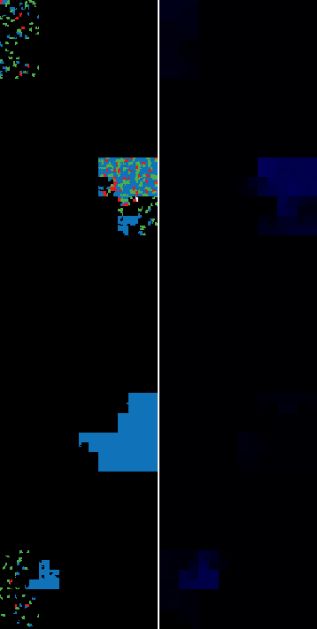
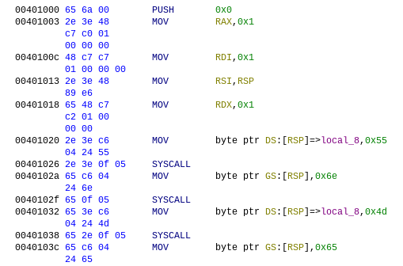

[La Barre Fixe](challenge_files/README.md) - steg, easy, 22 solves
===

**Author**: [@Redhpm](https://redhpm.re)    
**Files**: [chall](https://www.narthorn.com/ctf/404CTF-2024/challenge_files/St%C3%A9ganographie/La%20Barre%20Fixe/chall)

## Solve

Running the file just prints "UnMessagePasDuToutSuspect" and exits.   
Besides a rickroll url at the end and a big clump of 0x69 bytes, the binary is pretty much empty: 

[^1]

The place with the most entropy, the one most likely to be hiding something, is where the instructions of the binary's only function are. 



These instructions are a little strange: as hinted at by the challenge text, they seem to have extra bytes to them.

Those bytes are [instruction prefixes](https://wiki.osdev.org/X86-64_Instruction_Encoding#Legacy_prefixes); we find that exactly 4 of those prefixes have been put in instructions where they have no meaning in x64: 0x40 (rex), 0x65 (gs), 0x2e (cs), and 0x3e (ds). The prefixes are always written in the same order, but not every instruction has all the prefixes:

```asm
  prefixes   | rest of instruction | disassembly                
-------------+---------------------+----------------------------
   65        |     6a 00           | push    0                    
      2e 3e  |  48 c7 c0 01000000  | mov     rax, 1               
             |  48 c7 c7 01000000  | mov     rdi, 1               
      2e 3e  |  48 89 e6           | mov     rsi, rsp             
   65        |  48 c7 c2 01000000  | mov     rdx, 1               
      2e 3e  |     c6 04 24 55     | mov     byte ptr [rsp], 0x55 
      2e 3e  |     0f 05           | syscall                      
   65        |     c6 04 24 6e     | mov     byte ptr [rsp], 0x6e 
   65        |     0f 05           | syscall                      
   65    3e  |     c6 04 24 4d     | mov     byte ptr [rsp], 0x4d 
   65 2e     |     0f 05           | syscall                      
   65        |     c6 04 24 65     | mov     byte ptr [rsp], 0x65 
40    2e 3e  |     0f 05           | syscall                      
   65 2e 3e  |     c6 04 24 73     | mov     byte ptr [rsp], 0x73 
40           |     0f 05           | syscall                      
   65 2e 3e  |     c6 04 24 73     | mov     byte ptr [rsp], 0x73 
40           |     0f 05           | syscall                      
      2e 3e  |     c6 04 24 61     | mov     byte ptr [rsp], 0x61 
   65 2e     |     0f 05           | syscall                      
      2e 3e  |     c6 04 24 67     | mov     byte ptr [rsp], 0x67 
40 65 2e 3e  |     0f 05           | syscall                      
   65    3e  |     c6 04 24 65     | mov     byte ptr [rsp], 0x65 
   65 2e     |     0f 05           | syscall                      
      2e 3e  |     c6 04 24 50     | mov     byte ptr [rsp], 0x50 
   65        |     0f 05           | syscall                      
      2e 3e  |     c6 04 24 61     | mov     byte ptr [rsp], 0x61 
40 65    3e  |     0f 05           | syscall                      
      2e     |     c6 04 24 73     | mov     byte ptr [rsp], 0x73 
40       3e  |     0f 05           | syscall                      
   65 2e     |     c6 04 24 44     | mov     byte ptr [rsp], 0x44 
   65 2e 3e  |     0f 05           | syscall                      
   65        |     c6 04 24 75     | mov     byte ptr [rsp], 0x75 
40 65 2e     |     0f 05           | syscall                      
   65 2e     |     c6 04 24 54     | mov     byte ptr [rsp], 0x54 
40 65 2e 3e  |     0f 05           | syscall                      
   65 2e     |     c6 04 24 6f     | mov     byte ptr [rsp], 0x6f 
      2e     |     0f 05           | syscall                      
   65 2e 3e  |     c6 04 24 75     | mov     byte ptr [rsp], 0x75 
      2e 3e  |     0f 05           | syscall                      
      2e 3e  |     c6 04 24 74     | mov     byte ptr [rsp], 0x74 
      2e 3e  |     0f 05           | syscall                      
   65 2e 3e  |     c6 04 24 53     | mov     byte ptr [rsp], 0x53 
40 65    3e  |     0f 05           | syscall                      
      2e     |     c6 04 24 75     | mov     byte ptr [rsp], 0x75 
   65    3e  |     0f 05           | syscall                      
      2e 3e  |     c6 04 24 73     | mov     byte ptr [rsp], 0x73 
   65        |     0f 05           | syscall                      
   65    3e  |     c6 04 24 70     | mov     byte ptr [rsp], 0x70 
   65    3e  |     0f 05           | syscall                      
   65 2e 3e  |     c6 04 24 65     | mov     byte ptr [rsp], 0x65 
   65 2e     |     0f 05           | syscall                      
   65        |     c6 04 24 63     | mov     byte ptr [rsp], 0x63 
   65 2e     |     0f 05           | syscall                      
   65        |     c6 04 24 74     | mov     byte ptr [rsp], 0x74 
40 65    3e  |     0f 05           | syscall                      
   65 2e 3e  |     c6 04 24 0a     | mov     byte ptr [rsp], 0xa  
             |     0f 05           | syscall                      
             |  48 c7 c0 3c000000  | mov     rax, 0x3c            
```

Because of the strict ordering of those prefixes, we can interpret them as being 0/1 bits, at specific positions in groups of four:

```asm

  prefixes   | as bits | rest of instruction | disassembly             
-------------+---------+---------------------+-----------------------------
.. 65 .. ..  |  0100   |     6a 00           | push    0                    
.. .. 2e 3e  |  0011   |  48 c7 c0 01000000  | mov     rax, 1               
             |         |                     |
.. .. .. ..  |  0000   |  48 c7 c7 01000000  | mov     rdi, 1               
.. .. 2e 3e  |  0011   |  48 89 e6           | mov     rsi, rsp             
             |         |                     |
.. 65 .. ..  |  0100   |  48 c7 c2 01000000  | mov     rdx, 1               
.. .. 2e 3e  |  0011   |     c6 04 24 55     | mov     byte ptr [rsp], 0x55 
             |         |                     |
.. .. 2e 3e  |  0011   |     0f 05           | syscall                      
.. 65 .. ..  |  0100   |     c6 04 24 6e     | mov     byte ptr [rsp], 0x6e 
             |         |                     |
.. 65 .. ..  |  0100   |     0f 05           | syscall                      
.. 65 .. 3e  |  0101   |     c6 04 24 4d     | mov     byte ptr [rsp], 0x4d 
             |         |                     |
.. 65 2e ..  |  0110   |     0f 05           | syscall                      
.. 65 .. ..  |  0100   |     c6 04 24 65     | mov     byte ptr [rsp], 0x65 
             |         |                     |
40 .. 2e 3e  |  1011   |     0f 05           | syscall                      
.. 65 2e 3e  |  0111   |     c6 04 24 73     | mov     byte ptr [rsp], 0x73 
             |         |                     |
40 .. .. ..  |  1000   |     0f 05           | syscall                      
.. 65 2e 3e  |  0111   |     c6 04 24 73     | mov     byte ptr [rsp], 0x73 
             |         |                     |
40 .. .. ..  |  1000   |     0f 05           | syscall                      
.. .. 2e 3e  |  0011   |     c6 04 24 61     | mov     byte ptr [rsp], 0x61 
             |         |                     |
.. 65 2e ..  |  0110   |     0f 05           | syscall                      
.. .. 2e 3e  |  0011   |     c6 04 24 67     | mov     byte ptr [rsp], 0x67 
             |         |                     |
40 65 2e 3e  |  1111   |     0f 05           | syscall                      
.. 65 .. 3e  |  0101   |     c6 04 24 65     | mov     byte ptr [rsp], 0x65 
             |         |                     |
.. 65 2e ..  |  0110   |     0f 05           | syscall                      
.. .. 2e 3e  |  0011   |     c6 04 24 50     | mov     byte ptr [rsp], 0x50 
             |         |                     |
.. 65 .. ..  |  0100   |     0f 05           | syscall                      
.. .. 2e 3e  |  0011   |     c6 04 24 61     | mov     byte ptr [rsp], 0x61 
             |         |                     |
40 65 .. 3e  |  1101   |     0f 05           | syscall                      
.. .. 2e ..  |  0010   |     c6 04 24 73     | mov     byte ptr [rsp], 0x73 
             |         |                     |
40 .. .. 3e  |  1001   |     0f 05           | syscall                      
.. 65 2e ..  |  0110   |     c6 04 24 44     | mov     byte ptr [rsp], 0x44 
             |         |                     |
.. 65 2e 3e  |  0111   |     0f 05           | syscall                      
.. 65 .. ..  |  0100   |     c6 04 24 75     | mov     byte ptr [rsp], 0x75 
             |         |                     |
40 65 2e ..  |  1110   |     0f 05           | syscall                      
.. 65 2e ..  |  0110   |     c6 04 24 54     | mov     byte ptr [rsp], 0x54 
             |         |                     |
40 65 2e 3e  |  1111   |     0f 05           | syscall                      
.. 65 2e ..  |  0110   |     c6 04 24 6f     | mov     byte ptr [rsp], 0x6f 
             |         |                     |
.. .. 2e ..  |  0010   |     0f 05           | syscall                      
.. 65 2e 3e  |  0111   |     c6 04 24 75     | mov     byte ptr [rsp], 0x75 
             |         |                     |
.. .. 2e 3e  |  0011   |     0f 05           | syscall                      
.. .. 2e 3e  |  0011   |     c6 04 24 74     | mov     byte ptr [rsp], 0x74 
             |         |                     |
.. .. 2e 3e  |  0011   |     0f 05           | syscall                      
.. 65 2e 3e  |  0111   |     c6 04 24 53     | mov     byte ptr [rsp], 0x53 
             |         |                     |
40 65 .. 3e  |  1101   |     0f 05           | syscall                      
.. .. 2e ..  |  0010   |     c6 04 24 75     | mov     byte ptr [rsp], 0x75 
             |         |                     |
.. 65 .. 3e  |  0101   |     0f 05           | syscall                      
.. .. 2e 3e  |  0011   |     c6 04 24 73     | mov     byte ptr [rsp], 0x73 
             |         |                     |
.. 65 .. ..  |  0100   |     0f 05           | syscall                      
.. 65 .. 3e  |  0101   |     c6 04 24 70     | mov     byte ptr [rsp], 0x70 
             |         |                     |
.. 65 .. 3e  |  0101   |     0f 05           | syscall                      
.. 65 2e 3e  |  0111   |     c6 04 24 65     | mov     byte ptr [rsp], 0x65 
             |         |                     |
.. 65 2e ..  |  0110   |     0f 05           | syscall                      
.. 65 .. ..  |  0100   |     c6 04 24 63     | mov     byte ptr [rsp], 0x63 
             |         |                     |
.. 65 2e ..  |  0110   |     0f 05           | syscall                      
.. 65 .. ..  |  0100   |     c6 04 24 74     | mov     byte ptr [rsp], 0x74 
             |         |                     |
40 65 .. 3e  |  1101   |     0f 05           | syscall                      
.. 65 2e 3e  |  0111   |     c6 04 24 0a     | mov     byte ptr [rsp], 0xa  
             |         |                     |
.. .. .. ..  |  0000   |     0f 05           | syscall                      
.. .. .. ..  |  0000   |  48 c7 c0 3c000000  | mov     rax, 0x3c            
```

Finally, comparing with the expected flag format `404CTF{...}`, we expect to find a repeating `4` near the start of the message. Splitting the bits in groups of 8, one per character, we find a repeating pattern `0100 0011`, which is almost exactly `4` in ascii: `0011 0100` - it's just that the 2 groups of 4 bits have switched positions.

```c
  prefixes   | as bits | as byte  | as ascii char
-------------+---------+----------+---------------
.. 65 .. ..  |  0100   |          |  
.. .. 2e 3e  |  0011   | 00110100 | 4
             |         |          |   
.. .. .. ..  |  0000   |          |   
.. .. 2e 3e  |  0011   | 00110000 | 0
             |         |          |   
.. 65 .. ..  |  0100   |          |   
.. .. 2e 3e  |  0011   | 00110100 | 4
             |         |          |   
.. .. 2e 3e  |  0011   |          |   
.. 65 .. ..  |  0100   | 01000011 | C
             |         |          |   
.. 65 .. ..  |  0100   |          |   
.. 65 .. 3e  |  0101   | 01010100 | T
             |         |          |   
.. 65 2e ..  |  0110   |          |   
.. 65 .. ..  |  0100   | 01000110 | F
             |         |          |   
40 .. 2e 3e  |  1011   |          |   
.. 65 2e 3e  |  0111   | 01111011 | {
             |         |          |   
40 .. .. ..  |  1000   |          |   
.. 65 2e 3e  |  0111   | 01111000 | x
             |         |          |   
40 .. .. ..  |  1000   |          |   
.. .. 2e 3e  |  0011   | 00111000 | 8
             |         |          |   
.. 65 2e ..  |  0110   |          |   
.. .. 2e 3e  |  0011   | 00110110 | 6
             |         |          |   
40 65 2e 3e  |  1111   |          |   
.. 65 .. 3e  |  0101   | 01011111 | _
             |         |          |   
.. 65 2e ..  |  0110   |          |   
.. .. 2e 3e  |  0011   | 00110110 | 6
             |         |          |   
.. 65 .. ..  |  0100   |          |   
.. .. 2e 3e  |  0011   | 00110100 | 4
             |         |          |   
40 65 .. 3e  |  1101   |          |   
.. .. 2e ..  |  0010   | 00101101 | -
             |         |          |   
40 .. .. 3e  |  1001   |          |   
.. 65 2e ..  |  0110   | 01101001 | i
             |         |          |   
.. 65 2e 3e  |  0111   |          |   
.. 65 .. ..  |  0100   | 01000111 | G
             |         |          |   
40 65 2e ..  |  1110   |          |   
.. 65 2e ..  |  0110   | 01101110 | n
             |         |          |   
40 65 2e 3e  |  1111   |          |   
.. 65 2e ..  |  0110   | 01101111 | o
             |         |          |   
.. .. 2e ..  |  0010   |          |   
.. 65 2e 3e  |  0111   | 01110010 | r
             |         |          |   
.. .. 2e 3e  |  0011   |          |   
.. .. 2e 3e  |  0011   | 00110011 | 3
             |         |          |   
.. .. 2e 3e  |  0011   |          |   
.. 65 2e 3e  |  0111   | 01110011 | s
             |         |          |   
40 65 .. 3e  |  1101   |          |   
.. .. 2e ..  |  0010   | 00101101 | -
             |         |          |   
.. 65 .. 3e  |  0101   |          |   
.. .. 2e 3e  |  0011   | 00110101 | 5
             |         |          |   
.. 65 .. ..  |  0100   |          |   
.. 65 .. 3e  |  0101   | 01010100 | T
             |         |          |   
.. 65 .. 3e  |  0101   |          |   
.. 65 2e 3e  |  0111   | 01110101 | u
             |         |          |   
.. 65 2e ..  |  0110   |          |   
.. 65 .. ..  |  0100   | 01000110 | F
             |         |          |   
.. 65 2e ..  |  0110   |          |   
.. 65 .. ..  |  0100   | 01000110 | F
             |         |          |   
40 65 .. 3e  |  1101   |          |   
.. 65 2e 3e  |  0111   | 01111101 | }
             |         |          |
.. .. .. ..  |  0000   |          |
.. .. .. ..  |  0000   | 00000000 | \0
```

`404CTF{x86_64-iGnor3s-5TuFF}`

## Comments

The easy challenge with very few solves!  It can be a 30 minutes thing if you see the right pattern straight away, otherwise it's very easy to get lost and try a million things that won't lead anywhere.

A few pitfalls include:

 - Trying to disassemble using `objdump`: fine for the most part, but it puts the rex prefix of the syscall instructions on its own line, so that can throw you off:
```asm
  40103c:	65 c6 04 24 65       	mov    BYTE PTR gs:[rsp],0x65
  401041:	40                   	rex
  401042:	2e 3e 0f 05          	cs ds syscall
  401046:	65 2e 3e c6 04 24 73 	gs cs mov BYTE PTR gs:[rsp],0x73
```
 - Relying on the disassembled instructions, rather than the raw hex bytes: the prefixes are mostly meaningless, but still refer to real segment registers that are interpreted by the CPU. They have no effect in x64 *in practice*, but disassemblers will still try to make sense of them - however the result of using multiple segment selector prefixes is undefined, so the disassembled output cannot make any sense.

 - There's also a valid rex prefix (0x48) used at the start and end of the function, that cannot be considered part of the message, since it is actually meaningful in the instructions where it appears.

 - Prematurely throwing away too much information: one line has no prefixes at all - if you remove the context of the rest of the instruction, you might end up ignoring that line as a meaningless blank, and from then on you're very screwed, since anything you decode will be off by a half-byte.

I think the challenge has enough noticeable structure that you can avoid going too far into the weeds, if you're careful. But there really are a lot of different ways of interpreting the extra prefixes that you can come up with...

[^1]: byteclass/entropy visualisation using https://binvis.io