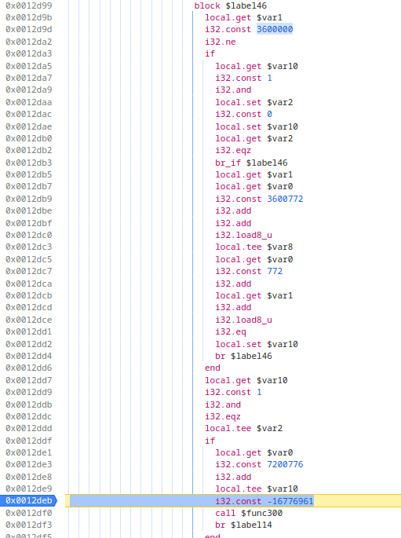

[Le Tableau Noir](challenge_files/README.md) - reverse, insane, 1 solves
===

**Author**: [@Redhpm](https://redhpm.re)    
**Website**: [Le Tableau Noir](https://narthorn.com/ctf/404CTF-2024/challenge_files/Rétro-Ingénierie/Le%20Tableau%20Noir/website/Le%20Tableau%20Noir.html)

## Solve

We're given a [website](https://narthorn.com/ctf/404CTF-2024/challenge_files/Rétro-Ingénierie/Le%20Tableau%20Noir/website/Le%20Tableau%20Noir.html) displaying a webassembly applet. It has a blackboard you can draw on, and buttons you can click to make drawings of judo moves appear.


Clicking the "Check" button causes the entire blackboard to go bright red:


The [challenge text](challenge_files/README.md) goes out of its way to tell us "Red = Bad, Green = Good", which is a HUGE, MASSIVE hint that if followed properly, can help you solve the challenge in less than half an hour[^1].

That is because it gives us a needle to search for in the massive amount of wasm bytecode: we know that something is going to turn the blackboard from its base color 0x104424 to full red 0xff0000, and close to that we might find either some code that does the check, or a relevant variable that would lead us to the check code that set it.

Opening the wasm binary in chrome's devtools, we get a [WAT](https://developer.mozilla.org/en-US/docs/WebAssembly/Understanding_the_text_format) disassembly listing of the code, but all the constants are displayed in decimal instead of hex, so we search for:

- `  16711680` (0xff0000): no results
- `4278190335` (0xff0000ff, rgb+alpha): no results either
- ` -16776961` (0xff0000ff, as a signed 32bit integer): bingo

We get two results: 


and


In the second result, we see the close constant 16711935 = 0x00ff00ff, which is bright green, further confirming that we're looking at something relevant. However, adding a breakpoint there and clicking on the check button does nothing.

In the first result however, we do hit our breakpoint! Inspecting the code directly above it, we see an if test on `$var2`, and just a little bit above, `$var2` is being set after some xoring with a few integer constants.


Converting those constants to hex again because devtools won't do it for us:

 - 4051043073205482288 = 0x3838323634383330 = '88264830'
 - 3472901146198618932 = 0x3032393137373334 = '02917734'
 - 3761408603592144436 = 0x3433353238353634 = '43528564'
 - 3618705188412667953 = 0x3238393236333831 = '28926381'

These are suspiciously ascii bytes for numbers from 0 to 9. Lets try clicking on some buttons in a recognizable pattern, like "1111222233334444555566667777" and break at that point in the code, to inspect the values of the local vars the constants are xored with:


Once again converting to hex:

 - `$var102`: 3617008641886990641 = 0x3232323231313131 = '22221111'
 - `$var103`: 3761688987563143987 = 0x3434343433333333 = '44443333'
 - `$var105`: 3472328296345581367 = 0x3030303037373737 = '00007777'
 - `$var106`: 3906369333239297333 = 0x3636363635353535 = '66665555'

Yep, these are the numbers we entered, only a little bit shuffled around from the order we entered them in.   
Putting them in the correct order to cancel out all the xors with the constants gives the code `03846288465825344377192018362982`, which we type in and press check. This causes the screen to briefly flash red, and the code hits our second breakpoint from the previous search for red - progress!



Having clicked the buttons in the correct order, we can guess that maybe this is a 2nd part to the check, that has something to do with the image we can draw. Indeed, looking at the code directly above, there seems to be some sort of loop over a counter, `$var1`, going up to 3600000, which is exactly `1500*600*4`: the pixel dimensions of the blackboard (1500x600) times the size of an RGBA pixel (4 bytes).

At this point you might go, "what if it's simply checking every single pixel of the image we draw against every single pixel of the target image?", which would mean the target image has been loaded in memory somewhere. Looking at the code more closely, it is loading bytes from addresses `$var0+772 + $var1` and `$var0+3600772 + $var1`, one of which could be the buffer for the pixels we drew, and the other the buffer for the target pixels.

Looking up the value of `$var0`, we can directly view that memory location in devtools:


And it sure looks like groups of 4 bytes set to the blackboard background color 0x104424ff. Devtools is also kind enough to let us export the wasm memory as a global variable in the js console, so we can export those 3600000 pixel values as a byte array:


and then recreate the image from those bytes:

```python
from PIL import Image
from PIL.ImageOps import flip

pixels = eval(xclip()) # list of bytes from clipboard

im = Image.new("RGBA", (1500,600))
im.putdata([tuple(x) for x in chunks(pixels,4)])
flip(im).show()
```


Decoding the QR code finally gives us the flag: `404CTF{L3_FutUr-dU-W3B...?}`

## Comments

It's actually not that bad if you go in with the mindset of "finding the shortest path to flag" instead of "doing a full reverse of the entire code". Of course in reverse, you can never know in advance which approach is going to save you the most time in the long run.

[^1]: guess [how](/Narthorn/ctf/tree/master/2024-04-20_404CTF-2024/07.%20reverse/Le%20Tableau%20Noir/~extra_callgraph.png) many [days](/Narthorn/ctf/tree/master/2024-04-20_404CTF-2024/07.%20reverse/Le%20Tableau%20Noir/~extra_callgraph_better.png) I [spent](/Narthorn/ctf/tree/master/2024-04-20_404CTF-2024/07.%20reverse/Le%20Tableau%20Noir/~extra_going_insane.gif) on this [challenge](/Narthorn/ctf/tree/master/2024-04-20_404CTF-2024/07.%20reverse/Le%20Tableau%20Noir/~extra_howaboutthat.png)